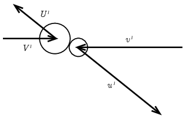
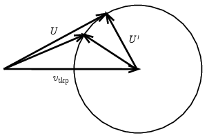

**Megoldás.**
 Az álló, $m$ tömegű neonatomhoz ütköző $M$ tömegű argonatom sebességét jelöljük $\boldsymbol{V}$-vel! Az 1. ábrán tömegközépponti koordináta-rendszerben ábrázoltuk az ütközést. A tömegközépponti rendszer sebessége a nyugvóhoz képest:
 $\boldsymbol{v}_\mathrm{tkp}=\frac{M}{M+m}\,\boldsymbol{V}.$
 A részecskék bejövő sebessége
 $\boldsymbol{V}'=\frac{m}{M+m}\boldsymbol{V}\quad\textrm{és}\quad\boldsymbol{v}'=-\frac{M}{M+m}\boldsymbol{V},$
 ahol nagybetűvel az argon, kisbetűvel a neonatomra vonatkozó mennyiségeket jelöltük, $V$ és $U$ a bejövő és kimenő sebességeket különbözteti meg, a vessző pedig a tömegközépponti rendszerben értelmezett mennyiségeket. Tömegközépponti rendszerben rugalmas ütközéskor a kimenő $\boldsymbol{U}'$ és $\boldsymbol{u}'$ sebességek nagysága nem változik, egymással ellentétes irányúak, de bármerre mutathatnak (a harmadik, ábra síkjából kilépő irányba is mutathatnának, de akkor az ábra síkját ott vettük volna fel).

 1. ábra
 2. ábra

 A 2. ábrán visszatérünk a nyugvó koordináta-rendszerhez. Az argonatom kimenő $\boldsymbol{U}$ sebességét úgy kapjuk, hogy a tömegközépponti rendszerbeli $\boldsymbol{U}'$ kimenő sebességhez hozzáadjuk a tömegközéppontét:
 $\boldsymbol{U}=\boldsymbol{U}'+\boldsymbol{v}_\mathrm{tkp}.$
 Ez akkor zár be maximális $\vartheta$ szöget a bejövő sebességgel, ha hatásvonala érinti a $\boldsymbol{v}_\mathrm{tkp}$ vektor végpontja köré rajzolt $|\boldsymbol{U}'|=|\boldsymbol{V}'|$ sugarú kört. Mivel az érintő és a sugár merőlegesek, a vektorok összeadását szemléltető derékszögű háromszögben:
 $\sin\vartheta=\frac{U'}{v_\mathrm{tkp}}=\frac{V'}{v_\mathrm{tkp}}=\frac{m}{M}.$
 Behelyettesítve az atomtömegeket:
 $\sin\vartheta=\frac{20{,}2}{39{,}9}=0{,}506,$
 és az argonatom maximális eltérülési szöge
 $\vartheta=30{,}4^\circ.$

