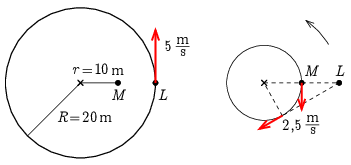
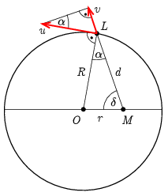

**I. megoldás.**
 Ha a lovas a legközelebb vagy a legtávolabb van a lovászmestertől, akkor éppen nem változik a közöttük lévő távolság. A kérdésre az a válasz, hogy akkor változik a leglassabban a lovas és a lovászmester közötti távolság, amikor a lovas éppen a legközelebbi ponton halad át, vagy éppen a legtávolabbi pont közelében mozog a 20 m sugarú pályáján. Ekkor a lovas és a lovászmester közötti távolság 10 m, illetve 30 m, a távolság állandósága miatt annak változási sebessége nulla.
 Az ábrán kétféle nézőpontból láthatjuk a helyzetet. A bal oldali ábrán a talajhoz rögzített rendszerben a lovászmester (M) áll, a lovas (L) pedig 5 m/s kerületi sebességgel 20 m sugarú körpályán mozog. A jobb oldali ábrán lévő forgó rendszerben a lovas áll, és a lovászmester végez 10 m sugarú körön körmozgást ugyanazon középpont körül, 2,5 m/s nagyságú sebességgel, ellenkező körüljárás szerint.

 A jobb oldali ábráról leolvashatjuk, hogy akkor nő a leggyorsabban a lovas és a lovászmester közötti távolság, ha a lovászmester sebességének hatásvonalán helyezkedik el a lovas, ami éppen $60^\circ$-os elfordulási szögnél következik be. Álló rendszerből ez ugyanakkora szögű, pozitív elfordulást jelent. Az ábráról leolvashatjuk azt is, hogy ebben a helyzetben a távolság növekedésének maximális üteme 2,5 m/s.
 Ha a jobb oldali ábra félszabályos háromszögét tükrözzük az átfogóra, akkor azt a pontot kapjuk meg, ahol a leggyorsabban csökken a lovas és a lovászmester közötti távolság. A távolság csökkenési sebessége ilyenkor is 2,5 m/s.

**II. megoldás**
 Az előző megoldás jelöléseit kiegészítve legyen a lovas kerületi sebessége $u$, a lovas $L$ pozícióját a lovászmester $M$ pozíciójával összekötő szakasz $d$, a kör középpontja pedig $O$!

 Nyilván akkor változik $d$ a leggyorsabban, ha $u$-nak $d$ irányára vett
 $v=u\sin{\alpha}$
 vetülete a legnagyobb. A merőleges szárú szögek egyenlősége miatt $\alpha$ egyenlő az $OLM\triangle$ $L$-nél lévő szögével. Ebben a háromszögben a szinusz-tétel szerint
 $\sin{\alpha}=\frac{r}{R}\sin{\delta},$
 ami akkor maximális, ha $\sin{\delta}=1$, azaz $\delta=\tfrac{\pi}{2}=90^\circ$. Ekkor $\alpha=\tfrac{\pi}{6}=30^\circ$, ami a lovas $\tfrac{\pi}{3}=60^\circ$-os elfordulásakor következik be. Ilyenkor
 $v_\mathrm{max}=\frac{r}{R}u= 2{,}5\,\mathrm{\frac{m}{s}},$
 és $d$ növekszik. Azt a pozíciót, amikor a $d$ leggyorsabban csökken, a lovas megfelelő helyzetének az $OM$ szakasz által kitűzött egyenesre való tükrözésével kapjuk meg.

**III. megoldás.**
 Jelöljük a lovas és a lovászmester közötti távolságot $d$-vel, a távolság változási sebességét $v$-vel, a sebességváltozás ütemét (vagyis $d$ gyorsulását) $a$-val. Legyen a lovászmesterhez legközelebbi helyzethez képest a lovas (radiánokban mért) szögelfordulása $\varphi$. Ha a távolságokat méter, az időt másodperc egységekben mérjük, akkor $\varphi=t/4$.
 A koszinusztétel alapján
 $(1)$ $d^2=R^2+r^2-2Rr\cos(t/4)=500-400\,\cos(t/4),$
 ennek az egyenletnek a deriválásából pedig
 $(2)$ $2vd=100\,\sin(t/4),$
 vagyis
 $(3)$ $v=\frac{50\,\sin(t/4)}{\sqrt{500-400\,\cos(t/4)}}.$
 A lovas és a lovászmester közötti távolság akkor változik a leglassabban, amikor a változás pillanatnyi sebessége nulla. (3) szerint ez $t=0$ és $t=4\pi$ időpontokban, vagyis a $\varphi=0$, valamint $\varphi=\pi$ (és azoktól $2\pi$ egész számú többszörösével eltérő) szögeknél következik be, ekkor kerül a lovas a legközelebb, illetve legtávolabb a lovászmestertől.
 A távolság változási sebességének abszolút értéke akkor a legnagyobb, amikor $v$ maximális, illetve minimális értékű. Mindkét esetben $v(t)$ változási sebessége (idő szerinti deriváltja), vagyis az $a$ gyorsulás nulla.
 (2) ismételt deriválásával,
 $2ad+2v^2=25\,\cos(t/4),$
 ahonnan (3), valamint $a=0$ felhasználásával kapjuk:
 $2\frac{50^2\,\sin^2(t/4)}{500-400\, \cos(t/4)}=25\,\cos(t/4).$
 Ebből következik:
 $(4)$ $2\cfrac{\sin^2(t/4)}{5-4\cos(t/4)}=\cos(t/4).$
 Bevezetve a $\xi=\cos(t/4)$ jelölést (4) másodfokú egyenletté alakul:
 $\xi^2-\frac{5}{2}\xi+1=0.$
 Ennek $\vert\xi\vert\le1$ megoldása:
 $\xi=\frac{1}{2},\qquad \varphi=\frac{t}{4}=\pm\frac{\pi}{3}.$
 Mindkét esetben (3) szerint $\vert v\vert=2{,}5\,\mathrm{m/s}$. Ekkora sebességgel növekszik a $d$ távolság akkor, amikor a lovas a teljes kör 1/6-át tette meg, a körpálya 5/6 részénél pedig ekkora sebességgel csökken a lovas és a lovászmester közötti távolság.

