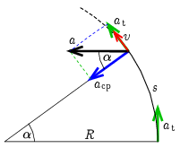
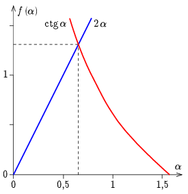

**Megoldás.**
 A motorosnak kezdetben csak érintőirányú gyorsulása van, később viszont a gyorsulásvektora az $a_\mathrm{t}$ nagyságú tangenciális és az $a_\mathrm{cp}$ nagyságú centripetális gyorsulás eredője. Jelöljük a keresett elfordulási szöget $\alpha$-val. Az 1. ábrán látható, hogy amikor az eredő gyorsulás először merőleges a kezdeti gyorsulásra, akkor
 $(1)$ $\cot\alpha=\frac{a_\mathrm{cp}}{a_\mathrm{t}}.$

 1. ábra

 A nulla kezdősebességről állandó $a_\mathrm{t}$ érintőirányú gyorsulással mozgó testre fennáll:
 $v^2=2a_\mathrm{t}s=2a_\mathrm{t}R\alpha,$
 ahol $v$ a motoros sebessége az $s=R\alpha$ út megtétele után. A centripetális gyorsulás:
 $a_\mathrm{cp}=\frac{v^2}{R}=\frac{2a_\mathrm{t}R\alpha}{R}=2a_\mathrm{t}\alpha.$
 Ezt behelyettesítve az (1) kifejezésbe a
 $\cot\alpha=2\alpha$
 transzcendens egyenletet kapjuk.
 Az egyenletet iterálással vagy grafikusan ( 2. ábra ) megoldva a keresett elfordulási szög:
 $\alpha=0{,}653\approx 37^\circ.$

 2. ábra

 Az iterálásnál egy tetszőleges $0<\alpha_0<\tfrac{\pi}{2}$ értékről elindulhatunk. Ezután az
 $\alpha_{i+1}=\frac{\alpha_i+\frac{\cot\alpha_i}{2}}{2}$
 eljárást addig folytatjuk, amíg az értéket kellő pontossággal megkapjuk. Ha $\alpha_0=1$ értékről indulunk, akkor négy tizedesre számolva
$$\begin{gather*}
\alpha_1=0{,}6605,\\
\alpha_2=0{,}6520,\\
\alpha_3=0{,}6535,\\
\alpha_4=0{,}6532,\\
\alpha_5=0{,}6533,\\
\alpha_6=0{,}6533.
\end{gather*}$$
 Ugyanilyen jó a ,,fordított''
 $\alpha_{i+1}=\frac{\alpha_i+\operatorname{arccot}(2\alpha_i)}{2}$
 algoritmus. Ekkor, szintén $\alpha_0=1$-ről indulva:
$$\begin{gather*}
\alpha_1=0{,}7318,\\
\alpha_2=0{,}6656,\\
\alpha_3=0{,}6549,\\
\alpha_4=0{,}6534,\\
\alpha_5=0{,}6533,\\
\alpha_6=0{,}6533.
\end{gather*}$$
 Megjegyzés. Lassabban konvergál, de egy zsebszámológépen* (természetesen radián állásban) például 1 kiinduló értékről indulva periodikusan a
 $$\begin{gather*}
\times\\
2\\
=\\
\textrm{1/x}\\
\textrm{INV tan}
\end{gather*}$$
 gombokat nyomkodva (mindaddig, míg kellő pontossággal ugyanaz az érték adódik) szintén megkapjuk az eredményt. (Ugyanakkor a ,,másik irányban'' próbálkozva, a
 $$\begin{gather*}
\textrm{tan}\\
\textrm{1/x}\\
\div\\
2\\
=
\end{gather*}$$
 lépéssor divergens lesz.)

 *Az eljárás részletei attól függenek, hogy milyen zsebszámológépet használunk. Az itt leírtak egy egyszerű TI-30 SLR számológép jelöléseit tartalmazzák.

