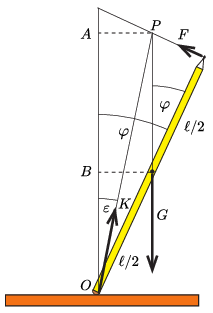
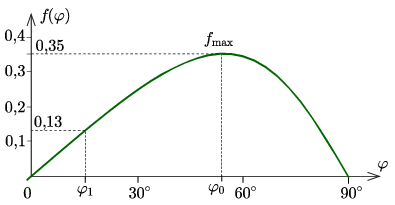
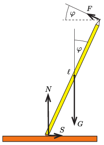

**I. megoldás.**
 Jelöljük a ceruza hosszát $\ell$-lel, a súlyát $G$-vel, a függőlegessel bezárt szögét pedig $\varphi$-vel (1. ábra) .

 1. ábra

 A ceruzára merőleges cérnaszál által kifejtett $F$ erő hatásvonala és a függőleges irányú nehézségi erő hatásvonala a $P$ pontban metszi egymást, tehát egyiküknek sincs forgatónyomatéka erre a pontra vonatkoztatva. A ceruzára a radíros végénél hat még az asztallap valamekkora $K$ erővel, aminek hatásvonala ugyancsak áthalad a $P$ ponton, csak így teljesül a forgatónyomatékok egyensúlyának feltétele.
 Jelöljük a $\boldsymbol{K}$ erő hatásvonalának a függőlegessel bezárt szögét $\varepsilon$-nal. A ceruza akkor nem csúszik meg az asztallapon, ha a tapadó súrlódás együtthatója legalább $\tan\varepsilon$.

 Megjegyzés. A $\boldsymbol{K}$ erő függőleges komponensét $N$ nyomóerőnek, a vízszintes komponensét $S$ súrlódási erőnek szokták nevezni. Mivel $N=K\cos\varepsilon$ és $S=K\sin\varepsilon$, a tapadási súrlódás $S\le\mu N$ feltétele valóban $\tan\varepsilon\le\mu$ esetén teljesül.

 Az 1. ábráról leolvasható, hogy
 $AP=\frac{\ell}{2}\sin\varphi,$
 $AB=\frac{\ell}{2\cos\varphi},$
 $OB=\frac{\ell}{2}\cos\varphi,$
 tehát
 $\tan\varepsilon=\frac{AP}{AB+OB}=\frac{\sin\varphi\,\cos\varphi}{1+\cos^2\varphi}\equiv f(\varphi).$
 a) Adott $\varphi$ szögnél a ceruza egyensúlyának feltétele: $\mu\ge f(\varphi)$. Mivel $\varphi_1=15^\circ$-nál $f(\varphi_1)\approx 0{,}13$, legalább ekkora tapadási súrlódási együttható szükséges a radír és az asztallap között, hogy a ceruza ne csússzon meg.

 b) Ha a ceruzát függőleges helyzetéből a cérnaszálnál fogva lassan engedjük megdőlni, a radír elcsúszása akkor kerülhető el, ha minden $0\le\varphi\le 90^\circ$ szögnél teljesül a $\mu\ge f(\varphi)$ feltétel. Ha az $f(\varphi)$ függvény a legnagyobb értékét valamekkora $\varphi_0$ szögnél veszi fel és $f(\varphi_0)=f_\mathrm{max}$, akkor a ceruza csúszásmentes eldönthetőségének feltétele: $\mu\ge f_\mathrm{max}$.
 Határozzuk meg $f(\varphi)$ legnagyobb értékét! Bevezetve az $x=\tan\varphi$ jelölést, $f(\varphi)$ helyett vizsgálhatjuk az
 $f(x)=\frac{x}{2+x^2}$
 kifejezést, kereshetjük ennek legnagyobb értékét, vagy ami ezzel egyenértékű, kereshetjük
 $\frac{1}{f(x)}=\frac{2}{x}+x$
 minimális értékét. Ez a számtani és a mértani középértékekre vonatkozó egyenlőtlenségből könnyen megkapható:
 $\frac{2}{x}+x=2\cdot\frac{\frac{2}{x}+x}{2}\ge 2\cdot\sqrt{\frac{2}{x}\cdot x}=\sqrt{8}.$
 Ezek szerint a kérdésre adható válasz:
 $\mu\ge \frac{1}{\sqrt{8}}\approx 0{,}35$
 súrlódási együttható esetén ,,fektethető le'' a ceruza az asztalra anélkül, hogy a radíros vége elcsúszna.
 Ugyanez az eredmény úgy is megkapható, hogy az $f(\varphi)$ függvény szélsőértékét a deriváltja eltűnéséből határozzuk meg:
 $f'(\varphi)=\left.\frac{(\cos^2\varphi-\sin^2\varphi)(1+\cos^2\varphi)+2\sin^2\varphi\cos^2\varphi}{(1+\cos^2\varphi)^2}\right|_{\varphi=\varphi_0} =0,$
 ahonnan
 $\varphi_0=\arccos\frac{1}{\sqrt{3}}\approx 55^\circ\qquad\textrm{és}\qquad f_\mathrm{max}=f(\varphi_0)=\frac{1}{\sqrt{8}}.$
 Az $f(\varphi)$ függvény grafikonját ábrázolva (lásd a 2. ábrát ) arról is leolvashatjuk a $15^\circ$-os dőlésszöghöz tartozó kritikus súrlódási együttható értékét, illetve a függvény maximumhelyét és legnagyobb értékét.

 2. ábra

**II. megoldás.**
 A (3. ábra) jelöléseivel a ceruza egyensúlyának feltétele:
 $N+F\sin\varphi-G=0,$
 $S-F\cos\varphi=0,$
 $G\,\frac{\ell}{2}\sin\varphi-F\ell=0.$

 3. ábra

 Innen $F$ kiküszöbölése után kapjuk, hogy
 $S=\frac12 G \sin\varphi\,\cos\varphi,$
 $N=G\left(1-\frac12\sin^2\varphi\right).$
 A ceruza radírgumis vége akkor nem csúszik meg az asztallapon, ha
 $\mu\ge \frac{S}{N}= \frac{\sin\varphi\,\cos\varphi}{1+\cos^2\varphi}\equiv f(\varphi).$
 A megoldás további része megegyezik az I. megoldásnál leírtakkal.

