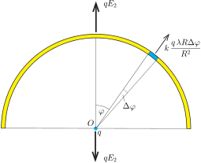
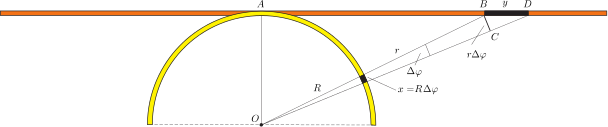

**I. megoldás.**
 Legyen a szál vonalmenti töltéssűrűsége (egységnyi hosszúságú darabjának töltése) $\lambda$. A nagyon hosszú, egyenes száltól $R$ távolságban az elektromos térerősség nagysága
 $(1)$ $E_1=\frac{1}{2\pi\varepsilon_0}\,\frac{\lambda}{R},$
 amit a $k=1/(4\pi\varepsilon_0)$ Coulomb-állandóval kifejezve így is felírhatunk:
 $(1')$ $E_1=2k\frac{\lambda}{R}.$

 Megjegyzés. A fenti képlet helyességét pl. a Gauss-féle fluxustörvényből is megkaphatjuk. A szál $\ell$ hosszúságú darabjának töltése $Q=\lambda\ell$. Ha a szálat koaxiálisan körülvesszük egy $R$ sugarú hengerrel, annak palástjára vonatkoztatott elektromos fluxus $\Psi=2R\pi\ell E_1.$ A fluxustörvény szerint $\Psi=\tfrac{1}{\varepsilon_0}Q$, ezekből pedig (1) már következik.

 Tekintsük most az $R$ sugarú, félkör alakú szál esetét. A félkör $O$ középpontjában az elektromos térerősség iránya a félkör szimmetriatengelye, nagysága pedig legyen $E_2$. Ha a félkör középpontjába egy $q$ nagyságú ponttöltést helyezünk, arra $qE_2$ nagyságú erő hat. Ugyanekkora nagyságú, de ellentétes irányú erőt fejt ki a ponttöltés az egyenletesen töltött szálra.

 1. ábra

 A félkör alakú szálnak egy kicsiny, $O$-ból nézve $\Delta\varphi$ szög alatt látszó darabkájának töltése $\lambda R\Delta\varphi,$ erre tehát a $q$ töltés
 $\Delta F=k\frac{q\,\lambda R\Delta\varphi}{R^2}$
 nagyságú, sugár irányban ,,kifelé'' mutató erőt fejt ki. Ezen erőnek a szimmetriatengely irányú komponense $\Delta F \cos\varphi$, ahonnan az egyes darabkák járulékainak összegzésével kapjuk, hogy
 $qE_2=\sum k\frac{q\,\lambda R\Delta\varphi}{R^2}\,\cos\varphi.$
 Innen – a felosztás finomításával integrálásra áttérve – adódik a keresett eredmény:
 $E_2=k\frac{\lambda}{R}\int\limits_{-\pi/2}^{\pi/2}\cos\varphi\,\mathrm{d}\varphi.$
 Az integrál számértéke 2, így (1')-vel összevetve megállapíthatjuk, hogy $E_2=E_1$, vagyis a kétféle elrendezés térerőssége a vizsgált pontban ugyanakkora .

 Megjegyzés. A félkörre ható eredő erő nagyságát integrálszámítás nélkül is meghatározhatjuk. Megállapíthatjuk, hogy a félkör alakú szálra hosszegységenként $p=kq\lambda/R^2$ nagyságú, a száldarabka érintőjére merőleges irányú erő hat. ($p$ a folyadékok nyomásához hasonló, ,,vonalmenti nyomásként'' értelmezhető mennyiség.) Egészítsük ki a félkör-szálat egy a végpontjai között elhelyezkedő, $2R$ hosszúságú egyenes darabbal, aminek ugyanakkora a töltéssűrűsége, mint a félköré. Ha erre az egyenes szálra is $p$ ,,nyomást'', tehát $2Rp$ nagyságú erőt fejtünk ki, akkor a zárt hurokra ható eredő erő nullává válik. (Analóg helyzet: egy zárt tartályra a benne lévő gáz nyomása nem fejt ki eredő erőt.) Ennek megfelelően a félkörre ható $qE_2$ elektromos erő is $2Rp=2kq\lambda/R$ nagyságú, azaz $E_2=E_1$ teljesül.

**II. megoldás.**
 A két töltött szál $O$ pontbeli elektromos térerősségét anélkül is össze tudjuk hasonlítani, hogy bármelyik térerősség nagyságát kiszámítanánk. Megmutatjuk, hogy a két szál egymásnak megfeleltethető kicsiny darabkáinak térerőssége ugyanolyan irányú és ugyanolyan nagyságú vektor, emiatt ezeknek a vektoroknak az összege, vagyis az eredő elektromos térerősség a kétféle alakú szálra ugyanakkora.
 Tekintsük a félkörív és az egyenes szál azon kicsiny darabkáit, amelyek az $O$ pontból nézve ugyanolyan irányban és ugyanakkora szög alatt látszanak.

 2. ábra

 A 2. ábra jelöléseit követve megállapíthatjuk, hogy a körív alakú szál kicsiny $x=R\Delta\varphi$ hosszúságú ívén $Q_1=\lambda x$ töltés, az egyenes szál $y$ hosszúságú részén pedig $Q_2=\lambda y$ töltés található. Ezek a töltések az $O$ pontban
 $E_1=k\lambda\frac{x}{R^2},\qquad\textrm{illetve}\qquad E_2=k\lambda\frac{y}{r^2}$
 nagyságú elektromos térerősséget hoznak létre. Ez a két térerősség azonban egyforma nagy, hiszen az $OAB\triangle$ és a $BCD\triangle$ hasonlósága miatt
 $\frac{r}{R}=\frac{y}{r\Delta\varphi}=\frac{yR}{xr},\qquad\textrm{tehát}\qquad\frac{y}{r^2}=\frac{x}{R^2}.$
 A fenti megfontolások során kihasználtuk, hogy $x\ll R$ és $y\ll r$, vagyis a szálak kis darabkáinak látószöge nagyon kicsi, emiatt a kicsiny körívek hossza és a megfelelő húrok hossza egyenlőnek vehető.

