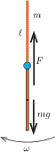

**Megoldás.**
 Jelöljük a tornászt modellező rúd tömegét $m$-mel, hosszát $\ell$-lel. Egy ilyen rúdnak a végpontján átmenő, rá merőleges tengelyre vonatkoztatott tehetetlenségi nyomatéka $\Theta=\tfrac{1}{3}m\ell^2.$
 Miközben a rúd a felső állásból az alsóba ér, a tömegközéppontja $\ell$ távolsággal mélyebbre kerül, tehát a helyzeti energiája $mg\ell$-lel csökken. Ha a kezdetben álló rúd szögsebessége a legmélyebb helyzetben $\omega$ lesz, akkor a mozgási energiája $\frac{1}{2}\Theta\omega^2$-tel növekszik.

 Elhanyagolható súrlódás és közegellenállás esetén alkalmazható a mechanikai energia megmaradásának tétele:
 $mg\ell=\frac{1}{2}\left(\frac{1}{3}m\ell^2\right)\omega^2,$
 vagyis a rúd maximális szögsebessége:
 $\omega=\sqrt{\frac{6g}{\ell}}.$
 A rúd alsó helyzetében a rúd tömegközéppontja
 $v=\frac{1}{2}\ell\omega=\sqrt{\frac{3}{2}g\ell}$
 sebességgel $\ell/2$ sugarú körpályán mozog, így a gyorsulása függőlegesen felfelé
 $a=\frac{v^2}{\ell/2}=3g.$
 A rúd tömegközéppontjára felírható mozgásegyenlet:
 $F-mg=ma,$
 ahonnan a tengely által kifejtett erő:
 $F=4mg.$
 Ennek az erőnek az ellenereje a nyújtó tengelyére ható, függőlegesen lefelé irányuló, $4mg$ nagyságú erő, ez okozza a nyújtó rúdjának lehajlását.

