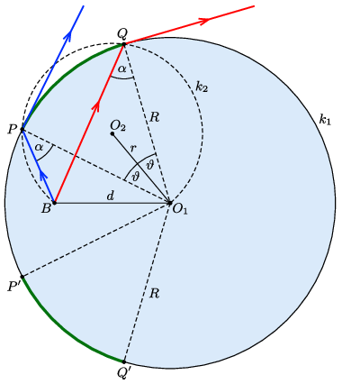

**Megoldás.**
 Az alábbi felülnézeti ábrán az akváriumot az $O_1$ középpontú $k_1$ kör szemlélteti, a búvár helyzetét pedig a $B$ pont. Mivel a fény útja megfordítható, a kérdést feltehetjük így is: a $B$ pontból vízszintesen kiinduló fénysugarak a $k_1$ kör mely részén tudnak kilépni az akváriumból?

 Egy fénysugár kilépésének feltétele, hogy a beesési szög kisebb legyen a teljes visszaverődés $\alpha=\arcsin(1/n)$ határszögénél. (Könnyen belátható, hogy ez akkor is igaz marad, ha az akvárium falának fénytörését is figyelembe vesszük, feltéve, hogy a falvastagság sokkal kisebb az $R$ sugár értékénél.) Tekintsünk egy olyan fénysugarat, amely éppen a kritikus $\alpha$ beesési szögben, valamely $P$ pontban érkezik az akvárium falához (lásd a kék töröttvonalat az ábrán). A $P$ pont tehát rajta van a $BO_1$ szakaszhoz tartozó, $\alpha$ szögű $k_2$ látószögköríven; jelöljük ennek középpontját $O_2$-vel! A $k_2$ körív az eredeti $k_1$ kört nem csak a $P$ pontban, hanem egy másik $Q$ pontban is metszi, azaz létezik egy másik fénysugár is (az ábrán a piros töröttvonal), amely a teljes visszaverődés határhelyzetében halad. A $k_1$ kör (rövidebb) $PQ$ íve mentén az akvárium falát elérő fénysugarak mind teljes visszaverődést szenvednek, mert ezekből a pontokból nézve a $BO_1$ szakasz $\alpha$-nál nagyobb szögek alatt látszik. Ugyancsak nem jut ki fény a $PQ$ körív $BO_1$ tengelyre való tükrözésével kapott $P'Q'$ köríven sem. Ha a $k_1$ kör $PQ$ ívéhez tartozó középponti szöget $2\vartheta$ módon jelöljük, akkor a $k_1$ kör kerületének
 $\eta=\frac{2\pi-4\vartheta}{2\pi}=1-\frac{2\vartheta}{\pi}$
 hányadát tudja fény elhagyni.
 Hátra van még a $\vartheta$ szög meghatározása. Ehhez először is vegyük észre, hogy az $O_1O_2B$ háromszög egyenlőszárú, valamint a kerületi és középponti szögek tétele miatt $O_1O_2B\angle=2\alpha$. Ennek segítségével a $k_2$ körív sugara kiszámítható:
 $r=\frac{d}{2\sin\alpha}=\frac{nd}{2}.$
 Most tekintsük a szintén egyenlőszárú $O_1O_2P$ háromszöget, melyben a $\vartheta$ szög koszinusza így írható:
 $\cos\vartheta=\frac{R}{2r}=\frac{R}{nd}.$
 Mindezek felhasználásával a feladat kérdésére a válasz megadható:
 $\eta=1-\frac{2}{\pi}\arccos\frac{R}{nd}.$
 Ennek az eredménynek csak $R/(nd)\leq 1$ esetén van értelme. Ha a búvár $d\leq R/n$ távolságra van az akvárium szimmetriatengelyétől, akkor víszintesen körbenézve minden irányban kilát a tartályból, azaz $\eta=1$.

