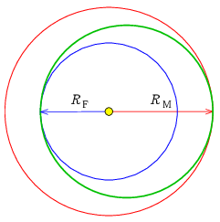

**Megoldás.**

 Az oda és a visszautazás időtartama egyaránt az űrhajó ellipszispályájához tartozó keringési idő fele. Az ellipszis pálya nagytengelye a két bolygópálya nagytengelyének számtani közepe, az időt pedig Kepler III. törvényéből kaphatjuk meg – ami szerint a bolygók $T$ keringési idejének négyzete arányos a pályák $a$ fél-nagytengelyének köbével: $T=\alpha a^{3/2}$, ahol $\alpha$ azonos a Nap körül keringő összes égitestre.
 $T_\mathrm{H}=\alpha a_\mathrm{H}^{3/2}=\alpha\left(\frac{1}{2}(R_\mathrm{F}+R_\mathrm{M})\right)^{3/2}=\alpha\left(\frac{1}{2}\left(\alpha^{-2/3}T_\mathrm{F}^{2/3}+\alpha^{-2/3}T_\mathrm{M}^{2/3}\right)\right)^{3/2}=\left(\frac{1}{2}\left(T_\mathrm{F}^{2/3}+T_\mathrm{M}^{2/3}\right)\right)^{3/2}=517{,}7\,\mathrm{nap}.$
 Az oda és a visszaút egyformán feleennyi, azaz 259 napig tart.
 A Marson tartózkodás időtartamát jelöljük $t$-vel. A teljes űrutazás ideje alatt a Föld
 $\frac{t+T_\mathrm{H}}{T_\mathrm{F}}$
 fordulatot tesz meg a Nap körül (ez nem feltétlen egész szám, a Naphoz húzott vezérsugár ennyiszer 360$^\circ$-ot fordul el). Ezalatt az űrhajósok az űrhajón és a Marson
 $\frac{1}{2}+\frac{t}{T_\mathrm{M}}+\frac{1}{2}$
 fordulatot tesznek meg a Nap körül. A két fordulat különbsége egész szám kell legyen, a Föld legalább eggyel több kört tesz meg:
 $\frac{t+T_\mathrm{H}}{T_\mathrm{F}}=1+\frac{t}{T_\mathrm{M}}+k\qquad k=1,2,3\ldots$
 ahonnan
 $t=\frac{T_\mathrm{M}\left((1+k)T_\mathrm{F}-T_\mathrm{H}\right)}{T_\mathrm{M}-T_\mathrm{F}}.$
 Az első alkalom visszaindulásra
 $t_1=\frac{687(2\cdot365{,}25-517{,}7)}{687-365{,}25}=454{,}4$
 nap után adódik, majd pedig $T_\mathrm{sp}=\frac{T_\mathrm{F}T_\mathrm{M}}{T_\mathrm{M}-T_\mathrm{F}}=780$ naponként (az utóbbi időtartamot szinodikus periódusnak nevezik).

 Megjegyzések. 1. A megadott ellipszispályát Hohmann-pályának nevezik Walter Hohmann német mérnök után, aki 1925-ben javasolta, mint rakétaüzemanyag-felhasználás szempontjából leggazdaságosabb bolygóközi pályát.

 2. A Föld és a Mars pályájának numerikus excentricitása: 0,0167, illetve 0,0934. A Mars-pálya inklinációja (a pálya síkjának a Föld pályájáéval, vagyis az ekliptikával bezárt szöge): $1{,}85^\circ$. Ezeket a végső, pontosabb tervezéskor figyelembe kell venni.

