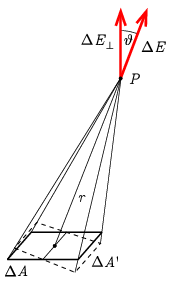

**Megoldás.**
 Jelöljük a kérdéses pontot $P$-vel! A töltött háromszög lapnak a $P$-n átmenő, a lapra merőleges egyenes egy úgynevezett három fogású szimmetria tengelye, azaz a háromszöget ekörül a tengely körül $2\pi/3$-mal vagy $4\pi/3$-mal elforgatva nem változhat meg a tengelyen mérhető elektromos térerősség. Következésképp annak a tengely irányába kell mutatnia. Tekintsük a háromszög egy kicsiny $\Delta A$ nagyságú darabját! Ennek a $\Delta Q=\sigma\Delta A$ töltése a $P$-ben olyan $\Delta E$ térerősséget hoz létre, aminek a lapra merőleges komponense
 $\Delta E_\perp=\Delta E\cos\vartheta=\frac{1}{4\pi\varepsilon_0}\frac{\sigma\Delta A}{r^2}\cos\vartheta.$
 Itt $r$ a felület darab távolsága $P$-től, $\vartheta$ pedig az adott szakasz irányának a síklap normálisával bezárt szöge, ahogy az ábra mutatja.

 (A $\Delta E_\parallel=\Delta E\sin\vartheta$ komponensekkel nem kell foglalkoznunk, mert azok eredője az említett szimmetria miatt eltűnik.) Mivel $\Delta A\cos\vartheta=\Delta A'$ a $\Delta A$-nak a $P$ irányára merőleges vetülete,
 $\frac{\Delta A\cos\vartheta}{r^2}=\Delta\Omega$
 az a térszög, ami alatt a $\Delta A$ a $P$-ből látszik sr-ben (szteradiánban) kifejezve. Így a teljes térerősség
 $E=\frac{\sigma}{4\pi\varepsilon_0}\sum\Delta\Omega=\frac{\sigma}{4\pi\varepsilon_0}\Omega,$
 ahol $\Omega$ a teljes háromszöghöz tartozó térszög. Könnyen beláthatjuk, hogy a háromszögünk és a $P$ pont alkotta tetraéder pontosan egy kocka levágott csúcsa, amit a szabályos mellett három egyenlő szárú, derékszögű háromszög alkot. Következésképpen a $P$-nél lévő csúcs térszöge a teljes $4\pi$ térszög nyolcada, azaz
 $\Omega=\frac{\pi}{2},$
 azaz
 $E=\frac{\sigma}{8\varepsilon_0}.$

