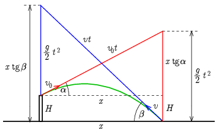

**I. megoldás.**
 A kő vízszintes sebessége, amely a mozgás során végig állandó, legyen $v_x$, a becsapódás keresett távolsága pedig $x$. Ez alapján a kő
 $t=\frac{x}{v_x}$
 idő múlva csapódik a talajba. A kő az eldobás pillanatában $y(0)=H$ magasságban van, és függőleges sebessége $v_y(0)=v_x\tan\alpha$, míg a becsapódáskor $y(t)=0$ és $v_y(t)=-v_x\tan\beta$ (a negatív előjel abból származik, hogy $v_y(t)<0$). Mindezek alapján két egyenletet írhatunk fel:
$$\begin{gather*}
y(t)=H+v_y(0)t-\frac{g}{2}t^2=H+v_x\tan\alpha\,t-\frac{g}{2}t^2=H+x\tan\alpha-\frac{g}{2v_x^2}x^2=0,\\
v_y(t)=v_y(0)-gt=v_x\tan\alpha-gt=v_x\tan\alpha-\frac{g}{v_x}x=-v_x\tan\beta.
\end{gather*}$$
 A második alapján
 $\frac{g}{v_x^2}x=\tan\alpha+\tan\beta,$
 és ezt az elsőbe behelyettesítve, majd rendezve:
$$\begin{gather*}
H+x\tan\alpha-\frac{x}{2}(\tan\alpha+\tan\beta)=0,\\
x=\frac{2H}{\tan\beta-\tan\alpha}.
\end{gather*}$$

 Megjegyzések. 1. A megoldásunk alapján:
 $v_x=\sqrt{\frac{2gH}{\tan^2\beta-\tan^2\alpha}},$
 és ebből a mozgáshoz szükséges kezdősebesség:
 $v_0=\frac{v_x}{\cos\alpha}=\frac{1}{\cos\alpha}\sqrt{\frac{2gH}{\tan^2\beta-\tan^2\alpha}}=\sqrt{\frac{2gH}{\tan^2\beta\cos^2\alpha-\sin^2\alpha}}.$

 2. Ha $H>0$ (azaz valóban egy toronyból és nem egy gödörből dobtuk el a követ), akkor csak $\beta>\alpha$ esetben kapunk pozitív távolságot. Ez érthető, hiszen amikor a kő már lefelé haladva eléri a $H$ magasságot, akkor vízszintessel bezárt szöge éppen $\alpha$, és ezután egyre meredekebb szögben esik, tehát valóban $\beta>\alpha$.
 $\beta=\alpha$ estében $x\to\infty$, ehhez azonban $v_0\to\infty$ kezdősebesség kellene. Ez is érthető: nagyon nagy távolság esetében $H$ elhanyagolható a pálya magasságához képest, a mozgás olyan, mintha a talajról dobnánk el a követ, amikor is valóban $\beta=\alpha$.

**II. megoldás.**
 Két trükk alkalmazásával egyszerűvé válik a megoldás. Elsőként kihasználjuk azt, hogy a veszteség nélküli hajítás megfordítható mozgás, ami visszafelé is ugyanannyi ideig tart. A mozgás leírására pedig az $\alpha$, illetve $\beta$ szögű ferdeszögű koordináta-rendszert érdemes használnunk, ahogy az ábrán látható.

 Pirossal azt jelöltük, hogy a kő $v_0$ sebességgel, $\alpha$ szögű irányba, egyenes vonalú, egyenletes mozgással $v_0t$ utat tesz meg, miközben függőlegesen szabadon esik $\tfrac{g}{2}t^2$ távolságot. A kő függőleges elmozdulása így írható fel:
 $\frac{g}{2}t^2=x\tan\alpha+H.$
 Kékkel a visszafelé lejátszódó folyamatot ábrázoltuk, amikor a kő $v$ sebességgel, $\beta$ szögű irányba, egyenletes mozgással $vt$ utat tesz meg, és eközben szintén $\tfrac{g}{2}t^2$ távolságot esik, ami most így írható fel:
 $\frac{g}{2}t^2=x\tan\beta-H.$
 A két kifejezést egyenlővé téve megkapjuk a kérdéses $x$ távolságot:
 $x\tan\alpha+H=x\tan\beta-H\qquad\Rightarrow\qquad x=\frac{2H}{\tan\beta-\tan\alpha}.$

