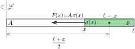
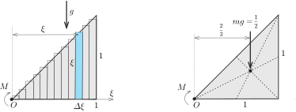

**Megoldás.**
 A megforgatott rúd különböző részeiben különböző nagyságú húzófeszültség alakul ki, emiatt a rúd teljes megnyúlása csak az egyes (kicsiny) darabkái megnyúlásának összegzésével számítható ki. A feszültségeket mindhárom esetben a deformálatlan helyzetben számítjuk ki, majd ebből a feszültségből következtetünk a rúd kicsiny darabkáinak relatív hosszváltozására. Ez a közelítés azért alkalmazható, mert egy fémrúd rugalmas alakváltozása a szokásos húzófeszültségeknél nagyon kis mértékű, nagyon nagy feszültségeknél pedig az alakváltozás már nem követi a Hooke-törvényt. (A fenti közelítés nyilván nem lenne alkalmazható egy slinky-rugónál, vagy más ,,nagyon lágy'' rugóknál.)
 Tekintsük először a c) esetet, és számítsuk ki a rúd egyik felének megnyúlását. Jelöljük a félrúd hosszát $\ell$-lel, keresztmetszetét $A$-val, sűrűségét $\varrho$-val, a Young-modulusát $E$-vel, a forgás szögsebességét pedig $\omega$-val.
 A rúdnak a forgástengelytől $x$ távolságra lévő keresztmetszeténél fellépő $F(x)$ erő a megforgatott rúd $\ell-x$ hosszúságú, $m=\varrho A(\ell-x)$ tömegű darabjának centripetális gyorsulását biztosítja ( 1. ábra ). Mivel a kérdéses rúddarab tömegközéppontja $r=\ell-\frac{\ell-x}{2}=\frac{\ell+x}{2}$ távol van a forgástengelytől, a mozgásegyenlet:
 $F(x)=mr\omega^2=\frac{1}{2}\varrho A\omega^2(\ell^2-x^2).$
 A húzófeszültség ezek szerint
 $\sigma(x)=\frac{F(x)}{A}=\frac{1}{2}\varrho\omega^2(\ell^2-x^2).$

 1. ábra

 Osszuk fel – gondolatban – a rudat igen kicsi, $\varDelta x\ll\ell$ hosszúságú darabokra, és egy-egy darabkán belül tekintsük a húzófeszültséget állandó, $\sigma(x)$ nagyságúnak. A Hooke-törvény szerint egy-egy rúddarabka megnyúlása
 $\Delta s(x)=\frac{\sigma(x)}{E}\varDelta x,$
 a teljes ($\ell$ hosszúságú) félrúd megnyúlása így
 $s=\sum\varDelta s(x)=\frac{\varrho\omega^2}{2E}\sum_{x=0}^\ell(\ell^2-x^2)\varDelta x.$
 Célszerű az $x$ változót $x=\xi\cdot\ell$ alakban felírni, ahol $0\le\xi\le 1$ egy dimenziótlan mennyiség. Nyilván $\varDelta x=\ell\cdot\varDelta\xi$, és így
 $(2)$ $s=\frac{\varrho\omega^2\ell^3}{2E}\sum_{\xi=0}^1(1-\xi^2)\varDelta\xi.$
 A fenti összeg első tagja magától értetődő:
 $\sum_{\xi=0}^1 1\cdot\varDelta\xi=1.$
 A második tag már nem ennyire nyilvánvaló; kiszámítására három módszert is megadunk.

 I. módszer. A kérdéses összeg egy határozott integrál annál jobb közelítése, minél kisebb darabokra osztottuk fel a félrudat:
 $\sum_{\xi=0}^1 \xi^2\,\varDelta\xi\approx\int_0^1\xi^2\,\mathrm{d}\xi=\left.\frac{\xi^3}{3}\right\vert_0^1=\frac{1}{3}.$

 II. módszer. Ha a félrudat $n\gg 1$ számú (egyforma hosszúságú) darabra osztottuk fel, akkor a kérdéses összeg
 $\sum_{\xi=0}^1\xi^2\,\varDelta\xi\approx\sum_{k=1}^n\left(\frac{k}{n}\right)^2\,\frac1n=\frac{n(n+1)(2n+1)}{6n^3}=\frac{1}{6}\left(1+\frac{1}{n}\right)\left(2+\frac{1}{n}\right)\approx\frac{1}{3}.$

 III. módszer. Tekintsünk egy derékszögű, egyenlő szárú háromszög alakú lemezt, amelynek felületegységre jutó súlya éppen 1. Ha a lemez függőleges síkban helyezkedik el úgy, hogy a háromszög egyik (egységnyi hosszúságú) szára vízszintes és a csúcsa az origóban van (lásd a 2. ábrát ), akkor a nehézségi erő $M$ forgatónyomatéka az $O$ csúcsra éppen a keresett szummával egyenlő. (Ha ugyanis a lemezt – gondolatban - sok keskeny csíkra vágjuk, akkor az egyes csíkok területe, vagyis a tömege $\xi\cdot\varDelta\xi$, az erőkar, azaz a csúcstól vízszintesen mért távolság pedig ugyancsak $\xi$ nagyságú.)

 2. ábra

 $M\approx\sum_{\xi=0}^1\xi\cdot(\xi\,\varDelta\xi).$
 Ugyanezt a forgatónyomatékot úgy is megkaphatjuk, hogy a háromszög súlyát (ami a területével, vagyis $1/2$-del egyezik meg) megszorozzuk az erőkarral, azaz a súlyponton átmenő függőleges egyenes és a csúcs $2/3$ egységnyi távolságával:
 $M=\frac{1}{2}\cdot\frac{2}{3}=\frac{1}{3}.$
 A fentiek szerint
 $\sum_{\xi=0}^1(1-\xi^2)\varDelta\xi=1-\frac{1}{3}=\frac{2}{3},$
 és így (2) felhasználásával a teljes ($2\ell$ hosszúságú) rúd megnyúlása a c) esetben:
 $(3c)$ $s_\mathrm{c}=\frac{\varrho\omega^2\ell^3}{3}\left(\frac{1}{E_\mathrm{A}}+\frac{1}{E_\mathrm{B}}\right)=\frac{\varrho\omega^2\ell^3}{6E_\mathrm{A}E_\mathrm{B}}\left(2{E_\mathrm{A}}+2{E_\mathrm{B}}\right).$
 Számítsuk ki most a $2\ell$ hosszúságú rúd megnyúlását, ha a rudat az A rúd végpontja körül forgatjuk $\omega$ szögsebességgel. A húzófeszültség ebben az esetben a forgástengelytől $x$ távolságban
 $\sigma(x)=\frac{1}{2}\varrho\omega^2(4\ell^2-x^2),$
 a megnyúlás pedig (a rúd két felének különböző Young-modulusával számolva)
 $s_\mathrm{a}=\frac{\varrho\omega^2}{2}\left(\frac{1}{E_\mathrm{A}}\sum_{x=0}^\ell(4\ell^2-x^2)\varDelta x+\frac{1}{E_\mathrm{B}}\sum_{x=\ell}^{2\ell}(4\ell^2-x^2)\varDelta x\right).$
 Célszerű bevezetni az $x=2\ell\cdot\xi$ jelölést ($0\le\xi\le 1$), amellyel a megnyúlás így írható:
 $s_\mathrm{a}=4\varrho\omega^2\ell^3\left(\frac{1}{E_\mathrm{A}}\sum_{\xi=0}^{1/2}(1-\xi^2)\varDelta\xi+\frac{1}{E_\mathrm{B}}\sum_{\xi=1/2}^{1}(1-\xi^2)\varDelta\xi\right).$
 Az itt szereplő összegeket a korábban alkalmazott három módszer bármelyikével ki tudjuk számítani, és az eredmény:
 $\sum_{\xi=0}^{1/2}(1-\xi^2)\varDelta\xi=\frac{11}{24},\qquad\text{illetve}\qquad\sum_{\xi=1/2}^{1}(1-\xi^2)\varDelta\xi=\frac{5}{24}.$
 Ennek megfelelően a rúd megnyúlása az a) esetben
 $(3a)$ $s_\mathrm{a}=\frac{\varrho\omega^2\ell^3}{6}\left(\frac{11}{E_\mathrm{A}}+\frac{5}{E_\mathrm{B}}\right)=\frac{\varrho\omega^2\ell^3}{6E_\mathrm{A}E_\mathrm{B}}\left(5{E_\mathrm{A}}+11{E_\mathrm{B}}\right).$
 Ebből $E_\mathrm{A}$ és $E_\mathrm{B}$ felcserélésével megkapjuk a b) esethez tartozó megnyúlást is:
 $(3b)$ $s_\mathrm{b}=\frac{\varrho\omega^2\ell^3}{6E_\mathrm{A}E_\mathrm{B}}\left(11{E_\mathrm{A}}+5{E_\mathrm{B}}\right).$
 A három megnyúlás összehasonlításához elegendő a (3a), (3b) és (3c) képletekben szereplő zárójeles kifejezéseket összevetnünk, hiszen az előttük álló szorzótényezők megegyeznek. Nyilván $s_\mathrm{a}>s_\mathrm{b}$, mert $E_\mathrm{B}>E_\mathrm{A}$ esetén
 $\left(11{E_\mathrm{B}}+5{E_\mathrm{A}}\right)-\left(11{E_\mathrm{A}}+5{E_\mathrm{B}}\right)=7\left(E_\mathrm{B}-E_\mathrm{A}\right)>0,$
 és $s_\mathrm{b}>s_\mathrm{c}$ is teljesül, hiszen $E_\mathrm{A}>0$ és $E_\mathrm{B}>0$.
 A rúd teljes megnyúlása tehát az a) esetben lesz a legnagyobb és a c) esetben a legkisebb.

