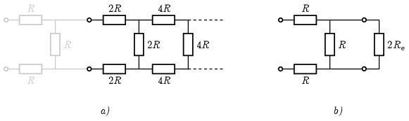

**Megoldás.**
 Ha az első ,,lépcsőt'' elhagynánk, akkor egy ugyanolyan végtelen ellenállásláncot kapnánk, mint az eredeti, csak minden ellenállás értéke az eredeti kétszerese lenne, és így az eredő ellenállása is az eredeti lánc (keresett) $R_\mathrm{e}$ eredő ellenállásának kétszerese lenne ( ábra a) része). Ez alapján az eredeti láncot az ábra b) részén látható módon átrajzolhatjuk.

 Ebből az eredő ellenállásra a következő egyenletet kapjuk:
 $R_\mathrm{e}=2R+R\times 2R_\mathrm{e}=2R+\frac{2RR_\mathrm{e}}{R+2R_\mathrm{e}}.$
 (Itt $\times$ a ,,replusz'' jele: a reciprokok összegének reciproka.) Az egyenletet rendezve:
 $2R_\mathrm{e}^2-5RR_\mathrm{e}-2R^2=0,$
 amelynek pozitív megoldása:
 $R_\mathrm{e}=\frac{5+\sqrt{41}}{4}R\approx 2{,}85 R.$

