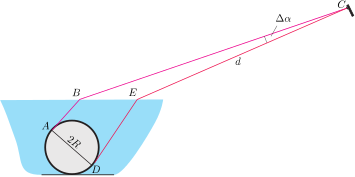
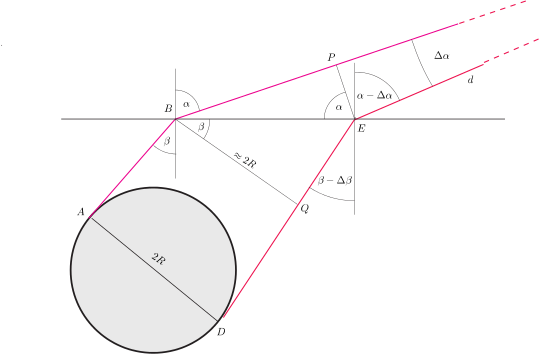
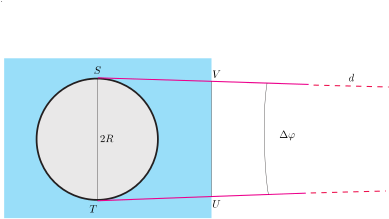

**Megoldás.**
 A fényképen a golyó képének méretét a fényképezőgépbe jutó fénysugarak legnagyobb szögeltérése határozza meg.
 Tekintsük azokat a fénysugarakat, amelyek a golyó középpontjára és a fényképezőgép kamerájára illeszkedő, függőleges síkban haladnak. Ezek közül a fényképezőgépbe érkezve azok zárnak be legnagyobb szöget egymással, amelyeknek a vízben haladó része éppen érinti az $R$ sugarú golyó kör alakú síkmetszetét. Az 1. ábrán és annak kinagyított részletén, a 2. ábrán a ,,szélső'' fénysugarakat és azok töréspontjait ábrázoltuk (a jobb láthatóság érdekében erősen torzított méretarányokkal.)

 1. ábra

 Legyen a fényképezőgép $C$ kamerájának és a vízből kilépő egyik fénysugár $E$ töréspontjának távolsága $EC=d$, a kamerába érkező fénysugarak (radiánban mért) szöge pedig $\Delta\alpha=BCE\angle$. Mivel $d\gg R$, állíthatjuk, hogy $\Delta\alpha\ll 1$.

 2. ábra

 A fénysugarak a vízfelülethez érve megtörnek. Ha a beesési szögek $\beta$ és $\beta-\Delta\beta$, a törési szögek pedig $\alpha$ és $\alpha-\Delta\alpha$, akkor a Snellius–Descartes-törvény szerint fennáll
 $(1)$ $\frac{\sin\alpha}{\sin\beta}=n,$
 valamint
 $(2)$ $\frac{\sin(\alpha-\Delta\alpha)}{\sin(\beta-\Delta\beta)}=n,$
 ahol $n=\frac{4}{3}$ a víz törésmutatója.
 A (2) egyenletből következik, hogy $\Delta\beta\ll 1$, és emiatt az $AB$ és $DQ$ egyenesek majdnem párhuzamosak, tehát a $BQ$ távolság jó közelítéssel $2R$-nek vehető. Másrészt a $PE$ távolság jól közelíthető a $d$ sugarú és $\Delta\alpha$ szögű körív hosszával, azaz $PE\approx d\,\Delta\alpha.$
 A $BE$ szakasz hossza (az említett közelítésekkel) kétféle képen is kiszámítható:
 $BE=\frac{PE}{\cos\alpha}=\frac{d\,\Delta\alpha}{\cos\alpha},$
 másrészt
 $BE=\frac{BQ}{\cos\beta}=\frac{2R}{\cos\beta}.$
 Ezek szerint a fényképezőgépbe érkező fénysugarak látószöge
 $\Delta\alpha=\frac{2R}{d}\,\frac{\cos\alpha}{\cos\beta},$
 ami (1) felhasználásával így is írható:
 $(3)$ $\Delta\alpha=\frac{2R}{d}\sqrt{\frac{1-\sin^2\alpha}{1-\frac{\sin^2\alpha}{n^2}}}.$
 A fényképen a golyó ,,függőleges mérete'' ezzel a látószöggel arányos.
 Határozzuk meg a golyó képének ,,vízszintes'' méretét is. A 3. ábra felülnézetből mutatja a golyó felületéről induló és a fényképezőgépbe érkező két szélső fénysugarat. Ezek a sugarak a víz felszínénél (az $U$ és $V$ pontoknál) megtörnek, de ez a vetületi ábrán nem látszik.

 3. ábra

 A fényképezőgépbe a két fénysugár valamekkora $\Delta\varphi$ szögeltéréssel érkezik, a kép vízszintes mérete ezzel a látószöggel arányos. Mivel $d\gg R$, nyilván $\Delta\varphi\ll 1,$ és így $UV\approx 2R,$ tehát jó közelítéssel
 $(4)$ $\Delta\varphi=\frac{2R}{d}.$
 A golyó képének torzítása a
 $K=\frac{\textrm{függőleges méret}}{\textrm{vízszintes méret}}=\frac{\Delta\alpha}{\Delta\varphi}$
 arányszámmal jellemezhető. (3) és (4) felhasználásával kapjuk, hogy
 $(5).$ $K=\sqrt{\frac{1-\sin^2\alpha}{1-\frac{\sin^2\alpha}{n^2}}}.$
 Függőlegesen lefelé fényképezve a golyót $\alpha=0,$ ilyenkor $K=1,$ tehát a képe kör. Ugyancsak torzításmentes lenne a kép minden $\alpha$-ra, ha a törésmutató $n=1$ lenne, vagyis ha a tálban nem volna víz. Ezt a helyzetet mutatja a kitűzés 1. ábrája. Ugyanezen az ábrán ellenőrizhetjük, hogy nem torzít-e a fényképezőgépünk vagy a monitor, esetleg a nyomtatónk. (Nem tapasztaltunk ilyen hibát.)
 Esetünkben $n=4/3$, és így az $\alpha$ szög szinusza (5)-ből kifejezve
 $\sin\alpha=\sqrt{\frac{1-K^2}{1-\frac{9}{16}K^2}}.$
 A feladat kitűzési 3. fényképéről lemérhetők a golyó képének méretei, és ebből kiszámítható, hogy $K\approx 0{,}76\pm 0{,}02$, és ennek megfelelően (5) szerint
 $\sin\alpha=0{,}79,\qquad\textrm{tehát}\qquad\alpha\approx 52^\circ.$
 A fényképezőgép kamerájának optikai tengelye tehát $90^\circ-\alpha=38^\circ$-os szöget zár be a vízszintessel.

