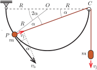
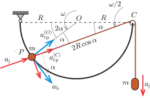

**Megoldás.**
 a) Amikor a bal oldali test a drótpálya legalsó pontján halad át, akkor $\alpha=45^\circ$. Legyen ebben a pillanatban a bal oldali test sebessége $v$, és így a kényszerfeltétel (vagyis az állandó fonálhossz miatt) a jobb oldali test sebessége $\tfrac{v}{\sqrt{2}}$. Ezeket a sebességeket a munkatételből (vagy az energiamegmaradásból) kaphatjuk meg:
 $mgR+mg\left(2-\sqrt{2}\right)R=\frac{1}{2}mv^2+\frac{1}{2}m\left(\frac{v}{\sqrt2}\right)^2,$
 amiből
 $v_{\mathrm{bal}}=v=\sqrt{\frac{4(3-\sqrt{2})}{3}gR}\qquad\textrm{és}\qquad v_{\mathrm{jobb}}=\frac{v}{\sqrt{2}}=\sqrt{\frac{2(3-\sqrt{2})}{3}gR}.$

 b) Vizsgáljunk egy általános esetet, amikor a bal oldali test valamilyen $\alpha$ szöggel fordult el. Ebben a helyzetben a bal oldali test sebessége legyen $v_{\mathrm{b}}$, és a kötél hosszának állandósága miatt a jobb oldali test sebessége:
 $v_{\mathrm{j}}=v_{\mathrm{b}}\cdot \sin{\alpha}, $
 amint azt az 1. ábráról leolvashatjuk. Azt is megállapíthatjuk, hogy az $OP$ egyenes ebben a helyzetben éppen
 $\omega=\frac{v_{\mathrm{b}}}{R}$
 szögsebességgel forog. A fonál ferde részének, vagyis a $CP$ egyenesnek a forgási szögsebessége $\omega/2$, hiszen a vízszintessel bezárt szöge csak fele akkora, mint az $OP$ sugár hajlásszöge.

 1. ábra

 A továbbiakban szükségünk lesz a bal és a jobb oldali test gyorsulása közötti kapcsolatra. Ezt kétféle módszerrel is meghatározhatjuk. A bal oldali test gyorsulásvektorának $OP$ irányú (centripetális) komponense nyilván
 $a_\mathrm{cp}^{(O)}=\frac{v_\mathrm{b}^2}{R}.$
 Az $(O)$ jel arra figyelmeztet, hogy az $O$ pont körüli elfordulásból származó centripetális gyorsulásról van szó.
 Az $OP$ egyenesre merőleges (érintő irányú) gyorsuláskomponens a $v_{\mathrm{b}}$ sebességnagyság növekedési üteméből származik, ezt $a_{\mathrm{b}}$-vel jelöljük. A 2. ábrán ezeket az összetevőket kék nyilakkal ábrázoltuk.

 2. ábra

 Ugyanez a gyorsulásvektor felbontható $CP$ irányú és arra merőleges összetevőkre. A $CP$ irányú gyorsuláskomponens egyrészt az $CP$ fonálhossz gyorsuló ütemű rövidüléséből származik, ami megegyezik a jobb oldali test függőleges irányú $a_{\mathrm{j}}$ gyorsulásával, másrészt a $CP=2R\cos\alpha$ hosszúságú szakasz $\omega/2$ szögsebességű forgásából adódik. (Ez utóbbi is centripetális gyorsulás, de az most nem az $O$ pontra, hanem a $C$ pontra vonatkozik.) Ez a komponens $CP=2R\cos\alpha$ hosszúságú szakasz $\omega/2=\frac{v_{\mathrm{b}}}{2R}$ szögsebességű forgásából származik, nagysága tehát
 $a_\mathrm{cp}^{(C)}=2R\cos\alpha \left(\frac{v_{\mathrm{b}}}{2R}\right)^2$
 A $P$ pont gyorsulásának van $CP$-re merőleges, tehát a $C$ körüli forgás szempontjából tangenciális komponense, de ennek nagyságát nem szükséges meghatároznunk. A $C$ pontra vonatkoztatott gyorsuláskomponenseket a 2. ábrán piros nyilak szemléltetik.
 A kék gyorsulásvektorok összege, és így annak $CP$ irányú vetülete megegyezik a piros gyorsulásvektorok összegével, illetve annak $CP$ irányú vetületével.
 $a_{\mathrm{b}} \,\sin\alpha+\cos\alpha\frac{v_\mathrm{b}^2}{R}=a_{\mathrm{j}}+2R\cos\alpha \left(\frac{v_{\mathrm{b}}}{2R}\right)^2,$
 ahonnan
 $a_{\mathrm{j}}=a_{\mathrm{b}} \,\sin\alpha+\cos\alpha\frac{{v_{\mathrm{b}}^2}}{2R}.$
 A gyorsulások közötti összefüggést más módon, a differenciálszámítás összefüggéseinek alkalmazásával is levezethetjük. A bal oldali test pályamenti (érintőirányú) gyorsulása $a_{\mathrm{b}}=\frac{\mathrm{d} v_{\mathrm{b}}}{\mathrm{d} t}$. A jobb oldali test gyorsulását a szorzatfüggvény deriválási szabálya szerint kaphatjuk meg:
 $a_{\mathrm{j}}=\frac{\mathrm{d} v_{\mathrm{j}}}{\mathrm{d} t}=\frac{\mathrm{d} (v_{\mathrm{b}}\cdot \sin{\alpha})}{\mathrm{d} t}=a_{\mathrm{b}}\cdot \sin{\alpha}+v_{\mathrm{b}}\cdot\cos{\alpha}\cdot\frac{\mathrm{d} \alpha}{\mathrm{d} t}=a_{\mathrm{b}}\cdot \sin{\alpha}+v_{\mathrm{b}}\cdot\cos{\alpha}\cdot(\omega/2)=$
 $=a_{\mathrm{b}}\cdot \sin{\alpha}+v_{\mathrm{b}}\cdot\cos{\alpha}\cdot\frac{v_{\mathrm{b}}\cdot\cos{\alpha}}{2R\cos{\alpha}}=a_{\mathrm{b}}\cdot \sin{\alpha}+\cos{\alpha}\cdot\frac{{v_{\mathrm{b}}^2}}{2R}.$
 Ezek után térjünk át az $\alpha=45^\circ$-os helyzetre:
 $a_{\mathrm{jobb}}=a_{\mathrm{bal}}\cdot \sin{45^\circ}+\cos{45^\circ}\cdot\frac{{v_{\mathrm{bal}}^2}}{2R}=\frac{a_{\mathrm{bal}}}{\sqrt 2}+\frac{{v_{\mathrm{bal}}^2}}{2\sqrt2R}.$
 A fonálban ébredő feszítőerő legyen $F$. A jobb oldali testre ezt a dinamikai egyenletet írhatjuk fel:
 $mg-F=ma_{\mathrm{jobb}}=m\left(\frac{a_{\mathrm{bal}}}{\sqrt 2}+\frac{{v_{\mathrm{bal}}^2}}{2\sqrt2R}\right).$
 Hasonló módon a bal oldali test pályamenti gyorsulására felírható mozgásegyenlet:
 $\frac{F}{\sqrt{2}}=ma_\mathrm{bal}.$
 A fenti két egyenletből
 $F=\frac{10-6\sqrt{2}}{9}mg\approx0{,}168\,mg\qquad\mathrm{és}\qquad a_{\mathrm{bal}}=\frac{5\sqrt{2}-6}{9}g\approx 0{,}119\,g,\qquad\mathrm{illetve} \qquad a_{\mathrm{jobb}}=\frac{6\sqrt{2}-1}{9}g\approx 0{,}832\,g.$
 Ezzel megkaptuk a jobb oldali test gyorsulását, azonban $a_{\mathrm{bal}}$ csak a pályamenti (érintőleges) gyorsulást jelenti.
 A bal oldali test gyorsulása két összetevőre bontható; a fenti pályamenti (érintőleges) gyorsulásra és a sugárirányú centripetális gyorsulásra: $a_\mathrm{cp}=\frac{{v_{\mathrm{bal}}^2}}{R}=\frac{4(3-\sqrt{2})}{3}g\approx 2{,}11\,g$. A bal oldali test eredő gyorsulását Pitagorasz-tétellel számíthatjuk ki:
 ${a_\mathrm{bal}}^{\mathbf{eredő}}=\sqrt{{a_{\mathrm{bal}}}^2+{a_\mathrm{cp}}^2}=\frac{\sqrt{1670-924\sqrt{2}}}{9}g\approx 2{,}12\,g.$

