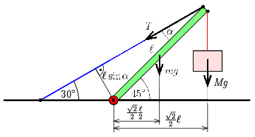

**Megoldás.**
 Legyen a merevítő rúd hossza $\ell$, tömege $m=45\,\mathrm{kg}$ és a terhelés tömege $M=225\,\mathrm{kg}$, a feszítőkábelben ébredő erő $T$. Vegyük észre, hogy a merevítőrúd és a feszítőkábel által bezárt szög $\alpha=15^\circ$. A következő ábrán néhány erőhöz tartozó erőkart olvashatjuk le a csuklóhoz mint forgástengelyhez viszonyítva.

 Írjuk fel a csuklóra a forgatónyomatékok egyensúlyát:
 $Mg\frac{\sqrt{2}}{2}\ell+mg\frac{\sqrt{2}}{2}\frac{\ell}{2}=T\ell\sin\alpha.$
 Az adatokat behelyettesítve:
 $T=6{,}63\,\mathrm{kN}.$
 A továbbiakban az erők egyensúlyával számolunk. A feszítőkábel a függőlegessel $60^\circ$-os szöget zár be, ezért a kábelben ébredő erő függőleges összetevője $T/2$. Ehhez még hozzá kell adni a rúd és a terhelés súlyát, hogy megkapjuk a csukló által a rúdra ható erő függőleges összetevőjét:
 $F_y=\frac{T}{2}+(m+M)g=5{,}97\,\mathrm{kN}.$
 A vízszintes összetevő megegyezik a kábelben ható erő vízszintes komponensével:
 $F_x=\frac{\sqrt{3}}{2}T=5{,}74\,\mathrm{kN}.$
 A csuklóban ébredő erő nagysága:
 $\sqrt{F_x^2+F_y^2}=8{,}28\,\mathrm{kN},$
 és ez az erő a terhelés felé hajlik, a függőlegessel bezárt szöge:
 $\arctan\left({\frac{F_x}{F_y}}\right)=43{,}9^\circ.$

