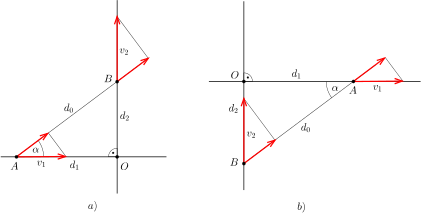
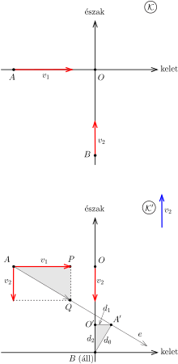
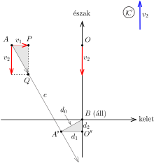

**I. megoldás.**
 Vázoljuk azt a helyzetet, amikor a két motoros közötti távolság éppen a minimális $d_0$. Amikor mindkét motoros közeledik a kereszteződéshez, vagy már távolodik attól, a távolságuk egyértelműen csökken, illetve nő, tehát a kérdéses pillanatban az egyik még nem, de a másik már elhagyta a kereszteződést. Jelöljük a pozíciójukat $A$-val és $B$-vel, legyen a távolságuk az $O$-val jelölt kereszteződéstől rendre $d_1$ illetve $d_2$, és legyen $BAO\sphericalangle=\alpha$, ahogy azt az 1. ábra a) része mutatja.

 1. ábra

 Az $A$ és a $B$ pont éppen sem nem közeledik, sem nem távolodik egymástól, tehát a sebességük $AB$-vel párhuzamos komponense egyenlő:
 $v_1\cos\alpha=v_2\sin\alpha,$
 azaz
 $\tan\alpha=\frac{v_1}{v_2}.$
 Ennek megfelelően
 $d_1=d_0\cos\alpha=d_0\frac{v_2}{\sqrt{v_1^2+v_2^2}}\qquad\textrm{és}\qquad d_2=d_0\sin\alpha=d_0\frac{v_1}{\sqrt{v_1^2+v_2^2}}.$
 Természetesen az is lehetséges, hogy az eddigi feltételezésünkkel szemben a $v_1$ sebességű motor hagyta már el a kereszteződést, és a $v_2$ sebességű az, amelyik csak közeledik hozzá, ahogy azt az 1. ábra b) része mutatja, de a kérdéses távolságok ebben az esetben is ugyanakkorák.

**II. megoldás.**
 Használjuk az I. megoldás jelöléseit, és írjuk fel az $AB$ szakasz $d(t)$ hosszát, pontosabban ennek a négyzetét az idő függvényében! Mérjük az időt attól a pillanattól, amikor $AB$ éppen a legrövidebb, azaz úgy, hogy $d(0)=d_0$ legyen!
 $d(t)^2=(d_1-v_1t)^2+(d_2+v_2t)^2=(d_1^2+d_2^2)+2(d_2v_2-d_1v_1)t+( v_1^2+v_2^2)t^2.$
 Ennek a $t$-ben kvadratikus kifejezésnek akkor van $t=0$-ban minimuma, ha a lineáris tag együtthatója eltűnik, azaz
 $\frac{d_2}{d_1}=\frac{v_1}{v_2}.$
 Ez a
 $d_0^2=d_1^2+d_2^2$
 egyenlettel együtt természetesen ugyanazt adja $d_1$-re és $d_2$-re, mint az előző megoldás. Ebben a gondolatmenetben az, hogy melyik motoros halad át előbb a kereszteződésen, a lineáris tag előjelében jelenik meg: ha a $v_1$ sebességű az, akkor a távolság négyzetének az egyenlete
 $d(t)^2=(d_1+v_1t)^2+(d_2-v_2t)^2=(d_1^2+d_2^2)-2(d_2v_2-d_1v_1)t+( v_1^2+v_2^2)t^2.$
 Ez az előjel azonban a megoldás szempontjából érdektelen, hisz az pont arra épül, hogy az adott tag nulla.

**III. megoldás.**
 Jelöljük az első motoros kiindulási helyét $A$-val, a másodikét $B$-vel, az utak kereszteződését pedig $O$-val. Az irányokra történő hivatkozások megkönnyítése érdekében tételezzük fel, hogy az első motoros $v_1$ sebességgel halad kelet felé, a második pedig $v_2$ sebességgel észak felé. Ezek a sebességek a talajhoz viszonyítottak, tehát az ,,álló'' $\cal{K}$ koordináta-rendszerben értendők (lásd a 2. ábra felső felét).

 2. ábra

 Üljünk most bele a $\cal{K}$-hoz képest $v_2$ sebességgel észak felé mozgó $\cal{K}'$ koordináta-rendszerbe, és írjuk le onnan nézve a motorosok mozgását. Ebben a rendszerben a második motoros áll, az első pedig $v_1$ sebességgel halad kelet felé, miközben $v_2$ nagyságú, dél felé irányuló sebességgel is rendelkezik (lásd a 2. ábra alsó felét). Az első motoros tehát $\sqrt{v_1^2+v_2^2}$ nagyságú sebességgel nagyjából délkelet felé halad az $e$ jelű egyenes mentén. Az utak kereszteződési pontja ugyancsak mozogni fog $\cal{K}'$-ben, nevezetesen $v_2$ sebességgel halad dél felé.
 A két motoros abban az $A'$ pontban kerül egymáshoz legközelebb, amelyet a $B$-ből $e$-re bocsátott merőleges egyenes jelöl ki. A 2. ábra alsó felén két (szürkén jelölt) derékszögű háromszöget látunk. Ezek megfelelő oldalainak arányából leolvashatjuk, hogy
 $\frac{d_1}{d_0}=\frac{O'A'}{A'B}=\frac{PQ}{AQ}=\frac{v_2}{\sqrt{v_1^2+v_2^2}},$
 vagyis
 $d_1=d_0\frac{v_2}{\sqrt{v_1^2+v_2^2}}.$
 Hasonló módon kapjuk, hogy
 $\frac{d_2}{d_0}=\frac{O'B}{A'B}=\frac{AP}{AQ}=\frac{v_1}{\sqrt{v_1^2+v_2^2}},$
 vagyis
 $d_2=d_0\frac{v_1}{\sqrt{v_1^2+v_2^2}}.$
 A fenti megfontolások során hallgatólagosan feltételeztük, hogy az $A$ pontból induló első motoros érkezik hamarabb az utak kereszteződéséhez. (A 2. ábrán ezt onnan látjuk, hogy az $e$ egyenes észak felől kerüli el az álló $B$ pontot.) De a fordított eset is előfordulhat (lásd a 3. ábrát ).

 3. ábra

 A megfelelő arányok összehasonlításából ebben az esetben is az előző esetével megegyező eredményt kapjuk:
 $d_1=d_0\frac{v_2}{\sqrt{v_1^2+v_2^2}},\qquad\textrm{illetve}\qquad d_2=d_0\frac{v_1}{\sqrt{v_1^2+v_2^2}}.$

