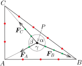
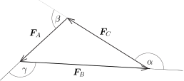
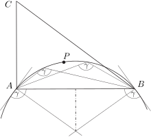
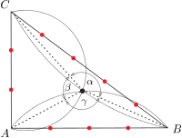

**Megoldás.**
 Az 1. ábra az elrendezés felülnézeti képét mutatja. A lemezen lévő lyukak helyzetét $A$, $B$ és $C$ jelöli, a távolságukat (önkényesen választott egységekben) kicsiny piros körök mutatják.
 A fonalakat feszítő erők az alsó végükre akasztott súlyok nagyságával arányos, tehát (ugyancsak önkényesen választható egységekben) $\vert\boldsymbol{F}_A\vert=2$, $\vert\boldsymbol{F}_B\vert=4$ és $\vert\boldsymbol{F}_C\vert=3$. A csomó keresett egyensúlyi helyzetének, vagyis az ábrán látható $P$ pontnak megszerkesztéséhez először a fonalak egymással bezárt $\alpha$, $\beta$ és $\gamma$ szögét (vagy ezek közül legalább kettőt) fogjuk meghatározni szerkesztéssel.

 1. ábra

 Egyensúlyi állapotban a csomóra ható erők eredője nulla, vagyis $\boldsymbol{F}_A+\boldsymbol{F}_B+\boldsymbol{F}_C=0$. A három fonálerő vektora – azokat rendre egymás csúcsából felmérve – zárt vektorháromszöget alkot. Ezt a háromszöget az oldalak hosszának (2, 4 és 3) ismeretében könnyen megszerkeszthetjük és a kérdéses szögeket arról leolvashatjuk ( 2. ábra ).

 2. ábra

 Az általánosított Thalész-tétel szerint azon pontok halmaza, amelyekből egy szakasz ismert nagyságú szögben látszik, két nyílt körív, amelyeknek a szakasz egy közös húrja. Például a feladatban szereplő lemez azon pontjai, amelyekből az $A$ és $B$ lyukak ismert nagyságú $\gamma$ szögben látszanak, egy olyan köríven találhatók, amelynek $AB$ az egyik húrja, és a húr végpontjainál húzható érintői hegyesszög esetén $\gamma$, tompaszög esetén pedig $180^\circ-\gamma$ szöget zárnak be az $AB$ húrral. Az $ABC\triangle$ keresett $P$ belső pontja is erre a körívre illeszkedik ( 3. ábra ).

 3. ábra

 Az $ABC\triangle$ másik két oldalára is elvégezve a látószög-körívek szerkesztését $\beta$, illetve $\alpha$ szögekkel, ezek (vagy ezek közül bármelyik kettő) metszéspontja megadja a csomónak a keresett egyensúlyi helyzetét ( 4. ábra ).

 4. ábra

 Megjegyzések. 1. A szerkesztés a fentebb leírtakhoz hasonló lépésekkel tetszőleges lyukelrendezés és tetszőleges súlyok mellett is elvégezhető. Az általános esetben azonban előfordulhat, hogy az erővektorok nagysága nem elégíti ki a háromszög-egyenlőtlenséget, emiatt a 2. ábrán látható háromszög nem szerkeszthető meg. Az is lehetséges, hogy az erők nagyságával arányos oldalhosszúságú háromszög megszerkeszthető ugyan, de a látószög-körívek metszéspontja az $ABC\triangle$-ön kívülre esik. Ez a külső pont nem határoz meg egyensúlyi helyzetet, vagyis a fonálerők nem alkothatnak zárt vektorháromszöget, hiszen lesz olyan egyenes (például az $ABC\triangle$ valamelyik oldala), amelyre nézve az összes erő rá merőleges komponense azonos előjelű, összegük tehát nem lehet nulla. Ezekben az esetekben a csomó a háromszög egyetlen belső pontjában sem lehet egyensúlyban, hanem valamelyik lyukig mozdul el, és azon esetleg átbújva az egyik súlynak a lemezhez ütközése után alakulhat csak ki egyensúly.
 2. Egy mechanikai rendszer egyensúlyi helyzetét nemcsak az erőrendszer egyensúlya, hanem a rendszer helyzeti energiájának minimuma is jellemzi. Esetünkben az energiaminimum feltétele egyenértékű azzal a geometriai feladattal, hogy keressük az $ABC\triangle$ azon belső $P$ pontját, amelyre a csúcspontoktól mért távolságok súlyozott összege a lehető legkisebb, vagyis
 $\vert\boldsymbol{F}_A\vert\cdot PA+\vert\boldsymbol{F}_B\vert\cdot PB+\vert\boldsymbol{F}_C\vert\cdot PC=\textrm{minimális}.$
 Ennek az ún. súlyozott Fermat–Torricelli-problémának többféle – tisztán geometriai, tehát fizikai fogalmakra nem hivatkozó – megoldása is megadható (lásd pl. Skljarszkij - Csencov - Jaglom: Válogatott feladatok és tételek az elemi matematika köréből II. Geometriai egyenlőtlenségek és szélsőérték feladatok, 79. probléma).

