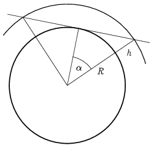

**Megoldás.**
 Számoljuk ki először egy képzeletbeli, tengerszinten keringő műhold $T_t$ keringési idejét! Ezen a pályán a centripetális gyorsulás éppen $g$ nagyságú:
 $R\left(\frac{2\pi}{T_t}\right)^2=g,$
 ahol $R=6378\,\mathrm{km}$ a Föld egyenlítői sugara. Innen
 $T_t=2\pi\sqrt{\frac{R}{g}}=2\pi\sqrt{\frac{6378\,\mathrm{km}}{9{,}8\,\mathrm{m/s^2}}}=84{,}48\,\mathrm{perc}.$
 (Megelégszünk két tizedes pontossággal, és nem foglalkoztunk azzal, hogy $g$ értékében megjelenik néhány ezreléknyi centrifugális erő) A $h=400\,\mathrm{km}$ magasan keringő műhold keringési idejét Kepler III. törvényét alkalmazva számíthatjuk:
 $T_m=T_t\left(\frac{R+h}{R}\right)^{1{,}5}=84{,}48\,\mathrm{perc}\left(\frac{6378\,\mathrm{km}+400\,\mathrm{km}}{6378\,\mathrm{km}}\right)^{1{,}5}=92{,}55\,\mathrm{perc}.$
 Az Egyenlítőn állva együtt forgunk a Földdel $n_f=1\,\mathrm{nap}^{-1}$ fordulatszámmal. A műhold haladási irányát a feladat nem adta meg, de leghosszabb ideig akkor látjuk, ha a velünk azonos irányban, nyugatról keletre kerüli meg a Földet. A műhold földi megfigyelőhöz viszonyított fordulatszáma ekkor:
 $n=T_m^{-1}-n_f.$
 A földi megfigyelőhöz viszonyított keringési ideje pedig
 $T=\frac{1}{n}=\frac{1\,\mathrm{nap}\cdot T_m}{1\,\mathrm{nap}-T_m}=\frac{1440\,\mathrm{perc}\cdot 92{,}55\,\mathrm{perc}}{1440\,\mathrm{perc}-92{,}55\,\mathrm{perc}}=98{,}91\,\mathrm{perc}.$
 Maradjunk innentől fogva a Földdel együtt forgó koordináta-rendszerben! A műhold felbukkan a nyugati horizonton, lemegy keleten. A két helyzetben a műholdat a röppálya középpontjával (Föld középpontjával) összekötő sugarak egymással bezárt szögét jelöljük $2\alpha$-val. Az ábra szerint:

 $\cos\alpha=\frac{R}{R+h}=\frac{6378\,\mathrm{km}}{6778\,\mathrm{km}}=0{,}9410\quad\Rightarrow\quad\alpha=19{,}8^\circ.$
 Ezen a körív pályaszakaszon
 $\frac{2\alpha}{360^\circ}\cdot T=\frac{19{,}8^\circ}{180^\circ}\cdot 98{,}91\,\mathrm{perc}=10{,}9\,\mathrm{perc}$
 ideig halad a műhold, legfeljebb ennyi ideig látjuk tehát.

