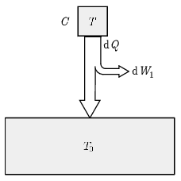
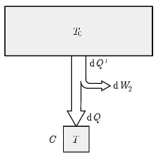
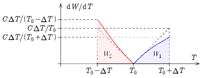

**Megoldás.**
 Mindkét esetben akkor maximális a munkavégzés, ha a hőerőgép minden pillanatban ideális Carnot-gépként működik. A nehézséget az okozza, hogy az egyik hőtartály hőmérséklete, és így a hatásfok is mindkét esetben folyamatosan változik, ezért csak kis elemi lépésekre írhatjuk fel az összefüggéseket, amelyeket azután összegeznünk kell.

 1. ábra

 Az első esetben ( 1. ábra ) a felső (melegebb) hőtartály hőmérséklete $T$, amely a folyamat során végig csökken, míg az alsó (hidegebb) hőtartály hőmérséklete állandó $T_0$. Ekkor a Carnot-gép ismert képlete alapján az elemi munkavégzés:
 $\mathrm{d}W_1=\left(1-\frac{T_0}{T}\right)\mathrm{d}Q,$
 ahol $\mathrm{d}Q$ a $C$ hőkapacitású, kezdetben $T=T_0+\Delta T$ hőmérsékletű (majd folyamatosan hülő) test által leadott elemi hőmennyiség, amit a test hőkapacitásával és hőmérséklet-változásával is kifejezhetünk:
 $\mathrm{d}Q=-C\mathrm{d}T.$
 Behelyettesítve az első összefüggésbe:
 $\mathrm{d}W_1=C\left(1-\frac{T_0}{T}\right)(-\mathrm{d}T).$
 A teljes munkavégzést ennek összegzésével (integrálással) kaphatjuk meg (bár látni fogjuk, hogy az integrál elvégzésére az összehasonlításhoz nem lesz feltétlenül szükségünk):
 $W_1=\int\limits_{T_0+\Delta T}^{T_0}C\left(1-\frac{T_0}{T}\right)(-\mathrm{d}T)=\int\limits_{T_0}^{T_0+\Delta T}C\left(1-\frac{T_0}{T}\right)\mathrm{d}T=CT_0\left(\frac{\Delta T}{T_0}-\ln\left(1+\frac{\Delta T}{T_0}\right)\right).$

 2. ábra

 A második esetben ( 2. ábra ) a felső (melegebb) hőtartály hőmérséklete állandó $T_0$, míg az alsó (hidegebb) hőtartály hőmérséklete $T$, amely a folyamat során végig növekszik. A Carnot-gép elemi munkavégzése:
 $\mathrm{d}W_2=\left(1-\frac{T}{T_0}\right)\mathrm{d}Q',$
 ahol most $\mathrm{d}Q'$ az állandó $T_0$ hőmérsékletű hőtartály által leadott hő. A $C$ hőkapacitású, kezdetben $T=T_0-\Delta T$ hőmérsékletű (majd folyamatosan melegedő) test által felvett elemi hőmennyiség:
 $\mathrm{d}Q=\mathrm{d}Q'-\mathrm{d}W_2=\frac{T}{T_0}\mathrm{d}Q'.$
 Ebből $\mathrm{d}Q'$-t kifejezve, és az első kifejezésbe beírva:
 $\mathrm{d}W_2=\left(\frac{T_0}{T}-1\right)\mathrm{d}Q,$
 majd felhasználva, hogy most
 $\mathrm{d}Q=C\mathrm{d}T,$
 az elemi munkavégzés kifejezése:
 $\mathrm{d}W_2=C\left(\frac{T_0}{T}-1\right)\mathrm{d}T.$
 A teljes munkavégzést ismét ennek összegzésével (integrálással) kaphatjuk meg (az integrál elvégzésére az összehasonlításhoz most sem lesz feltétlenül szükségünk):
 $W_2=\int\limits_{T_0-\Delta T}^{T_0}C\left(\frac{T_0}{T}-1\right)\mathrm{d}T=-CT_0\left(\frac{\Delta T}{T_0}+\ln\left(1-\frac{\Delta T}{T_0}\right)\right).$
 Ezután el kell döntenünk, hogy melyik munkavégzés nagyobb: erre két módszert mutatunk.
 I. Az integrál elvégzése nélkül. Mindkét esetben egy $\Delta T$ hosszúságú intervallumon végezzük az integrálást: az egyik esetben $T_0$-ról indulva $T_0+\Delta T$-ig, a másik esetben $T_0-\Delta T$-ről indulva $T_0$-ig ( 3. ábra ). Hasonlítsuk össze a két integrandust! Az első esetben
 $T_0\leq T\leq T_0+\Delta T\quad\Rightarrow\quad T=T_0+\delta T,$
 míg a második esetben
 $T_0-\Delta T\leq T\leq T_0\quad\Rightarrow\quad T=T_0-\delta T,$
 ahol $0\leq\delta T\leq\Delta T$. Ez alapján viszont a két integrandus összehasonlítása (a $C$ konstanst mindkét esetben elhagyva):
 $1-\frac{T_0}{T}=1-\frac{T_0}{T_0+\delta T}=\frac{\delta T}{T_0+\delta T}\leq\frac{\delta T}{T_0-\delta T}=\frac{T_0}{T_0-\delta T}-1=\frac{T_0}{T}-1,$
 azaz a második esetben az integrandus mindig nagyobb (az intervallum szélén pedig egyenlő). Tehát a második esetben nyerhető több munka.

 3. ábra

 II. Az integrálok összehasonlítása sorfejtéssel. A két munkavégzést is összehasonlíthatjuk, ehhez a fenti integrálásokkal kapott kifejezésekben a logaritmus függvényt sorba kell fejtenünk. Táblázatokban megtalálható:
 $\ln x=\sum\limits_{n=1}^\infty\frac{(-1)^{n-1}}{n}(x-1)^n.$
 A sorbafejtést mindkét esetben az első három tagig elvégezve:
$$\begin{gather*}
\frac{W_1}{CT_0}=\frac{\Delta T}{T_0}-\ln\left(1+\frac{\Delta T}{T_0}\right)=\frac{\Delta T}{T_0}-\frac{\Delta T}{T_0}+\frac{1}{2}\left(\frac{\Delta T}{T_0}\right)^2-\frac{1}{3}\left(\frac{\Delta T}{T_0}\right)^3=\frac{1}{2}\left(\frac{\Delta T}{T_0}\right)^2-\frac{1}{3}\left(\frac{\Delta T}{T_0}\right)^3\\
\frac{W_2}{CT_0}=-\frac{\Delta T}{T_0}-\ln\left(1-\frac{\Delta T}{T_0}\right)=-\frac{\Delta T}{T_0}+\frac{\Delta T}{T_0}+\frac{1}{2}\left(\frac{\Delta T}{T_0}\right)^2+\frac{1}{3}\left(\frac{\Delta T}{T_0}\right)^3=\frac{1}{2}\left(\frac{\Delta T}{T_0}\right)^2+\frac{1}{3}\left(\frac{\Delta T}{T_0}\right)^3.
\end{gather*}$$
 Tehát $W_2>W_1$, azaz a második esetben nyerhető több munka.

 Megjegyzés. Csak az első három tagot írtuk fel a sorfejtésben, mert $\Delta T<T_0$ miatt a további tagok egyre kisebbek. De az is belátható, hogy a páros tagok mindvégig megegyeznek, a páratlanok pedig a harmadik taghoz hasonlóan az első esetben negatívak, a másodikban pozitívak, így a további tagok a két kifejezés közti különbséget tovább növelik.

