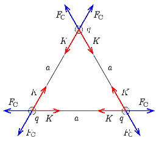
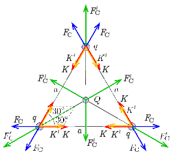

**Megoldás.**
 a) Minden $q=400\,\mathrm{nC}$ nagyságú töltésre két, egyforma nagyságú $K$ fonálerő és két, egyforma nagyságú $F_\mathrm{C}$ Coulomb-erő hat ( 1. ábra ).

 1. ábra

 Mivel a fonálerők és az elektrosztatikus erők is a háromszög oldalaival párhuzamosak, csak úgy lehet egyensúly, ha $K=F_\mathrm{C}$. Így a fonálerők nagysága ($a=0{,}3\,\mathrm{m}$ és $k=9\cdot 10^9\,\mathrm{Nm^2/C^2}$ felhasználásával):
 $K=F_\mathrm{C}=\frac{kq^2}{a^2}=0{,}016\,\mathrm{N}.$

 b) Ebben az esetben a háromszög csúcsaiban elhelyezkedő töltésekre a középpontba elhelyezett $Q=200\,\mathrm{nC}$ nagyságú töltés Coulomb-ereje is hat ( 2. ábra ). A fonálerőknek az eddigieken kívül ezt a taszító erőt is meg kell tartaniuk.

 2. ábra

 Az ábra alapján az új fonálerő:
 $K_2=K+K'=K+\frac{1}{2\cos 30^\circ}\,F_\mathrm{C}'=K+\frac{1}{\sqrt{3}}\frac{kqQ}{\left(a/\sqrt{3}\right)^2}=K+\frac{\sqrt{3}kqQ}{a^2}=0{,}016\,\mathrm{N}+0{,}014\,\mathrm{N}=0{,}030\,\mathrm{N}.$

