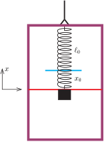
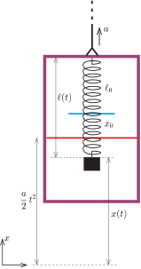
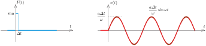
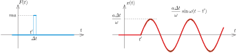
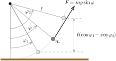
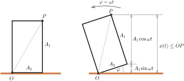

**I. megoldás.**
 A felfüggesztett test mozgását végig a lifthez rögzített vonatkoztatási rendszerben írjuk le. Amíg a rendszer nyugalomban van, a rugó $x_0$ megnyúlása akkora, hogy a rugóerő pont kiegyenlíti a rugón függő test $mg$ súlyát, azaz $x_0=\tfrac{mg}{D}$. Amikor a lift egyenletesen gyorsulva elindul fölfelé, a hozzá rögzített koordináta-rendszerben megjelenik egy $ma$ nagyságú lefelé mutató tehetetlenségi erő. Ez hatásában ugyanolyan, mintha a nehézségi gyorsulás $a$-val megnövekedne, tehát a gyorsulás alatt $g_\mathrm{eff}=g+a$. Ennek megfelelően az $m$ tömeg ,,egyensúlyi'' helyzete (az a helyzet, ahol a rugóerő pont kompenzálná az effektív súlyerőt) $\Delta x=\tfrac{ma}{D}$ értékkel lejjebb kerül, és amíg a lift gyorsul, a test e körül fog $\omega=\sqrt{\tfrac{D}{m}}$ körfrekvenciával rezgőmozgást végezni. A rezgés kezdetekor a testnek az egyensúlyi helyzettől mért kitérése éppen $\Delta x$, sebessége pedig nulla, ezért az $x$ kitérés és a lifthez viszonyított $v$ sebesség a $t$ idő függvényében
 $x(t)=\Delta x\cos\omega t\qquad\textrm{és}\qquad v(t)=-\omega\Delta x\sin\omega t.$
 Amint megszűnik a lift gyorsulása, az egyensúlyi helyzet visszakerül az $x_0$-lal jellemzett pozícióba és a test rezgése változatlan körfrekvenciával e körül a pont körül folytatódik. Innentől a mozgás jellemzőit az
 $x^\prime(t)=A\cos(\omega(t-\tau)+\varphi)\qquad\textrm{és}\qquad v^\prime(t)=-\omega A\sin(\omega(t-\tau)+\varphi)$
 egyenletek adják meg azzal, hogy az $x^\prime$ távolságot az új (egyben a gyorsulás előtti) egyensúlyi pozíciótól kell mérni. Figyelembe véve, hogy ez a pont a liftben $\Delta x$-szel magasabban van mint az, ahonnan $x$-et mérjük, a $t=\tau$ időpontban
 $x^\prime(\tau)+\Delta x=x(\tau)\qquad\textrm{és}\qquad v^\prime(\tau)=v(\tau),$
 azaz
 $A\cos\varphi=\Delta x\left(\cos\omega\tau-1\right)\qquad\textrm{és}\qquad A\sin\varphi=\Delta x\sin\omega\tau.$
 E két utóbbi egyenletet négyzetre emelve és összeadva $\varphi$-t kiküszöböljük az egyenletből:
 $A^2=2(1-\cos\omega\tau)(\Delta x)^2,$
 végül kihasználjuk, hogy $\Delta x=\tfrac{ma}{D}$ és $\omega=\sqrt{\tfrac{D}{m}}$, így
 $A=\sqrt{2\left(1-\cos\sqrt{\frac{D}{m}}\tau\right)}\,\frac{ma}{D}.$

 Megjegyzés. A kialakuló amplitúdó $\tau$ értékétől függően 0 és $2\tfrac{ma}{D}$ között változhat. Maximális amplitúdó akkor lesz, ha $\cos\sqrt{\tfrac{D}{m}}\tau=-1$, azaz ha $\tau=(2n+1)\pi\sqrt{\tfrac{m}{D}}$, $n\in \mathbb{N}$. A test egyáltalán nem fog rezegni, ha $\cos\sqrt{\tfrac{D}{m}}\tau=1$, azaz ha $\tau=2n\pi\sqrt{\tfrac{m}{D}}$, $n\in \mathbb{N}$.

**II. megoldás.**
 A feladatot megoldhatjuk inerciarendszerből (pl. a talajhoz rögzített ,,álló'' koordináta-rendszerből) nézve is. Ebben a rendszerben a Newton-egyenletek az eredeti alakjukban érvényesek, nincs szükség ,,tehetetlenségi erők'' bevezetésére.
 A megoldás menetét – a jobb áttekinthetőség kedvéért – több lépésre bontjuk.

 1. lépés: A lift megindulása előtti állapot vizsgálata.
 Legyen a rugó nyújtatlan hossza $\ell_0$, az $m$ tömegű test ráakasztása után pedig $\ell=\ell_0+x_0$. Egyensúlyi helyzetben a testre ható eredő erő
 $(1)$ $F=Dx_0-mg=0,\qquad\textrm{vagyis}\qquad x_0=\frac{mg}{D}.$
 Válasszunk egy olyan koordináta-rendszert, amelynek $x$ tengelye függőlegesen felfelé mutat (tehát minden vektort ebben az irányban tekintünk pozitívnak), és a origója a test nyugalmi helyzeténél van, amikor a lift még áll.

 1. ábra

 Ezt a helyet a lift oldalán is megjelöljük egy piros vonallal, hogy a helyét akkor is jól láthassuk, amikor a lift már mozgásba jött ( 1. ábra ).

 2. lépés: Az $m$ tömegű test mozgásegyenletének felírása a lift gyorsuló mozgásakor.
 A lift $t=0$ pillanatban elkezd függőlegesen felfelé $a$ gyorsulással mozogni, tehát $t$ idő alatt $\frac{a}{2}t^2$ utat tesz meg. Ezalatt az $m$ tömegű test elmozdulása a korábban választott inerciarendszerben legyen $x(t)$ ( 2. ábra ). Első feladatunk ezen $x(t)$ függvény meghatározása.

 2. ábra

 A lift teteje $t$ idő alatt $\frac{a}{2}t^2$-tel került magasabbra, így a rugó hossza
 $\ell(t)=\frac{a}{2}t^2-x(t)+\ell_0+x_0,$
 a megnyúlása pedig
 $\varDelta\ell=\ell(t)-\ell_0=\frac{a}{2}t^2-x(t)+x_0$
 lesz. A testre ható eredő erő
 $F(t)=D\,\varDelta\ell-mg=D\frac{a}{2}t^2-D\,x(t)+(Dx_0-mg).$
 A zárójelben álló kifejezés (1) miatt nulla, így
 $(2)$ $F(t)=D\frac{a}{2}t^2-D\,x(t).$
 Newton mozgástörvénye szerint az $F$ erő az $m$ tömeg és a test gyorsulásának szorzatával egyenlő. A gyorsulásra nem a megszokott jelölést használjuk, mert az ,,$a$'' betű már ,,foglalt'', az a lift gyorsulását jelöli. Ehelyett az elméleti fizika szakkönyvekben szokásos módon egy fizikai mennyiség változási sebességét (az idő szerinti deriváltját) a mennyiség betűjele fölé tett ponttal, a sebesség változási ütemét (a gyorsulást, vagyis az idő szerinti második deriváltat) a betűjel fölé tett két ponttal fogjuk jelölni. Ez a jelölés azért is praktikus, mert különbséget tud tenni különböző fizikai mennyiségek változási sebessége, illetve gyorsulása között.
 A tömegpont mozgásegyenlete ezek szerint
 $F(t)=m\ddot{x}(t),$
 azaz a $D/m=\omega^2$ jelölés bevezetésével ($\omega$ az álló liftben harmonikus rezgőmozgást végző test körfrekvenciája)
 $(3)$ $\ddot{x}(t)=-\omega^2\left(x(t)-\frac{a}{2}t^2\right).$

 3. lépés: A mozgásegyenlet megoldása alkalmasan választott új függvények segítségével.
 A test mozgásegyenlete egy bonyolultnak látszó ,,differenciálegyenlet'', ami azonban könnyen visszavezethető a szokásos rezgőmozgás jól ismert problémájára.
 Kézenfekvő, hogy (3) jobb oldalán a zárójelben álló kifejezést tekintsük új ismeretlen függvénynek, és arra írjunk fel mozgásegyenletet. Legyen tehát
 $(4)$ $y(t)\equiv x(t)-\frac{a}{2}t^2,$
 aminek változási sebessége és gyorsulása:
 $(5)$ $\dot{y}(t)=\dot{x}(t)-at,\qquad\textrm{illetve}\qquad\ddot{y}(t)=\ddot{x}(t)-a.$
 Az új mozgásegyenlet:
 $(6)$ $\ddot{y}(t)=-\omega^2\left(y(t)+\frac{a}{\omega^2}\right).$
 Ez már majdnem egy rezgőmozgás egyenlete, amely a
 $(7)$ $z(t)=y(t)+\frac{a}{\omega^2}$
 jelöléssel már az ismert alakot ölti:
 $(8)$ $\ddot{z}(t)=-\omega^2\,z(t).$
 (Kihasználtuk, hogy az időben állandó $a/\omega^2$ mennyiség változási sebessége és gyorsulása is nulla, tehát $\dot{z}(t)\equiv\dot{y}(t)$ és $\ddot{z}(t)\equiv\ddot{y}(t)$).

 4. lépés: A kezdőfeltételek felírása.
 A mozgásegyenlet megoldását a kezdeti hely- és sebességadatok teszik egyértelművé. Kezdetben a test az origóban állt, vagyis
 $x(0)=0\qquad\textrm{és}\qquad\dot{x}(0)=0.$
 Felhasználva (4), (5) és (7) egyenleteket kapjuk, hogy
 $y(0)=0\qquad\textrm{és}\qquad\dot{y}(0)=0,$
 valamint
 $(9)$ $z(0)=\frac{a}{\omega^2}\qquad\textrm{és}\qquad\dot{z}(0)=0.$

 5. lépés: A mozgásegyenlet megoldása a kezdőfeltételek figyelembevételével.
 A (8) mozgásegyenlet általános megoldása
 $z(t)=A_1\cos\omega t+A_2\sin\omega t,$
 ahol $A_1$ és $A_2$ állandók. A (9) kezdeti feltétel szerint $A_1=\frac{a}{\omega^2}$ és $A_2=0$, vagyis
 $z(t)=\frac{a}{\omega^2}\cos\omega t,\qquad\dot{z}(t)=-\frac{a}{\omega}\sin\omega t.$
 Ezt (7)-be, majd (4)-be helyettesítve megkapjuk a keresett $x(t)$ függvényt és annak változási sebességét:
 $x(t)=\frac{a}{\omega^2}(\cos\omega t-1)+\frac{a}{2}t^2,\qquad\dot{x}(t)=-\frac{a}{\omega}\sin\omega t+at.$

 6. lépés: Az energiaviszonyok vizsgálata a lift gyorsulásának megszűntekor.
 $t=\tau$ pillanatban megszűnik a lift gyorsulása. Ebben a pillanatban a test a liftszekrény piros vonala (az egyensúlyi helyzet) felett
 $(10)$ $y(\tau)=x(\tau)-\frac{a}{2}\tau^2=\frac{a}{\omega^2}(\cos\omega\tau-1)\leq 0$
 magasságban (ténylegesen az alatti helyen) található. A rugó hossza ekkor
 $\ell(\tau)=\frac{a}{2}\tau^2-x(\tau)+\ell_0+x_0=\ell_0+\frac{a}{\omega^2}(1-\cos\omega\tau )+x_0,$
 ahol $x_0=mg/D$. A rugó megnyúlása tehát ebben a pillanatban
 $\varDelta\ell=\frac{a}{\omega^2}(1-\cos\omega\tau)+x_0,$
 a rugalmas energia pedig
 $(11)$ $E_1=\frac{1}{2}D\,(\varDelta\ell)^2=\frac{1}{2}D\left(\frac{a}{\omega^2}\right)^2\left(1-2\cos\omega\tau+\cos^2\omega\tau\right)+Dx_0\frac{a}{\omega^2}(1-\cos\omega\tau)+\frac{1}{2}D\,x_0^2.$
 A test sebessége a talajhoz viszonyítva
 $\dot{x}(\tau)=a\tau-\frac{a}{\omega}\sin\omega\tau,$
 míg a lift sebessége $a\tau.$

 7. lépés: ,,Beülünk'' az egyenletes sebességgel mozgó liftbe.
 Térjünk most át a lifttel együtt $a\tau$ sebességgel mozgó koordináta-rendszerre, ami ugyancsak inerciarendszer. Ebben a rendszerben a lift áll, a test sebessége pedig
 $v=\dot{x}(\tau)-a\tau=-\frac{a}{\omega}\sin\omega\tau.$
 A test mozgási energiája ebben a rendszerben $t=\tau$ pillanatban
 $(12)$ $E_2=\frac{1}{2}mv^2=\frac{1}{2}D\left(\frac{a}{\omega^2}\right)^2\,\sin^2\omega\tau.$
 A test rendelkezik még valamekkora gravitációs helyzeti energiával is a lifthez képest álló vonatkoztatási rendszerben. Ha a helyzeti energiát a lift piros vonalánál (a rugó egyensúlyi helyzeténél) tekintjük nullának, akkor a (10) képletben szereplő $y(\tau)$ magasságban a gravitációs helyzeti energia
 $(13)$ $E_3=mgy(\tau)=Dx_0\frac{a}{\omega^2}(\cos\omega\tau-1).$

 8. (utolsó) lépés: A test összenergiájának és a rezgésének amplitúdójának kiszámítása. A lift koordináta-rendszerében a rezgő test összenergiája (11), (12) és (13) felhasználásával
 $E_\text{összes}=E_1+E_2+E_3=D\left(\frac{a}{\omega^2}\right)^2(1-\cos\omega\tau)+\frac{1}{2}D\,x_0^2.$
 Ez az összenergia a továbbiakban állandó marad, és a nagysága kifejezhető a rezgés $A$ amplitúdójával is. Az egyensúlyi helyzeten való áthaladáskor a test helyzeti energiája nulla, a mozgási energiája $\tfrac{1}{2}m(A\omega)^2$, a rugó rugalmas energiája pedig $\tfrac{1}{2}D\,x_0^2$. Felírhatjuk tehát, hogy
 $D\left(\frac{a}{\omega^2}\right)^2(1-\cos\omega\tau)+\frac{1}{2}D\,x_0^2=\frac{1}{2}mA^2\omega^2+\frac{1}{2}D\,x_0^2$
 ahonnan a keresett rezgési amplitúdó:
 $A=\frac{a}{\omega^2}\sqrt{2(1-cos\omega\tau)}\qquad\left(\omega=\sqrt{D/m}\right).$

**III. megoldás.**
 A feladatot a szuperpozíció módszerével is meg lehet oldani. Ez a módszer a mechanikában azért működik, mert egy tömegpont $x(t)$ elmozdulásfüggvénye, illetve az $\ddot{x}(t)$ gyorsulásfüggvénye, valamint a testre ható (időben akár változó) $F(t)$ erő között lineáris kapcsolat áll fenn. Ez annyit jelent, hogy ha az $x_1(t)$ elmozdulásfüggvénynek $F_1(t)$ erőfüggvény felel meg, $x_2(t)$-nek pedig $F_2(t)$, akkor a $c_1\,x_1(t)+c_2\,x_2(t)$ elmozduláshoz tartozó erőfüggvény $c_1\,F_1(t)+c_2\,F_2(t)$, ahol $c_1$ és $c_2$ tetszőleges állandó számok. (Ez a tulajdonság abból következik, hogy a deriválás lineáris művelet, Newton II. törvénye pedig lineáris egyenlet.)

 Megjegyzés . Valamilyen ismert erőfüggvény csak a kezdőfeltételekkel együtt határozza meg egyértelműen az elmozdulásfüggvényt. Különböző megoldások súlyozott összegének képzésekor a kezdeti hely- és sebességadatok is szuperponálódnak. Ezzel azonban nem kell törődjünk, ha a kezdeti feltétel pl. az, hogy a test kezdetben az origóban áll.

 Írjuk le az $m$ tömegű test mozgását a lift koordináta-rendszerében. Amennyiben a test elmozdulását a rugó nyugalmi helyzetétől mérjük (ahol a rugóerő egyensúlyt tart a nehézségi erővel), akkor az $mg$ nehézségi erőt a továbbiakban figyelmen kívül hagyhatjuk. A test mozgásegyenlete általánosan:
 $m\ddot{x}=-D\,x(t)+F(t),$
 ahol $F(t)$ a testre még a rugóerőn kívül ható tetszőleges erő, $\ddot{x}$ pedig a gyorsulást jelöli. Esetünkben
 $(14)$ $F(t)=\begin{cases}ma,&\textrm{ha }0<t<\tau\\0,&\textrm{egyébként}.\end{cases}$
 (A koordinátatengelyt lefelé irányítjuk, ezért a felfelé, állandó $a$ gyorsulással mozgó liftben fellépő tehetetlenségi erő $+ma$.) Bevezetve az $\omega=\sqrt{D/m}$ jelölést a mozgásegyenlet így írható:
 $\ddot{x}+\omega^2x(t)=\frac{1}{m}F(t).$
 Tekintsük először azt az egyszerűbb esetet, amikor $F(t)$ egy nagyon rövid $\varDelta t$ ideig tartó, $ma$ nagyságú erőlökés a $t=0$ pillanatban. Ez az erőlökés a kezdetben álló testet hirtelen $F\varDelta t/m=a\varDelta t$ sebességre gyorsítja fel ( 3. ábra ), és az a továbbiakban $\omega$ körfrekvenciájú, szinuszos rezgésbe kezd:
 $x(t;0)=\begin{cases}0,&\textrm{ha }t\le0\\
\frac{a\varDelta t}{\omega}\,\sin\omega t,&\textrm{ha }t>0.\end{cases}$
 (Az $x(t;0)$ képletében a 0 szám azt jelöli, hogy az erőlökés $t=0$ pillanatot követően történt.)

 3. ábra

 Amennyiben egy ugyanekkora erőlökés éri a testet valamely $t'$ időpillanatot követő $\varDelta t$ intervallumban ($0<t'<\tau$), akkor ennek hatására kialakuló mozgás (lásd a 4. ábrát ):
 $x(t;t')=\begin{cases}0,&\textrm{ha }t\le t'\\
\frac{a\varDelta t}{\omega}\,\sin\omega(t-t'),&\textrm{ha }t>t'.\end{cases}$

 4. ábra

 Mivel a (14) képletben szereplő $F(t)$ függvény összetehető (szuperponálható) sok rövid erőlökésből, a ténylegesen kialakuló mozgás is előállítható az egyes erőlökésekhez tartozó elmozdulásfüggvények összegeként:
 $x(t)=\sum_{t'=0}^{\tau}x(t;t')=\frac{a}{\omega}\sum_{t'=0}^{\tau}\sin\omega(t-t')\,\varDelta t',\qquad\textrm{ha}\quad t>\tau.$
 Érdemes áttérni a $t'$ változóról a
 $\varphi\equiv\omega(t-t')$
 új változóra. Mivel az erőlökések ,,szélességének'' megegyező $\varDelta t'$ időintervallumnak $\varDelta\varphi=\omega\,\varDelta t'$ felel meg, az összegzés határait pedig a $\omega(t-\tau)<\varphi<\omega t$, a keresett megoldás így írható:
 $(15)$ $x(t)=\frac{a}{\omega^2}\sum_{\varphi=\omega(t-\tau)}^{\omega t}\sin\varphi\,\varDelta \varphi.$
 A (15) egyenlet jobb oldalán szereplő, $W=\sum_{\varphi_1}^{\varphi_2}\sin\varphi\,\varDelta \varphi$ alakú összeg akár az integrálszámítás összefüggéseivel, akár fizikai megfontolásokkal is kiszámítható. Az erőlökések időtartamának fokozatos csökkentésével
 $(16)$ $W\approx \int\limits_{\varphi_1}^{\varphi_2}\sin\varphi\mathrm{d}\varphi=-\cos\varphi\Big\vert_{\varphi_1}^{\varphi_2}=\cos\varphi_1-\cos\varphi_2.$

 Megjegyzés. Ugyanezt az összefüggést megkaphatjuk úgy is, hogy egy $\ell$ hosszúságú, $m$ tömegű fonálinga $\varphi_1$ szögtől $\varphi_2$ szögig történő lassú kitérítésnél végzett munkát, illetve a helyzeti energia változását hasonlítjuk össze ( 5. ábra )
 $\sum_{\varphi_1}^{\varphi_2}(mg\sin\varphi)\,(\ell\varDelta\varphi)=mg\ell(\cos\varphi_1-\cos\varphi_2),$
 ami nyilván egyenértékű (16)-tal.

 5. ábra

 A fentiek szerint a (15)-ben szereplő elmozdulásfüggvény $t>\tau$ időpontokban
 $x(t)=\frac{a}{\omega^2}\cos\left(\omega t-\omega\tau\right)-\frac{a}{\omega^2}\cos(\omega t),$
 ami – trigonometrikus átalakítás után – ilyen alakban is felírható:
 $(17)$ $x(t)=A_1\cos\omega t+A_2\sin\omega t,$
 ahol
 $(18)$ $A_1=\frac{a}{\omega^2}\left(\cos\omega\tau-1\right)\qquad\textrm{és}\qquad A_2=\frac{a}{\omega^2}\sin\omega\tau.$
 Két (különböző fázisú) harmonikus rezgés összege is harmonikus rezgőmozgás. Kérdés: Mekkora az amplitúdója, vagyis a legnagyobb értéke az $x(t)$ függvénynek? Erre pl. a rezgőmozgás ismert sebességképletének felírásával kaphatunk választ. $x(t)$ legnagyobb értékénél a változási sebessége nulla:
 $\dot{x}(t)=-A_1\omega\sin\omega t+A_2\omega\cos\omega t=0,\qquad\textrm{azaz}\qquad\tan\omega t=\frac{A_2}{A_1}.$
 Ezt (17)-be helyettesítve kapjuk, hogy
 $x_\mathrm{max}=\sqrt{A_1^2+A_2^2}.$

 Megjegyzés. Ugyanezt az eredményt egyszerű geometriai megfontolással is megkaphatjuk. Ha ugyanis egy $A_1$ és $A_2$ oldalélű téglalapot az egyik csúcspontja körül függőleges síkban megforgatunk ( 6. ábra ), a szemközti csúcsa akkor kerül a legmagasabbra, amikor éppen a forgástengely fölé ér, és ekkor a magassága
 $x_\mathrm{max}=\sqrt{A_1^2+A_2^2}.$

 6. ábra

 A feladat eredeti kérdésében szereplő amplitúdó tehát (18) felhasználásával
 $A=\sqrt{A_1^2+A_2^2}=\frac{a}{\omega^2}\sqrt{\left(\cos\omega\tau-1\right)^2+\sin^2\omega\tau}=\frac{a}{\omega^2}\sqrt{2\left(1-\cos\omega\tau\right)}.$

 Megjegyzés. A fenti megoldásban szerepló $x(t;t')$ függvényt a vizsgált probléma Green-függvényének nevezik. A George Green (1793-1841) angol matematikus által kidolgozott módszert sikeresen alkalmazzák az elméleti fizika számos területén.

