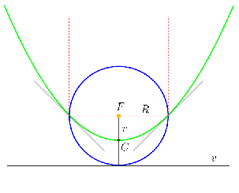

**Megoldás.**
 a) A földpálya középpontja egybeesik az üstökös parabolapályájának fókuszával. A parabola minden pontja ugyanakkora távolságra van az $F$ fókusztól, mint a $v$ vezéregyenestől. A két metszéspont éppen $R$ földsugárnyira van a fókusztól, tehát ugyancsak $R$ távolságra van a vezéregyenes is ezektől a pontoktól. Ebből következik, hogy a parabola vezéregyenese érinti a földpálya körét, és ezért a parabola $C$ csúcspontja a földsugár felénél van, vagyis az üstökös $r=R/2=75$ millió kilométerre közelíti meg a Napot. A parabolapálya miatt az üstökös teljes energiája nulla. Ebből ki tudjuk számítani az üstökös sebességét napközelben:
 $\frac{1}{2}mv^2-\gamma\frac{mM}{r}=0,\quad\textrm{amiből}\quad v=\sqrt{\frac{2\gamma M}{r}}=59{,}6\,\mathrm{km/s}.$

 b) Többféleképpen is megadhatjuk a választ. A legegyszerűbb talán az, ha optikai analógiát használunk. A parabola (térben forgási paraboloid) tengelyével párhuzamosan érkező fénysugarak úgy verődnek vissza a parabolatükörről, hogy azok a fókuszpontban koncentrálódnak. A két pálya metszéspontjaiba érkező, a parabola tengelyével párhuzamos sugarak eltérülése $90^\circ$-os, tehát a két pálya $45^\circ$-ban metszi egymást.

