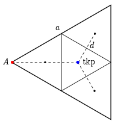
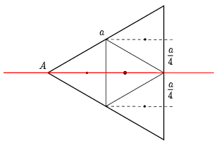
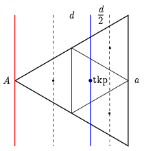
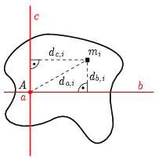
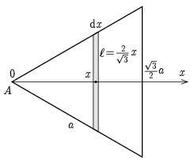

**I. megoldás.**
 a) Határozzuk meg először a $\Theta_\mathrm{a,\,tkp}$ tehetetlenségi nyomatékot a háromszög tömegközéppontján átmenő (és a háromszög síkjára merőleges) tengelyre. Ehhez osszuk fel a szabályos háromszöget 4 egybevágó kis háromszögre, ahogy azt az 1. ábra mutatja.

 1. ábra

 Egy kis háromszög saját tömegközéppontján átmenő tengelyre vonatkozó tehetetlenségi nyomatéka a nagy háromszögének 1/16-od része, hiszen a kis lemez tömege a nagy tömegének negyede, a lineáris méretei pedig a nagy méreteinek fele, de ezek a tehetetlenségi nyomatékban négyzetesen szerepelnek. Rakjuk össze a nagy háromszög tehetetlenségi nyomatékát a négy kis háromszögéből a Steiner-tétel segítségével:
 $\Theta_\mathrm{a,\,tkp}=4\frac{\Theta_\mathrm{a,\,tkp}}{16}+3\frac{m}{4}d^2,$
 ahol $d=\tfrac{a}{2\sqrt{3}}$ a három nem középen lévő kis háromszög tömegközéppontjának távolsága a közös tömegközépponttól. Ezt behelyettesítve és rendezve:
 $\Theta_\mathrm{a,\,tkp}=\frac{1}{12}ma^2.$
 Ebből a keresett tehetetlenségi nyomaték a Steiner-tétel alapján (felhasználva, hogy a tömegközéppont és a csúcs távolsága $\tfrac{a}{\sqrt{3}}$):
 $\Theta_\mathrm{a}=\Theta_\mathrm{a,\,tkp}+m\frac{a^2}{3}=\frac{5}{12}ma^2.$

 b) Hasonló módszerrel dolgozhatunk a $\Theta_\mathrm{b}$ tehetetlenségi nyomaték meghatározásakor is: a 2. ábrán látható módon ugyanúgy 4 kis háromszögre bontjuk a nagy háromszöget.

 2. ábra

 A kis háromszögek magasságvonalra vonatkoztatott tehetetlenségi nyomatéka az előzőhöz hasonlóan a nagy háromszög magasságvonalra vonatkozó tehetetlenségi nyomatékának 1/16-od része. A nagy háromszög tehetetlenségi nyomatékát ismét a négy kis háromszögéből rakjuk össze a Steiner-tétel segítségével:
 $\Theta_\mathrm{b}=4\frac{\Theta_\mathrm{b}}{16}+2\frac{m}{4}\frac{a^2}{16},$
 ahol felhasználtuk, hogy most csak két kis háromszög tömegközéppontja nem esik a tengelyre, és ezek tömegközéppontja $\tfrac{a}{4}$ távolságra van a tengelytől. Ebből rendezve a keresett tehetetlenségi nyomaték:
 $\Theta_\mathrm{b}=\frac{1}{24}ma^2.$

 c) Most az a) részhez hasonlóan először a tömegközépponton átmenő, az egyik oldallal párhuzamos $\Theta_\mathrm{c,\,tkp}$ tehetetlenségi nyomatékot határozzuk meg ugyanezzel a módszerrel ( 3. ábra ).

 3. ábra

 Egy kis háromszög tömegközépponton átmenő, egyik oldallal párhuzamos tengelyre vonatkozó tehetetlenségi nyomatéka az előzőkhöz hasonlóan most is a nagy háromszög tehetetlenségi nyomatékának 1/16-od része. A nagy háromszög tehetetlenségi nyomatékát ismét a négy kis háromszögéből rakjuk össze a Steiner-tétel segítségével:
 $\Theta_\mathrm{c,\,tkp}=4\frac{\Theta_\mathrm{c,\,tkp}}{16}+2\frac{m}{4}\frac{d^2}{4}+\frac{m}{4}d^2,$
 ahol ismét $d=\tfrac{a}{2\sqrt{3}}$, és felhasználtuk, hogy két kis háromszög tömegközéppontja $\tfrac{d}{2}$, egy pedig $d$ távolságra van a nagy háromszög tömegközéppontján átmenő tengelytől. Ezt behelyettesítve és rendezve:
 $\Theta_\mathrm{c,\,tkp}=\frac{1}{24}ma^2.$
 Ebből a keresett tehetetlenségi nyomaték a Steiner-tétel alapján (ismét felhasználva, hogy a tömegközéppont és a csúcs távolsága $\tfrac{a}{\sqrt{3}}$):
 $\Theta_\mathrm{c}=\Theta_\mathrm{c,\,tkp}+m\frac{a^2}{3}=\frac{3}{8}ma^2.$

 Megjegyzések. 1. Vegyük észre, hogy $\Theta_\mathrm{a}=\Theta_\mathrm{b}+\Theta_\mathrm{c}$ ($\tfrac{5}{12}=\tfrac{1}{24}+\tfrac{3}{8}$). Ez nem véletlen! Egy síkidom tehetetlenségi nyomatéka bármely tengelyre a $\Theta=\sum m_id_i^2$ összefüggéssel számítható ki, ahol $d_i$ az adott kis tömegelem távolsága a kiválasztott tengelytől. A 4. ábrán látható, hogy a síklapra merőleges $a$ tengelytől mért $d_{a,\,i}$ távolságra fennáll, hogy $d_{a,\,i}^2=d_{b,\,i}^2+d_{c,\,i}^2$, ahol $d_{b,\,i}$ és $d_{c,\,i}$ a síkban lévő, egymásra merőleges $b$ és $c$ tengelyektől mért távolságok.

 4. ábra

 Ebből és a tehetetlenségi nyomaték fenti összegzős képletéből azonnal adódik az összefüggés. (Ennek ismeretében a három feladatrész egyikének kiszámítása megspórolható lehet.)

 2. A megoldáshoz más feldarabolással is el lehet jutni.

**II. megoldás.**
 A tehetetlenségi nyomatékok kiszámíthatók integrálszámítással is. Itt most a háromszöglapot $\mathrm{d}x$ szélességű, $\ell=\tfrac{2}{\sqrt{3}}x$ hosszúságú kis téglalapokból fogjuk összerakni ( 5. ábra ), amelyek tehetetlenségi nyomatéka a középpontjukon átmenő, a szakaszra merőleges tengelyekre $\mathrm{d}\Theta=\tfrac{1}{12}\ell^2\mathrm{d}m$, a szakaszon átmenő tengelyre pedig nulla. A kis szakasz tömegét a $\mathrm{d}m=\tfrac{m}{A}\ell\mathrm{d}x$ összefüggéssel fejezhetjük ki, ahol $A=\tfrac{\sqrt{3}}{4}a^2$ a háromszög területe. Ahol szükséges, használjuk a Steiner-tételt.

 5. ábra

 a)
 $\Theta_\mathrm{a}=\int\limits_0^{\frac{\sqrt{3}}{2}a}\left(x^2+\frac{1}{12}\ell^2\right)\frac{4m}{\sqrt{3}a^2}\ell\mathrm{d}x=\frac{80m}{27a^2}\int\limits_0^{\frac{\sqrt{3}}{2}a}x^3\mathrm{d}x=\frac{80m}{27a^2}\left[\frac{1}{4}x^4\right]_0^{\frac{\sqrt{3}}{2}a}=\frac{5}{12}ma^2.$

 b)
 $\Theta_\mathrm{b}=\int\limits_0^{\frac{\sqrt{3}}{2}a}\frac{1}{12}\ell^2\frac{4m}{\sqrt{3}a^2}\ell\mathrm{d}x=\frac{8m}{27a^2}\int\limits_0^{\frac{\sqrt{3}}{2}a}x^3\mathrm{d}x=\frac{8m}{27a^2}\left[\frac{1}{4}x^4\right]_0^{\frac{\sqrt{3}}{2}a}=\frac{1}{24}ma^2.$

 c)
 $\Theta_\mathrm{a}=\int\limits_0^{\frac{\sqrt{3}}{2}a}x^2\frac{4m}{\sqrt{3}a^2}\ell\mathrm{d}x=\frac{8m}{3a^2}\int\limits_0^{\frac{\sqrt{3}}{2}a}x^3\mathrm{d}x=\frac{8m}{3a^2}\left[\frac{1}{4}x^4\right]_0^{\frac{\sqrt{3}}{2}a}=\frac{3}{8}ma^2.$

 Megjegyzések. 1. Már az integrálás elvégzése előtt látszik, hogy teljesül a $\Theta_\mathrm{a}=\Theta_\mathrm{b}+\Theta_\mathrm{c}$ összefüggés.

 2. Az integrálás más felosztással is elvégezhető.

