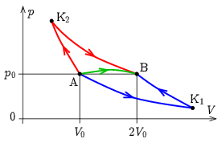
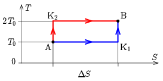

**I. megoldás.**
 A $pV$ állapotsíkon azok a folyamatok, amelyek során a hőmérséklet nem változik, a $pV=\textrm{állandó}$ izotermákkal, azok a folyamatok pedig, ahol nincs hőfelvétel vagy leadás, a $pV^\kappa=\textrm{állandó}$ adiabatákkal ábrázolhatók. Esetünkben a $\kappa=c_p/c_V$ fajhőhányados – egyatomos gázról lévén szó – 5/3. Azoknak a folyamatoknak a $p(V)$ függvénye, amelyeknél nincs hőleadás, és a hőmérséklet nem csökkenhet, az adiabatákat és az izotermákat csak a megfelelő oldalról metszhetik. Ez minden pontban kijelöli a megengedett irányokat. Ábrázoljuk a $p_0$ és $V_0$ értékekkel jellemzett A kezdő-, és a $p_0$, $2V_0$ értékekkel megadott B végponton átmenő adiabatákat és izotermákat. Jelöljük az A-n átmenő $pV=p_0V_0$ izoterma és a B-vel meghatározott $pV^{\kappa}=p_0(2V_0)^{\kappa}$ adiabata metszéspontját K$_1$-gyel, a B-n átmenő $pV=p_0(2V_0)$ izoterma és az A-t tartalmazó $pV^{\kappa}=p_0V_0^{\kappa}$ adiabata metszéspontját pedig K$_2$-vel. Könnyen belátható, hogy azokon az utakon, amik az A-K$_2$ és K$_1$-B adiabaták valamint a K$_2$-B és A-K$_1$ izotermák jelentette keretből kilépnek, a feltételeink valahol sérülnek, tehát a szóba jöhető folyamatok ezen görbék által meghatározott terület belsejében, vagy a határain kell, hogy végbemenjenek. (Az állítás megfordítva nem igaz, nem minden folyamat, amely az AK$_2$BK$_1$ idom belsejében ábrázolható, felel meg a hőmérséklet-csökkenés és hőleadás tilalmának.) A helyzetet vázlatosan mutató 1. ábrán megrajzoltuk a határokon futó A$\to$K$_1\!\to$B, valamint A$\to$K$_2\!\to$B folyamatokat, és bejelöltünk egy lehetséges közvetlen A$\to$B utat is.

 1. ábra

 Az alábbiakban megmutatjuk, hogy az egyes folyamatokhoz tartozó $Q_\mathrm{AK_1B}$, $Q_\mathrm{AK_2B}$ és $Q_\mathrm{AB}$ hőfelvételekre igaz a
 $Q_\mathrm{AK_2B}>Q_\mathrm{AB}>Q_\mathrm{AK_1B}$
 reláció. Tekintsük az A$\to$K$_2\!\to$B$\to$A körfolyamatot, ahol rendszer az A-ból B-be a határon futó A$\to$K$_2\!\to$B úton jut el, vissza pedig a bejelölt közvetlen A-B görbe mentén a jelölttel ellentétes irányba haladva. A körfolyamat során a hőfelvétel $Q_\mathrm{AK_2B}$, a hőleadás pedig $Q_\mathrm{AB}$, a kettő $W=Q_\mathrm{AK_2B}-Q_\mathrm{AB}$ különbsége pedig a végzett munka. Ez az adott körbejárási irány mellett pozitív, tehát valóban
 $Q_\mathrm{AK_2B}>Q_\mathrm{AB}.$
 Teljesen analóg módon az A$\to$B$\to$K$_1\!\to$A körfolyamatot tekintve megkapjuk a
 $Q_\mathrm{AB}>Q_\mathrm{AK_1B}$
 relációt is. Mivel az A$\to$B egy tetszőleges, a kijelölt tartomány belsejében végbevitt, a feltételeket kielégítő folyamat, a lehetséges legnagyobb és legkisebb hőfelvétel a határokon futó A$\to$K$_2\!\to$B, illetve A$\to$K$_1\!\to$B úton van:
 $Q_\mathrm{max}=Q_\mathrm{AK_2B},\qquad Q_\mathrm{min}=Q_\mathrm{AK_1B}.$
 Az A$\to$K$_2\!\to$B folyamat során hőfelvétel csak az izotermikus K$_2\!\to$B szakaszon van. Mivel itt a rendszer belső energiája nem változik, a felvett hő azonos a rendszer tágulási munkájával, azaz
 $Q_\mathrm{max}=\sum\Delta Q=\sum_\mathrm{K_2\to B}p\Delta V.$
 Az adott izoterma egyenlete szerint
 $p=\frac{p_02V_0}{V},$
 így
 $Q_\mathrm{max}=2p_0V_0\sum_\mathrm{K_2\to B}\frac{\Delta V}{V}.$
 A $\Delta V$ lépéseket egyre kisebbre választva az összefüggésünk jobb oldalán az összeg a megfelelő integrál értékéhez közelít,
 $\sum_\mathrm{K_2\to B}\frac{\Delta V}{V}\to\int\limits_{V_\mathrm{K_2}}^{V_\mathrm{B}}\frac{\mathrm{d}V}{V},$
 ami a Függvénytáblázatok szerint
 $\int\limits_{V_\mathrm{K_2}}^{V_\mathrm{B}}\frac{\mathrm{d}V}{V}=\ln\frac{V_\mathrm{B}}{V_\mathrm{K_2}}.$
 Definíciónk szerint K$_2$ a $pV=p_0(2V_0)$ izoterma és a $pV^\kappa=p_0V_0^\kappa$ adiabata metszéspontja, ahol is
 $V_\mathrm{K_2}^{\kappa-1}=\frac{V_{0}^{\kappa-1}}{2},\qquad\textrm{azaz}\qquad V_\mathrm{K_2}=\frac{V_0}{2^{1/(\kappa-1)}}.$
 Mivel $V_\mathrm{B}=2V_0$,
 $\frac{V_\mathrm{B}}{V_\mathrm{K_2}}=2^{\kappa/(\kappa-1)},$
 tehát
 $Q_\mathrm{max}=2p_0V_0\ln{2^{\kappa/(\kappa-1)}}=p_0V_0\frac{2\kappa\ln 2}{\kappa-1}=5p_0V_0\ln 2.$
 Teljesen hasonló módon ki tudjuk számolni az A$\to$K$_1$ úton felvett $Q_\mathrm{min}$ értékét, de van ennél egy rövidebb út is. Vegyük észre, hogy az A$\to$K$_2\!\to$B$\to$K$_1\!\to$A folyamat egy Carnot-körfolyamat, aminek a felső hőtartálya az állapotegyenlet szerint kétszer akkora hőmérsékletű, mint az alsó ($T_\mathrm{B}=2p_0V_0/nR$, illetve $T_\mathrm{A}=p_0V_0/nR$), tehát a hatásfoka $\eta=1/2$. Ennek megfelelően
 $\eta =\frac{Q_\mathrm{max}-Q_\mathrm{min}}{Q_\mathrm{max}}=\frac{1}{2},$
 amiből
 $Q_\mathrm{min}=\frac{Q_\mathrm{max}}{2}=\frac{5}{2}p_0V_0\ln 2.$

 Megjegyzés. Carnot tétele szerint bármely két hőmérséklet között végbevihető körfolyamatok közül a Carnot-körfolyamatnak a legjobb a hatásfoka. Ebből kiindulva is könnyen igazolható a $Q_\mathrm{max}=Q_\mathrm{AK_2B}$ és $Q_\mathrm{min}=Q_\mathrm{AK_1B}$ állításokat megalapozó $Q_\mathrm{AK_2B}>Q_\mathrm{AB}>Q_\mathrm{AK_1B}$ reláció. Innen tekintve a dolgot a fenti gondolatmenetünk a Carnot-tétel igazolásának tekinthető a lehetséges folyamatok egy osztályára (nevezetesen azokra, ahol a hőfelvétel és hőmérséklet-emelkedés, illetve a hőleadás és a hőmérséklet-csökkenés egy-egy szakaszban történik).

**II. megoldás.**
 Legyen a gáz hőmérséklete kezdetben $T_\mathrm{A}=T_0$, ekkor az ideális gáz $pV=nRT$ állapotegyenlete alapján a végállapotban $T_\mathrm{B}=2T_0$. Ábrázoljuk a kezdeti és a végállapotot, valamint a lehetséges folyamatokat az $T$-$S$ állapotsíkon ( 2. ábra ). Az entrópia kezdeti értékét nem tudjuk meghatározni (nincs is rá szükségünk), csak a megváltozását:
 $\Delta S=\frac{3}{2}nR\ln\frac{T_\mathrm{B}}{T_\mathrm{A}}+nR\ln\frac{V_\mathrm{B}}{V_\mathrm{A}}=\frac{5\ln 2}{2}nR=\frac{5\ln 2}{2}\frac{p_0V_0}{T_0},$
 ahol felhasználtuk, hogy $\tfrac{T_\mathrm{B}}{T_\mathrm{A}}=\tfrac{V_\mathrm{B}}{V_\mathrm{A}}=2$, az egyatomos gáznál $f=3$, valamint az állapotegyenlet alapján az $nR=\tfrac{p_0V_0}{T_0}$ összefüggést.

 2. ábra

 Ha a gáz hőmérséklete sohasem csökkenhet, illetve a gáz sohasem adhat le hőt, akkor se $T$, se $S$ nem csökkenhet, az A állapotból a B állapotba az $S$-$T$ állapotsíkon csak egy egyértékű, monoton növekvő görbe mentén juthat el a gáz. A gáz által felvett hőt az $S$-$T$ állapotsíkon a görbe alatti terület adja meg (hiszen $\mathrm{d}Q=T\mathrm{d}S$), így a minimális hőközléshez az A-K$_1$-B egyenes szakaszokból álló útvonal, a maximális hőközléshez az A-K$_2$-B útvonal tartozik. ($T$ és $S$ értéke nem csökkenhet, de lehet állandó.) Ez alapján a keresett minimális és maximális hőközlés:

 a)
 $Q_\mathrm{min}=T_0\Delta S=\frac{5\ln 2}{2}p_0V_0=1{,}73\,p_0V_0,$

 b)
 $Q_\mathrm{max}=2T_0\Delta S=5\ln 2\,p_0V_0=3{,}46\,p_0V_0=2Q_\mathrm{min}.$

