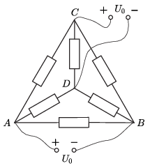
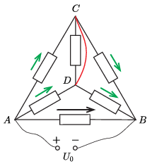
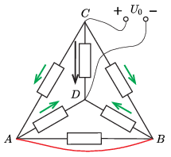
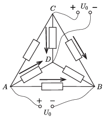
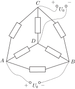
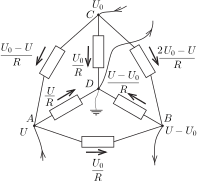

**I. megoldás.**
 Az 1. ábrán a feladatban leírt hálózat látható felülnézetből. A tetraéder minden pontja egyforma ellenállásokkal van összekötve az összes többivel, ezért mindegy, hogy melyik 2–2 pontra kötjük a telepeket, és milyen polaritással – mindig ugyanazt a feladatot kell megoldanunk.

 1. ábra $\qquad$ $\qquad$ $\qquad$ $\qquad$ $\qquad$ 2. ábra $\qquad$ $\qquad$ $\qquad$ $\qquad$ $\qquad$ 3. ábra $\qquad$ $\qquad$ $\qquad$ $\qquad$ $\qquad$ 4. ábra

 A szuperpozíció-tételt fogjuk alkalmazni, ami szerint hálózatunkban, ha több generátor van, akkor ezek együttes hatása egy ellenálláson a következőképp határozható meg: A generátorok hatását egyenként vesszük figyelembe, miközben a többi feszültséggenerátort rövidzárral, az áramgenerátorokat pedig szakadással helyettesítjük, majd az így kapott eredményeket előjelhelyesen összegezzük. A telepeket, mivel belső ellenállásuk elhanyagolható, feszültséggenerátornak tekintjük.
 Először oldjuk meg tehát a tetraédert az $A$ és $B$ pontok közti első teleppel, miközben a $C$ és $D$ pontok közti második telepet rövidzárral helyettesítettük ( 2. ábra ). Az $AB$ ágban folyó áram Ohm törvénye szerint:
 $I=\frac{U_0}{R},$
 az $AC$, $BC$, $AD$ és $BD$ ágakban pedig
 $\frac{\frac{1}{2}U_0}{R}=\frac{1}{2}I.$
 A kétféle áramerősséget az ellenállások mellé rajzolt hosszabb (fekete), illetve rövidebb (zöld) nyilakkal jelöltük. A $CD$ ellenálláson a rövidzár miatt nem folyik áram.
 A második telep a hozzá képest azonos helyzetben levő ágakban pont ugyanekkora áramokat hoz létre ( 3. ábra ).
 A  4. ábrán összeadtuk az előző kettőn berajzolt áramokat, figyelve az áramirányokra. Az $AC$ és $BD$ ágakban a két összetevő kiejti egymást, itt nem folyik áram. A többi négy ágban egyformán $I=U_0/R$. Ezekben az ágakban a teljesítmény egyenként $P=U_0I=U_0^2/R$. Végül tehát a $T$ idő alatt az egész hálózaton fejlődő hő:
 $Q=\frac{4TU_0^2}{R}.$

**II. megoldás.**
 A síkban kiterített kapcsolást az 5. ábra mutatja.

 5. ábra

 Mit állíthatunk az egyes csomópontok potenciáljáról? Bármelyik csomópontot ,,leföldelhetjük'', a potenciálját nullának választhatjuk. Legyen ez mondjuk a $D$ csomópont. Ekkor a $C$ pont potenciálja a rákapcsolt telep miatt $U_0$ lesz. A másik két csomópontról azt tudjuk, hogy ha $A$ potenciálja valamekkora, később meghatározandó $U$, akkor a $B$ ponté $U-U_0$ ( 6. ábra ). Az ábrán feltüntettük az egyes ellenállásokon folyó áramok erősségét is.

 6. ábra

 Az eddig ismeretlen $U$ értékét a Kirchhoff csomóponti törvényéből határozhatjuk meg. Az $A$ csomópontba például a telep pozitív pólusán keresztül ugyanannyi áram folyik be, amennyi a $B$ pontnál a negatív pólus felé kifolyik:
 $\frac{U_0}{R}+\frac{U}{R}-\frac{U_0-U}{R}=\frac{U_0}{R}-\frac{U-U_0}{R}+\frac{2U_0-U}{R},$
 ahonnan kapjuk, hogy
 $2U=4U_0-2U,$
 vagyis
 $U=U_0.$
 Ugyanezt az eredményt kapjuk, ha a $C$ és a $D$ csomópontokra alkalmazzuk a Kirchhoff törvényét.
 A csomópontok potenciáljának (és így az egyes ágakra eső feszültségek) ismeretében leolvashatjuk, hogy a $CA$ és a $BD$ ágakban nem folyik áram, a többi négy ágban pedig $I=U_0/R$ az áramerősség nagysága. Ezek szerint a teljes áramkör hőteljesítménye $4U_0I=4U_0^2/R$, és ennek megfelelően $T$ idő alatt
 $Q=4 U_0^2T/R$
 Joule-hő fejlődik.

 Megjegyzések. 1. A hőteljesítményt úgy is megkaphatjuk, hogy megállapítjuk: mindkét telepen $2I=2U_0/R$ áram folyik keresztül, a telepek által leadott összteljesítmény $2\cdot 2IU_0=4U_0^2/R.$
 2. Ha valamelyik telep polaritását felcseréljük, a fentiekkel megegyező eredményt kapjuk, vagyis azt, hogy két ellenálláson nem folyik áram, négyen pedig $U_0/R$ az áram erőssége, de az ellenállások ,,szereposztása'' megváltozik.

