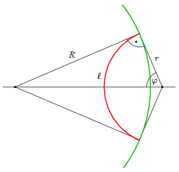

**Megoldás.**
 A feladat megoldásában komoly segítséget nyújt egy a felületi feszültség jelenségével összefüggő analógia. Tekintsünk egy vékony gyűrűt, amelyben szappanhártya feszül, és ezt a szappanhártyát egy olyan adott hosszúságú fonal osztja két részre, amelynek a végei a gyűrű mentén szabadon mozoghatnak. Ha kiszúrjuk a hártya kisebb felét, a fonalat a felületi feszültség úgy mozdítja el, hogy a hártya felülete a lehető legkisebb, következésképp a hártya mentes rész a lehető legnagyobb legyen. A jelenséget ismerve tudjuk, hogy ilyenkor a fonal alakja egy olyan körív, amely a gyűrűhöz arra merőlegesen érkezik. (Ez egyrészt abból következik, hogy a fonálra ható feszültség (hosszegységre jutó erő) a fonal mentén állandó, és a fonálra merőlegesen hat, így egyensúlyban a fonálban ható erő és a fonal görbületi sugara állandó, másrészt ha a fonál a gyűrűt nem merőlegesen érné el, akkor elmozdulna.) Ennek megfelelően a szigetből legnagyobb részt lehasító kerítés is körív alakú, és a végein merőleges a sziget partjára, ahogy az ábra mutatja. Ezen $R$-rel jelöltük a sziget sugarát, $r$-rel a kerítését, $\ell$-lel a kerítés hosszát és $\varphi$-vel a kerítés ívéhez tartozó középponti szög felét.

 Ennek alapján meg tudjuk határozni az ismeretlen $r$ és $\varphi$ változókat:
 $\varphi=\frac{\ell}{2r},$
 illetve
 $\tan\varphi=\frac{R}{r}.$
 Ez az egyenletrendszer $\varphi$-re a
 $\varphi=\frac{\ell}{2R}\tan\varphi$
 egyenletet adja, aminek a numerikus megoldása $\ell=R(=1\,\mathrm{km})$ esetén $\varphi=1{,}166$ radián (ez $66{,}78^\circ$).
 Megjegyzés. Az ilyen típusú egyenletek megoldására lapunk 2025. novemberi számában található egy igen egyszerű algoritmus ( Egy egyszerű egyenletmegoldó eljárás ). Az ott leírtaknak megfelelően az egyenletünk
 $\varphi=\arctan 2\varphi$
 alakjából érdemes kiindulni. A
 $\varphi_{n+1}=\arctan 2\varphi_n$
 képzési szabállyal generált sorozat elemei bármilyen pozitív számmal indítva nagyon gyorsan megközelítik a megoldás értékét.
 A kerítés ívének a sugara $r=0{,}429\,\mathrm{km}$.
 A levágott rész területe két körszelet területéből tevődik össze, az egyik sugara és központi szöge $r$ és $2\varphi$, a másiknak ugyanezek az adatai $R$ és $\pi-2\varphi$, így
 $T=r^2\left(\varphi-\frac{\sin 2\varphi}{2}\right)+R^2\left(\frac{\pi}{2}-\varphi-\frac{\sin(\pi-2\varphi)}{2}\right).$
 Az adatokat behelyettesítve $T=0{,}191\,\mathrm{km^2}$.

