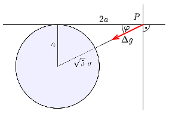

**Megoldás.**
 Az ,,elrendezést'' az ábra mutatja.

 A kérdéses $P$ pontban (a bánya modellbeli bejáratától $2a$ távolságra) a $g$ nehézségi gyorsulás vízbetörés előtti irányát tekintjük függőlegesnek, értelemszerűen az erre merőleges sík a vízszintes. A bánya elöntése után a bányába ömlött víz hatásara a függőleges $g$-hez egy a vízszintessel $\varphi=\arctan\tfrac{1}{2}$ szöget bezáró $\Delta g$ komponens adódik, aminek a nagysága
 $\Delta g=\frac{\gamma M}{5a^2},$
 ahol $\gamma$ a gravitációs állandó, és $M$ a beömlött víz tömege. Ennek a $\Delta g\cos\varphi$ nagyságú vízszintes komponense téríti ki a függőónt az eredeti helyzetéből. A kitérítés szöge
 $\vartheta=\frac{\Delta g\cos\varphi}{g}=\frac{2\gamma M}{5\sqrt{5}a^2g}.$
 Itt alkalmaztuk a kicsiny szögekre érvényes $\vartheta\simeq\tan\vartheta$ összefüggést, és $g$ mellett elhanyagoltuk a $\Delta g$ függőleges komponensét. Mivel $M=\tfrac{4a^3\pi}{3}\varrho_\mathrm{v}$, (ahol $\varrho_\mathrm{v}$ a víz sűrűsége) az összes adat ismert és $\vartheta$ kiszámítható, de érdemes a képletünket úgy átalakítani, hogy csak azonos dimenziójú mennyiségek hányadosát tartalmazza. Erre több lehetőség is van, az egyik az, hogy $g$ értékét a Föld $R$ sugarával és $\varrho_\mathrm{F}$ átlagos sűrűségével fejezzük ki:
 $g=\frac{\gamma 4\pi R\varrho_\mathrm{F}}{3}.$
 Ezt és $M$ $a$-val kifejezett értékét behelyettesítve
 $\vartheta=\frac{2}{5\sqrt{5}}\frac{\varrho_\mathrm{v}}{\varrho_\mathrm{F}}\frac{a}{R}.$
 Az $M$ tömeg becsült értékéből számítva, két értékes jegyre kerekítve $a=110\,\mathrm{m}$. A többi adatot is két jegyre kerekítve ($\varrho_\mathrm{F}=5{,}5\cdot 10^3\,\mathrm{kg/m^3}$, $R=6{,}4\cdot 10^6\,\mathrm{m}$)
 $\vartheta=5{,}6\cdot 10^{-7}\,\mathrm{rad}=0{,}12''.$

