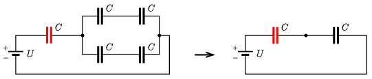
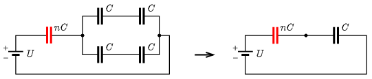
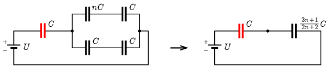

**Megoldás.**
 Sorba kapcsolt kondenzátorokon a feszültség a kapacitásokkal fordított arányban oszlik meg, hiszen a két kondenzátoron ugyanakkora töltésnek kell lennie:
 $C_1U_1=Q=C_2U_2,$
 a soros kapcsolás miatt a feszültségek összeadódnak:
 $U_1+U_2=U,$
 amiből
$$\begin{gather*}
U_1=\frac{C_2}{C_1+C_2}U,\\
U_2=\frac{C_1}{C_1+C_2}U.
\end{gather*}$$

 a) A kapcsolási rajzot kicsit átrajzolva ( 1. ábra ) láthatjuk, hogy a négy szélső kondenzátor eredője szintén egy $C$ kapacitású kondenzátor, hiszen a sorba kapcsolt két-két kondenzátor eredő kapacitása $\tfrac{C}{2}$, és ezeket párhuzamosan kapcsolva $2\cdot\tfrac{C}{2}=C$ kapacitást kapunk. Így az (eredetileg) középen elhelyezkedő (az ábrán piros) kondenzátorra
 $U_\mathrm{a}=\frac{1}{2}U$
 feszültség jut, a rajta felhalmozott töltés így:
 $Q_\mathrm{a}=\frac{1}{2}CU.$

 1. ábra

 b) Itt két esetet kell megkülönböztetnünk: vagy a középső, vagy valamelyik szélső kondenzátort cseréljük ki $nC$ kapacitásúra. (A második esetben a szimmetria miatt mindegy, hogy melyiket.)

 2. ábra

 Az első esetben a 2. ábrán látható módon az $U$ feszültség egy $nC$ és egy $C$ kapacitású, sorbakötött kondenzátor között oszlik meg. A bevezető szerint az (eredetileg) középen elhelyezkedő $nC$ kapacitású kondenzátorra jutó feszültség:
 $U_\mathrm{b1}=\frac{C}{nC+C}U=\frac{1}{n+1}U,$
 amiből a keresett töltés:
 $Q_\mathrm{b1}=nCU_\mathrm{b1}=\frac{n}{n+1}CU.$

 3. ábra

 A másik esetet a 3. ábra mutatja. Ekkor a négy másik kapacitás eredője:
 $C_\mathrm{e}=nC\times C+C\times C=\frac{n}{n+1}C+\frac{1}{2}C=\frac{3n+1}{2n+2}C,$
 ahol a $\times$ a ,,replusz'' jele (a reciprokok összegének a reciproka). Az (eredetileg) középen álló kondenzátorra jutó feszültség a feszültségosztás alapján:
 $U_\mathrm{b2}=\frac{\frac{3n+1}{2n+2}C}{C+\frac{3n+1}{2n+2}C}U=\frac{3n+1}{5n+3}U,$
 amiből a keresett töltés:
 $Q_\mathrm{b2}=CU_\mathrm{b2}=\frac{3n+1}{5n+3}CU.$

