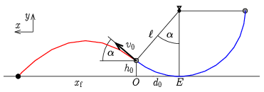
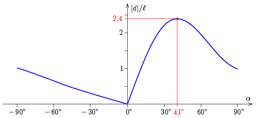

**Megoldás.**
 A mozgás két részből áll: egy ingamozgásból és egy ferde hajításból. Az 1. ábrán láthatók a jelölések. (A megfelelő szöget az inga felfelé mozgó részén keressük.)

 1. ábra

 A fonál elszakadásakor a test a talaj felett
 $h_0=\ell(1-\cos\alpha)$
 magasságban van, az egyensúlyi helyzettől vízszintesen
 $d_0=\ell\sin\alpha$
 távolságban. A sebessége ekkor érintőirányú (így a vízszintessel $\alpha$ szöget zár be), nagysága az energiamegmaradás alapján:
 $v_0=\sqrt{2\ell g\cos\alpha}.$
 A ferde hajítás elmozdulás-idő függvényei (az origót az $O$ pontban, a tengelyeket az ábrán jelölt módon választva):
$$\begin{gather*}
x=v_0\cos\alpha\,t,\\
y=h_0+v_0\sin\alpha\,t-\frac{g}{2}t^2.
\end{gather*}$$
 A földetérés $t_\mathrm{f}$ időpontját az $y(t_\mathrm{f})=0$ egyenlet adja meg. A másodfokú egyenlet pozitív gyöke:
 $t_\mathrm{f}=\frac{v_0\sin\alpha+\sqrt{v_0^2\sin^2\alpha+2gh_0}}{g},$
 amiből a földetérésig megtett vízszintes elmozdulás:
 $x_\mathrm{f}=v_0\cos\alpha\,t_\mathrm{f}=\frac{v_0\cos\alpha}{g}\left(v_0\sin\alpha+\sqrt{v_0^2\sin^2\alpha+2gh_0}\right).$
 Az $E$ egyensúlyi helyzettől mérve a távolság $h_0$, $d_0$ és $v_0$ kifejezését beírva:
 $d=d_0+x_\mathrm{f}=\ell\sin\alpha+2\ell\sin\alpha\cos^2\alpha+\cos\alpha\sqrt{4\ell^2\cos^2\alpha\sin^2\alpha+4\ell^2\cos\alpha(1-\cos\alpha)}.$
 A távolságot $\ell$ egységekben mérve, és a kifejezést tovább rendezve:
 $\frac{d}{\ell}=\sin\alpha(1+2\cos^2\alpha)+2\cos\alpha\sqrt{\cos\alpha-\cos^4\alpha}.$
 Ennek a kifejezésnek a maximumát keressük. A kifejezés deriválható, de az így kapott egyenlet nagyon bonyolult, csak numerikusan megoldható. Ehelyett érdemes a függvényt grafikusan ábrázolni, és a grafikonról leolvasni a maximális távolsághoz tartozó $\alpha_\mathrm{max}$ szöget és $d_\mathrm{max}$ távolságot ( 2. ábra ).

 2. ábra

 A grafikon alapján:
$$\begin{gather*}
\alpha_\mathrm{max}\approx 41^\circ,\\
d_\mathrm{max}\approx 2{,}4\,\ell.
\end{gather*}$$
 A másik lehetőség a függvény maximumhelyének és maximumértékének internetes megkeresése (például a https://www.wolframalpha.com/ oldalon).

