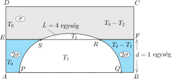
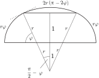
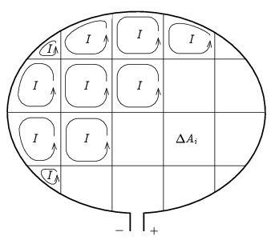
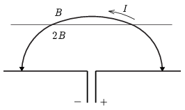

**I. megoldás**
 A kérdésre egy analógia felhasználásával, a vékony folyadékhártyák felületi feszültség által szabályozott energiaminimumra történő hivatkozással is választ kaphatunk.
 Képzeljük el a következő gondolatkísérletet. Merev drótból elkészítjük az $ABCD$ téglalap alakú keretet, amit az $EF$ egyenes mentén egy ugyancsak merev dróttal két egyforma, egyenként $T_0$ területű részre osztunk ( 1. ábra ). Az $AB$ oldalon (ami az eredeti feladatban az Észak-Afrikai partvonalnak felel meg) két kis karika ($P$ és $Q$) súrlódásmentesen csúszhat. Az $AB$-től $d=$ 1 egység távolságra lévő $EF$ drótra is felfűzünk két kis karikát ($S$ és $R$), amelyek ugyancsak súrlódásmentesen mozoghatnak. Ezután bujtassunk egy vékony, hajlékony, nyújthatatlan, $L=4$ egység hosszú fonalat az $S$ és az $R$ karikákon, a végeit pedig rögzítsük a $P$, illetve a $Q$ karikákhoz.

 1. ábra

 Ezt követően a drótkeret egyik, majd a másik felét különböző folyadékokba mártjuk, és így két különböző tulajdonságú folyadékhártyát hozunk létre. Tegyük fel, hogy az $ABFE$ területen képződő (kék színnel jelölt) hártya felületi feszültsége kétszer akkora, mint az $EFCD$ területen kialakuló (szürkével jelölt) másik hártyáé. Ha a fonál és az $AB$ egyenes közötti részeken lévő hártyákat elpukkasztjuk, az ábrán látható egyensúlyi alak jön létre. Ennek $E$ energiája a felületi feszültség és a hártya területének szorzatával egyezik meg, tehát az ábra jelöléseivel
 $E=2\sigma(T_0-T_1)+\sigma(T_0-T_2)=E_0-\sigma\cdot[2T_1+T_2].$
 A rendszer egyensúlyi állapotában az összenergia minimális, vagyis a szögletes zárójelben álló kifejezés – ami a Dido által körbekerített földterület értékével arányos – maximális értékű.
 Milyen tulajdonságai vannak a fonálnak az egyensúlyi állapotban? A végpontjainál az érintője merőleges az $AB$ oldalra; ha nem így lenne, akkor a $P$ és a $Q$ karikákra a fonál $AB$ irányú erőt is kifejtene, és azok mozgásba jönnének. A fonalat mindenhol ugyanakkora, mondjuk $K$ nagyságú erő feszíti, de ennek az erőnek az iránya helyről helyre változik. A fonál egy kicsiny darabjára a végpontjainál ható erők eredője a fonáldarabra merőleges és $K\Delta\varphi$ nagyságú, ahol $\Delta\varphi$ a végpontoknál ható erők irányának szögeltérése. Ezzel az erővel a felületi feszültségből származó $\sigma\cdot R\Delta\varphi$ erő tart egyensúlyt, ahol $R$ az adott helyen a fonál görbületi sugara. Ezek szerint $R=K/\sigma=$ állandó, tehát a görbe alakja körív. A nagyobb felületi feszültségű (kék) hártya határgörbéje fele akkora sugarú körív, mint a másik (szürke) hártya körívhatára. A két hártya határánál (az $S$ és az $R$ pontoknál) a körívek érintője megegyezik; ellenkező esetben a gyöngyökre eredő erő hatna, és azok elmozdulnának.
 Az eddigi eredmények ismeretében már pontosan meg tudjuk határozni a kerítés alakját és jellemző adatait, valamint a legnagyobb értékű elkerített terület nagyságát.
 Foglaljuk össze, hogy mit tudunk.
 1. A határgörbe érintője a görbe végpontjainál merőleges a tengerpartra.
 2. A görbe három, törésmentesen csatlakozó körívből áll.
 3. Ha a két szélső körív sugara $r$, a középsőé $2r$.
 4. A körívek csatlakozási pontjai 1 km távol vannak a tengerparttól.
 5. A kerítés teljes hossza 4 km egység.

 2. ábra

 A 2. ábráról leolvashatjuk, hogy (a távolságokat km egységekben számolva)
 $2r\sin\varphi=2\qquad\text{és}\qquad 2r\varphi+2r(\pi-2\varphi)=4,$
 vagyis
 $2\sin\varphi=\pi-\varphi.$
 Ennek a trigonometrikus egyenletnek a numerikus megoldása
 $\varphi\approx 1{,}245\,\mathrm{rad}\approx 71{,}4^\circ.$
 és $r=1{,}055\,\mathrm{km}$.
 $r$ és $\varphi$ ismeretében már kiszámíthatjuk a Dido által körülkerített legértékesebb terület nagyságát:
 $A=2\frac{r^2\varphi}2+\frac{2r\cdot 2r(\pi-2\varphi)}2-r^2\sin\varphi\,\cos\varphi=r^2(2\pi-3\varphi-\sin\varphi\,\cos\varphi)\approx 2{,}5\,\mathrm{km^2}.$

**II. megoldás.**
 A feladat megoldásához egy másik fizikai analógia is kínálkozik: nevezetesen egy hajlékony és alakváltoztatásra képes drótkeret mágneses térben olyan alakot vesz fel, illetve úgy helyezkedik el, hogy az energiája minimális legyen. Ez egy rögzített külső térben a vezető által körülfogott fluxus maximálását jelenti. Ennek belátásához az alábbiakat kell felidéznünk.
 Egy síkban elhelyezkedő $A$ felületű $I$ áram által átjárt vezető keret mágneses momentuma $m=IA$ nagyságú, az $\boldsymbol{m}$ vektor merőleges a keret síkjára és az irányát a jobbkéz szabály adja meg. Homogén mágneses térben erre a vezető hurokra $\boldsymbol{M}=\boldsymbol{m}\times\boldsymbol{B}$ forgatónyomaték hat. (Ezt használjuk ki a mágneses indukció magnetométerrel való mérésekor.) Ezzel összhangban a vezető keret energiája egy általános helyzetben $E=-\boldsymbol{m}\,\boldsymbol{B}$. Könnyen látható, hogy ennek az értéke $-I\Phi$, ahol $\Phi$ a vezető keret által körbefogott fluxus. Ez igaz inhomogén térben is. Fektessünk gondolatban a vezető keretre egy olyan hálót, aminek a különböző $\Delta A_i$ nagyságú szemei már elég kicsik ahhoz, hogy a szemeken belül a $\boldsymbol{B}_i$ teret állandónak vehessük, és képzeljük el, hogy minden kis hurokban $I$ nagyságú köráram folyik.

 3. ábra

 Ezek a hálózat belső élei mentén kiejtik egymást, de a külső (nem csak gondolatban létező) éleken pont kiadják a hurok áramát. A teljes keret energiája e kicsiny hurkok energiájának az összegeként adható meg, ami $E=-I\sum\Delta\Phi_i=-I\Phi$ a hurok felülete mentén változó mágneses indukció esetén is.
 A fentiek alapján tehát elfogadhatjuk, hogy amikor a hajlékony vezető hurok olyan alakot vesz fel, hogy az energiát minimalizálja, azzal a körbefogott fluxust maximalizálja. Vegyünk egy olyan elrendezést, amelyben a kerítést reprezentáló drót két vége szabadon mozoghat a part vonala mentén futó pozitív és negatív elektródák mentén, és a part mellett egy megfelelő szélességű sávban a függőleges mágneses indukció kétszer akkora mint beljebb. (Ez egy idealizált helyzet, a mágneses indukció nem változhat nagyon élesen, hacsak nem folyik a két térrészt elválasztó felületen valamekkora felületi áram, de ezzel nem kell foglalkoznunk, feltételezhetjük, hogy az átmeneti tartomány keskeny.)

 4. ábra

 Egyrészt tudjuk, hogy egyensúlyban a terület értékét ,,reprezentáló'' fluxus maximális, másrészt a vezetékre ható erők alapján meg tudjuk mondani, milyen alakot vesz fel ilyenkor a keret. Ettől a ponttól kezdve – mivel a mágneses tér által az árammal átjárt vezetőre ható erő pontos analógiában van a felületi feszültség miatt a fonálra ható erővel –, a megoldás gondolatmenete lépésről lépésre követi az előző megoldás megfontolásait, és megállapíthatjuk, hogy a drót pontosan úgy feszül ki, mint ahogy a fonál a két folyadékhártya hatására.

