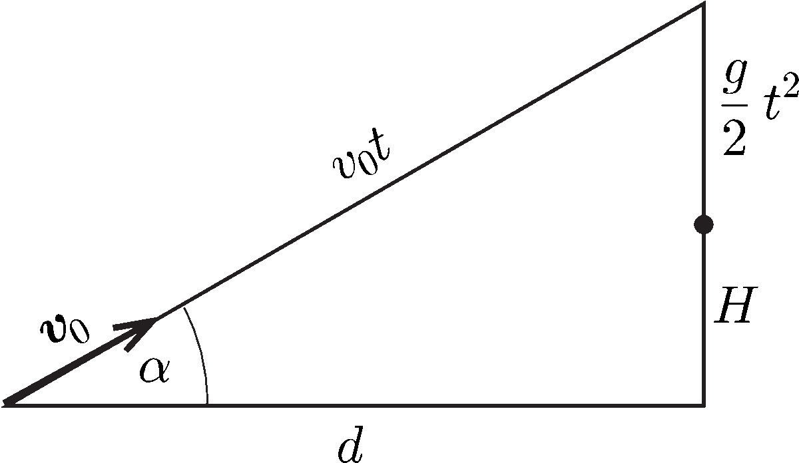

**Megoldás.**
 A megoldásban $g=9{,}8\,\mathrm{m/s^2}$-tel számolunk.

 a) A labda mozgását írjuk le egy $\boldsymbol{v}_0$ sebességű, egyenes vonalú, egyenletes mozgás és egy szabadesés szuperpozíciójaként, ahogy ezt az ábra mutatja.

 Az ábra alapján a Pitagorasz-tételt így írhatjuk fel:
 $d^2+(H+\frac{g}{2}t^2)^2=v_0^2t^2.$
 Ez az egyenlet ($t^2$)-ben másodfokú egyenletre vezet, melynek megoldása:
 $(1)$ $(t^2)_{1,2}=\frac{2}{g^2}\left(v_0^2-gH\pm\sqrt{v_0^4-2gHv_0^2-g^2d^2}\right).$
 Az adatok behelyettesítése alapján kétféle repülési idő jön szóba: $t_1=0{,}446\,\mathrm{s}$ vagy $t_2=1{,}886\,\mathrm{s}$. Az eldobás szögét például a
 $\cos\alpha=\frac{d}{v_0t}$
 összefüggés szerint kaphatjuk meg: $\alpha_1=26{,}3^\circ$ és $\alpha_2=77{,}8^\circ$.
 Meg kell még vizsgálnunk, hogy az ilyen dobások esetén a labda leszálló vagy felszálló ágban éri el a célt, mert csak a leszálló ágú dobások érvényesek. (A 6 méteres magasságkülönbség 10 m/s-os kezdősebesség esetén nem lehet akadály, mert még a függőlegesen eldobott labda is csak kb. 5 m magasra emelkedik.) Az első esetben a labda függőleges kezdősebessége $v_{y1}=v_0\sin\alpha_1=4{,}43\,\mathrm{m/s}$, tehát a labda $v_{y1}/g=0{,}452\,\mathrm{s}$-ig emelkedik, vagyis ilyenkor még alulról megy át a labda a célon, ami érvénytelen kosarat jelent.
 A második esetben a labda függőleges kezdősebessége $v_{y2}=v_0\sin\alpha_2=9{,}77\,\mathrm{m/s}$, tehát a labda $v_{y2}/g=0{,}997\,\mathrm{s}$-ig emelkedik (majdnem 5 méter magasra), vagyis a labda bőven a leszálló ágban megy át a gyűrű közepén. Tehát a 10 m/s-os kezdősebesség olyan nagy, hogy a büntetődobás csak meredeken felfelé elindítva lehet sikeres. Ilyet csak bemutatókon szoktak csinálni, mert valóban bravúros, hogy a labda majdnem 2 másodperces repülés után esik át a gyűrűn.

 b) Az (1) egyenletben akkor kapunk valós megoldást, ha a gyökjel alatti kifejezés nem negatív. A diszkrimináns vizsgálata azt mutatja, hogy ennek feltétele:
 $v_0\geq\sqrt{g\left(H+\sqrt{H^2+d^2}\right)}\approx 7{,}086\,\mathrm{m/s}.$
 A fiúnak tehát legalább ekkora sebességgel kell eldobnia a labdát. Minimális sebesség esetén csak egy indítási szög létezik:
 $\alpha_0=\arccos\frac{d}{v_0t}\approx 47{,}9^{\circ}.$
 Megmutatható, hogy ilyenkor érvényes a kosár, mert leszálló ágban éri el a gyűrűt a labda.
 Ha például a kezdősebesség 8 m/s, akkor a repülési idők és indítási szögek rendre 0,614 s és $35{,}4^\circ$, illetve 1,372 s és $68{,}6^\circ$. Mindkét esetben érvényes a kosár, mert lefelé szálló ágban megy át a labda a gyűrűn.
 Ha növeljük a kezdősebességet, akkor a két lehetséges pálya közül az alsó eléri azt a határt, amikor a labda a parabolapályájának a csúcspontján megy át a célon (a valóságban ez már nem érvényes kosár, mert a labda ilyenkor súrolja a gyűrűt). A parabola csúcspontjának eléréséig tartó idő (lásd a korábbi ábrát):
 $t=\frac{v_0\sin\alpha}{g}=\frac{v_0\frac{H+\frac{g}{2}t^2}{v_0t}}{g}\qquad\rightarrow\qquad t^2=\frac{2H}{g}.$
 Ha ezt egyenlővé tesszük az (1) kifejezésben lévő időnégyzet kisebb értékével, akkor $v_0$-ra ezt kapjuk:
 $v_0=\sqrt{gd\left(\frac{2H}{d}+\frac{d}{2H}\right)}=9{,}9\,\mathrm{m/s}.$
 Ehhez a sebességhez 0,4518 s repülési idő és $26{,}6^{\circ}$-os indítási szög tartozik.
 Láthatjuk tehát, hogy a sikeres dobáshoz legalább 7,09 m/s kezdősebesség szükséges. Ha az indítási sebesség 7,09 m/s és 9,9 m/s közötti, vagyis
 $\sqrt{g\left(H+\sqrt{H^2+d^2}\right)}=7{,}09\,\mathrm{m/s}<v_0<\sqrt{gd\left(\frac{2H}{d}+\frac{d}{2H}\right)}=9{,}9\,\mathrm{m/s},$
 akkor kétféleképpen is célba találhat a fiú. Ha a kezdősebessége 9,9 m/s-nál nagyobb, akkor csak az igen meredek dobás lehet sikeres. Ennek viszont az épület magassága szab határt. A labda legfeljebb 6 métert emelkedhet. Mivel ilyenkor majdnem függőleges az indulás, így $v_\mathrm{max}\approx\sqrt{2gh}=10{,}8\,\mathrm{m/s}$, tehát ennél nem lehet nagyobb a kezdősebesség.
 Láthatjuk, hogy a sikeres büntetődobáshoz viszonylag szűk lehetséges indítási sebesség és az ahhoz tartozó megfelelő indítási szög tartozik.

 Megjegyzés. A numerikus értékek rendkívül érzékenyek a számolás során alkalmazott kerekítésekre.

