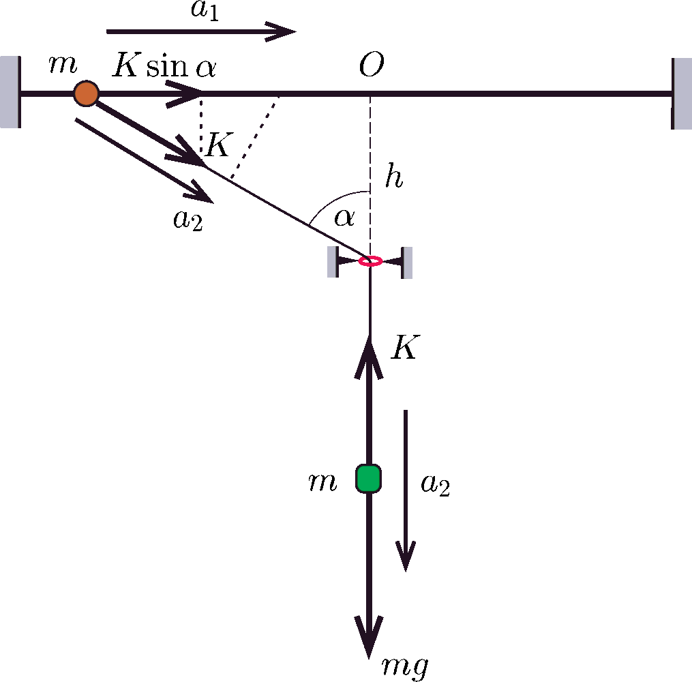
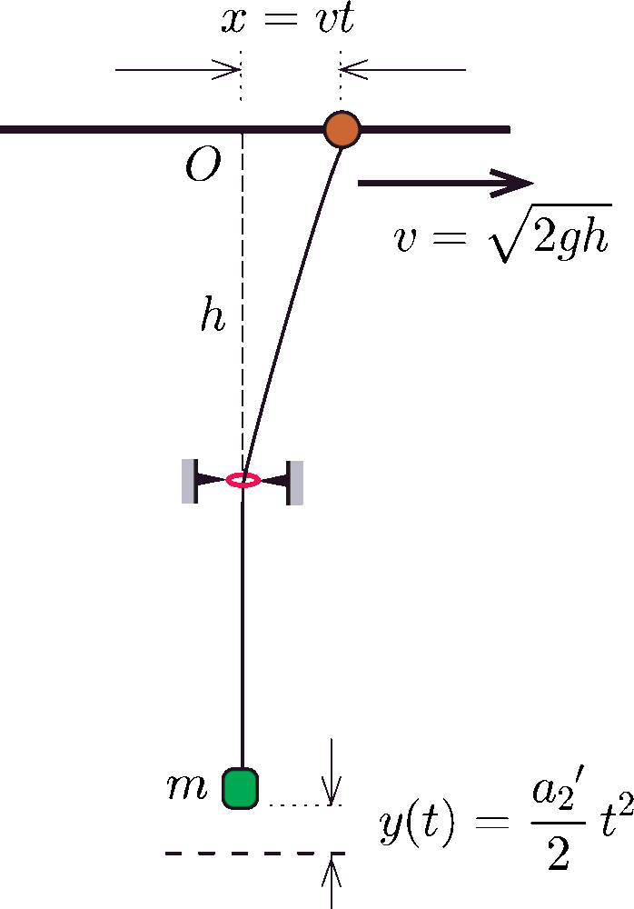
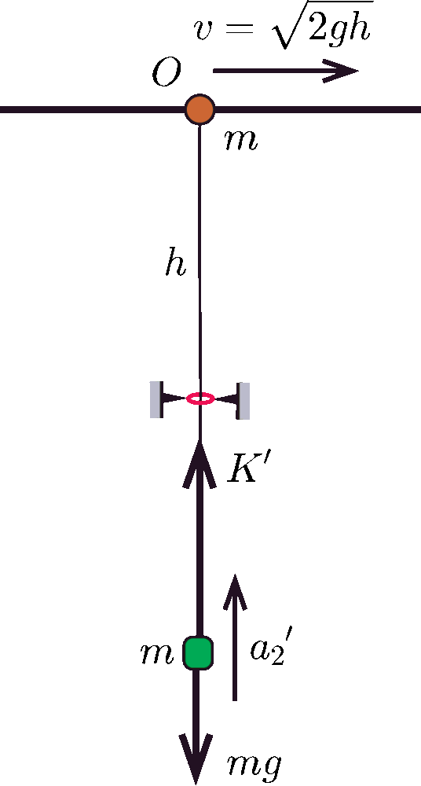
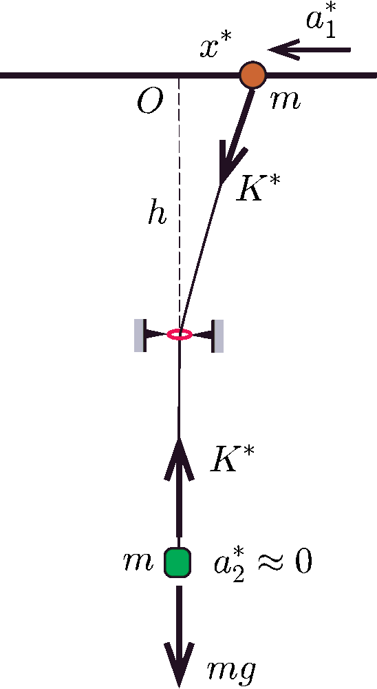

**Megoldás.**
 a) Az elengedés előtt a fonalat nyilván $mg$ erő feszíti. Az elengedéskor az erő hirtelen valamekkora $K$ értékre változik, miközben a golyó vízszintesen jobbra $a_1$, a nehezék pedig függőlegesen lefelé $a_2$ gyorsulással kezd el mozogni ( 1. ábra ).

 1. ábra

 A mozgásegyenletek:
$$\begin{gather*}
K\sin\alpha=ma_1,\\
mg-K=ma_2,
\end{gather*}$$
 a fonál nyújthatatlanságának feltétele pedig
 $a_2=a_1\sin\alpha.$
 Ezekből az egyenletekből kapjuk, hogy
 $K=\frac{mg}{1+\sin^2\alpha}=\frac{mg}{1+\frac{3}{4}}=\frac{4}{7}mg.$
 A karika fölötti $O$ ponton történő áthaladáskor a golyó $v$ sebességét az energiamegmaradás törvényéből határozhatjuk meg. Mivel a nehezék az indulási helyzetéhez képest
 $\frac{h}{\cos\alpha}-h=h$
 távolságnyit süllyed és a sebessége a kérdéses pillanatban nulla, fennáll
 $mgh=\frac{1}{2}mv^2,\qquad\textrm{vagyis}\qquad v=\sqrt{2gh}.$
 Jelöljük teljes hosszában függőleges helyzetű fonalat feszítő erőt $K'$-vel, a golyó gyorsulását $a_1'$-vel, a nehezék gyorsulását pedig $a_2'$-vel. Mivel a golyóra ebben a helyzetben nem hat vízszintes irányú erő, $a_1'$ nyilván nulla . A golyó elmozdulása az $O$ ponton történő áthaladása után egy kicsiny $t$ idővel később jó közelítéssel
 $x(t)=vt.$
 A nehezék a $t$ időpontban a legmélyebb (a 2. ábrán vízszintes szaggatott vonallal jelölt) helyzetéhez viszonyítva bizonyos $y(t)$ távolsággal magasabban lesz.

 2. ábra

 A fonál hosszának állandósága miatt fennáll:
 $y(t)=\sqrt{x^2+h^2}-h=\frac{\left[x(t)^2+h^2\right]-h^2}{\sqrt{x(t)^2+h^2}+h}\approx\frac{x(t)^2}{2h}=\frac{1}{2}\frac{v^2}{h}t^2.$
 Innen leolvashatjuk, hogy a nehezék a legmélyebb helyzetében $a_2'=\tfrac{v^2}{h}=2g$ nagyságú, függőlegesen felfelé irányuló gyorsulással mozog ( 3. ábra ).

 3. ábra

 A nehezék mozgásegyenlete a golyó $O$ ponton való áthaladásakor:
 $K'-mg=ma_2'=2mg,\qquad\textrm{vagyis}\qquad K'=3mg.$
 Ezek szerint a legnagyobb és a legkisebb fonálerő keresett aránya:
 $\frac{K'}{K}=\frac{21}{4}=5{,}25.$

 b) Vizsgáljuk most a golyó kis amplitúdójú rezgéseit az egyensúlyi helyzet (az $O$ pont) körül. Jelöljük a golyó pillanatnyi kitérését $x^*$-gal, a gyorsulásának nagyságát $a^*$-gal, a fonalat feszítő erőt pedig $K^*$-gal ( 4. ábra ).

 4. ábra

 Ha $x^*\ll h$, a nehezék elmozdulása $(x^*)^2/(2h)$ ,,másodrendűen kicsi'', tehát a gyorsulása jó közelítéssel nullának vehető. A nehezék mozgásegyenlete:
 $mg-K^*=ma_2^*=0,\qquad\textrm{tehát}\qquad K^*\approx mg.$
 A golyó mozgásegyenletében a fonálerő vízszintes komponense jelenik meg:
 $ma_1^*=-K^*\frac{x^*}{\sqrt{h^2+(x^*)^2}}\approx -\frac{mg}{h}x^*,$
 azaz
 $a_1^*=-\frac{g}{h}\,x^*.$
 (A negatív előjel a gyorsulás és a kitérés ellentétes irányát veszi figyelembe.) Ha a fenti képletet összevetjük a harmonikus rezgőmozgás
 $a_1^*=-\omega^2\,x^*$
 összefüggésével, leolvashatjuk, hogy $\omega=\sqrt{g/h}$, és így a rezgések periódusideje:
 $T=\frac{2\pi}{\omega}=2\pi\sqrt{\frac{h}{g}}.$
 Ez éppen akkora, mint egy $h$ fonálhosszúságú matematikai inga lengésideje.

