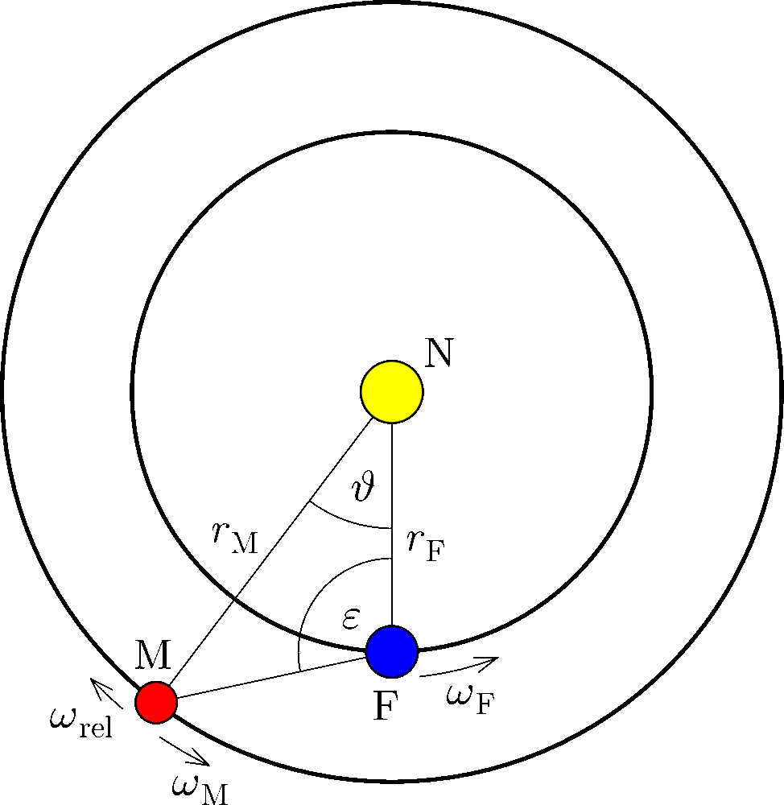
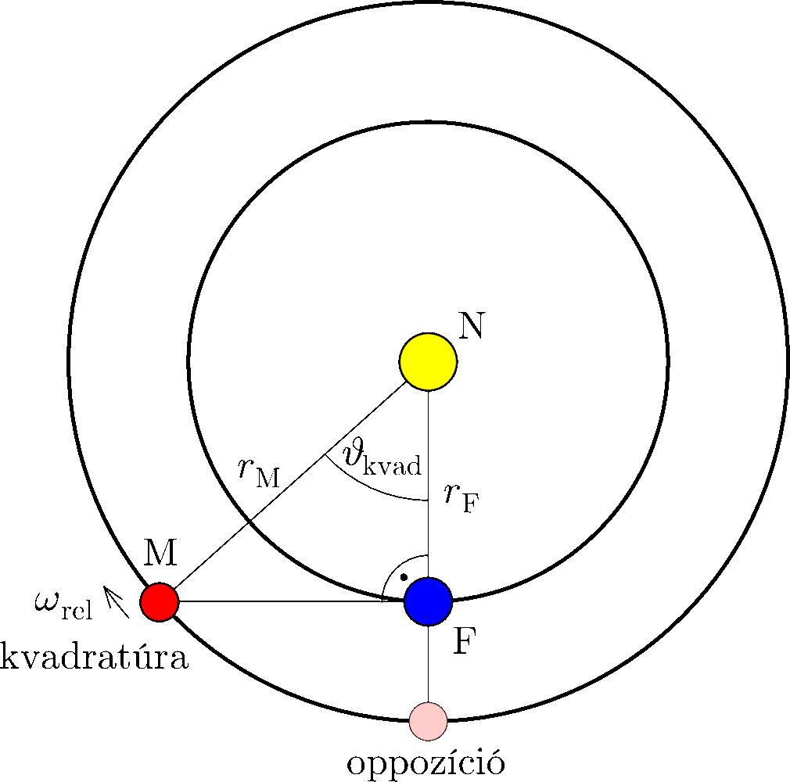
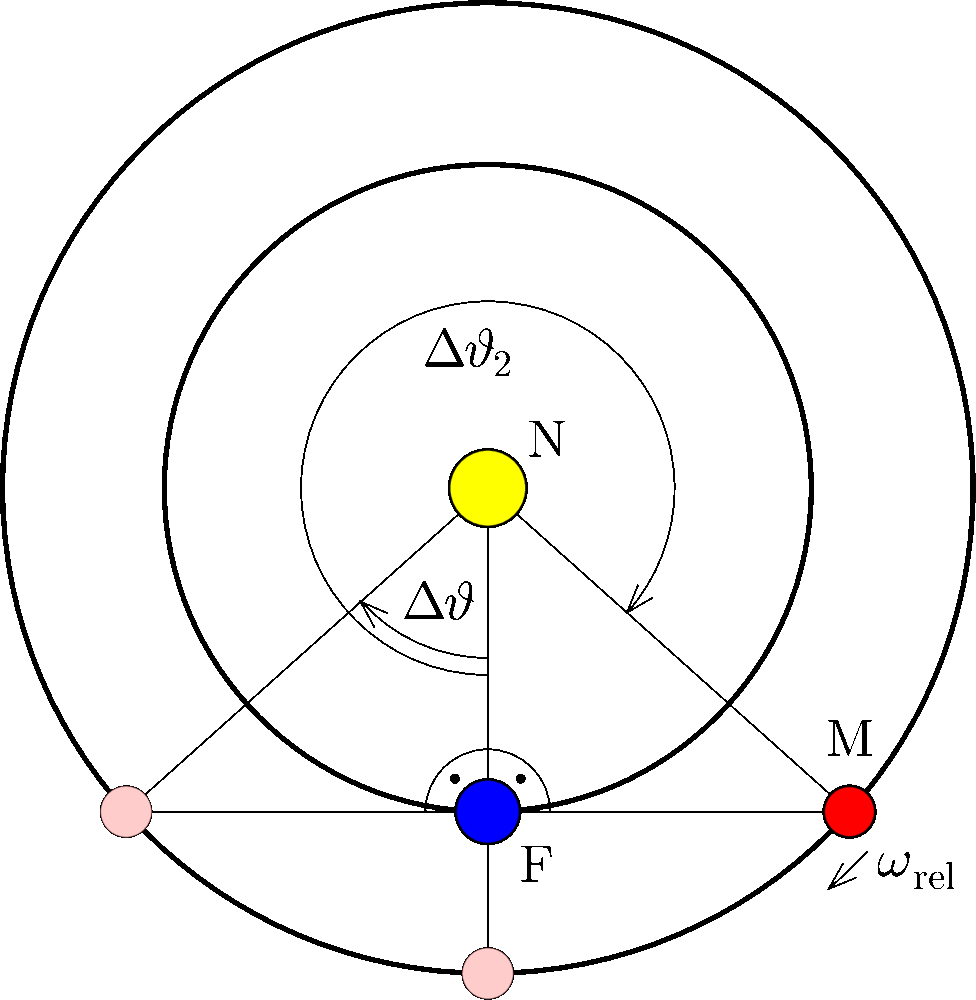

**Megoldás.**
 Kepler harmadik törvénye szerint $T^2\sim a^3$. Felhasználva a feladatban megadott pályasugarakat (a körpálya közelítés miatt $a=r$) és a Föld $T_\mathrm{F}=1\,\textrm{év}$ keringési idejét, a Mars keringési ideje
 $T_\mathrm{M}=\left(\frac{r_\mathrm{M}}{r_\mathrm{F}}\right)^\frac{3}{2}T_\mathrm{F}=(1{,}5)^\frac{3}{2}T_\mathrm{F}\approx 1{,}84\,\textrm{év}.$
 Jelölje a Mars és a Nap Földről látott szögtávolságát $\varepsilon$, a heliocentrikus Föld–Mars szögtávolságot pedig $\vartheta$ ( 1. ábra ).

 1. ábra

 Oppozícióban $\vartheta_\mathrm{opp}=0$. Kvadratúra esetében, ahol $\varepsilon=90^\circ$ a 2. ábra alapján:
 $\cos\vartheta_\mathrm{kvad}=\frac{r_\mathrm{F}}{r_\mathrm{M}}.$
 Tehát a két helyzet közti heliocentrikus szögkülönbség:
 $\Delta\vartheta=\left|\vartheta_\mathrm{opp}-\vartheta_\mathrm{kvad}\right|=\arccos\frac{r_\mathrm{F}}{r_\mathrm{M}}\approx 0{,}84\approx 48{,}2^\circ.$

 2. ábra

 A Nap inerciarendszerében tekintett szögsebességek $\omega=2\pi/T$ módon számolhatók. A fenti $\vartheta$ szög megváltozási ütemének meghatározásához üljünk át a Föld keringésével együtt forgó koordináta-rendszerbe! A Mars itteni, relatív keringési szögsebessége ( szinodikus szögsebesség) épp a $\vartheta$ szög megváltozási üteme. Mivel a két bolygó azonos irányban (prográd módon) kering:
 $\omega_\mathrm{rel}=\omega_\mathrm{F}-\omega_\mathrm{M}=2\pi\left(\frac{1}{T_\mathrm{F}}-\frac{1}{T_\mathrm{M}}\right)\approx 2{,}86\,\textrm{év}^{-1}.$
 Így az oppozíciótól kvadratúráig tartó legkisebb idő:
 $\Delta t=\frac{\Delta\vartheta}{\omega_\mathrm{rel}}\approx 0{,}294\,\textrm{év}\approx 107\,\textrm{nap}.$

 Megjegyzések. 1. A 3. ábráról látszik, hogy a következő kvadratúrába az oppozíció után $\Delta\vartheta_2=2\pi-\Delta\vartheta$ relatív szögelfordulás után kerül a Mars, amiből
 $\Delta t_2=\frac{\Delta\vartheta_2}{\omega_\mathrm{rel}}\approx 1{,}901\,\textrm{év}\approx 694\,\textrm{nap}.$

 3. ábra

 Ezután mindkét esemény
 $T_\mathrm{szin}=\frac{2\pi}{\omega_\mathrm{rel}}\approx 2{,}196\,\textrm{év}\approx 802\,\mathrm{nap}$
 periódusidővel ismétlődik. (Ez a Mars szinodikus , Földhöz viszonyított keringési ideje.)

 2. A feladat közelítései (körpályák, a Mars 1,5 CSE távolsága a Naptól, a két bolygó azonos síkban kering) miatt a valóságban ezek az értékek kicsit eltérnek az itt kiszámítottaktól.

