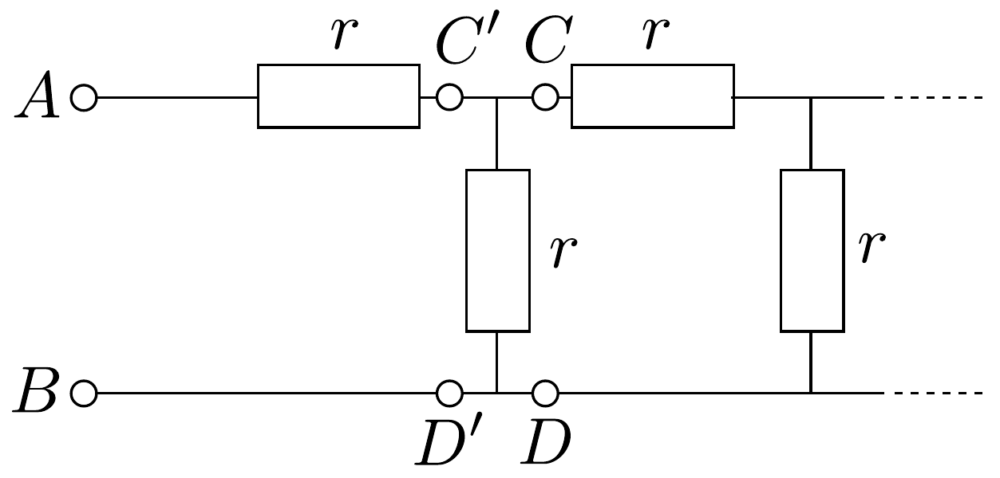

## Megoldás 2

Tegyük fel, hogy jobbról balra haladva a $C D$ pontokig terjedő lánc ellenállása valamilyen $r_{n}$ érték. Bal felé továbbhaladva először $r_{n}$-nel párhuzamosan van kapcsolva $r$, tehát $C^{\prime} D^{\prime}$ között az eredő ellenállás (4. ábra):
\[
\frac{r \cdot r_{n}}{r+r_{n}} .
\]

\footnotetext{
${ }^{1}$ A román versenyzők a 2. feladat helyett választhatták a pótfeladatot, mert a verseny idején elektromosságot még nem tanultak.

Azután ezzel sorba van kapcsolva $r$, tehát $A$ és $B$ között az ellenállás:
\[
r+\frac{r \cdot r_{n}}{r+r_{n}} .
\]
Ha a lánc végtelen hosszú, akkor ennek az újabb láncszemnek a hozzákapcsolása

4. ábra.
nem okoz változást, tehát $A B$ között épp úgy $r_{n}$-nek kell lennie az ellenállásnak, mint $C D$ között:
\[
r_{n}=r+\frac{r \cdot r_{n}}{r+r_{n}} .
\]

Ennek az egyenletnek a megoldása $r_{n}$-re:
\[
r_{n}=r \cdot \frac{1+\sqrt{5}}{2} .
\]
