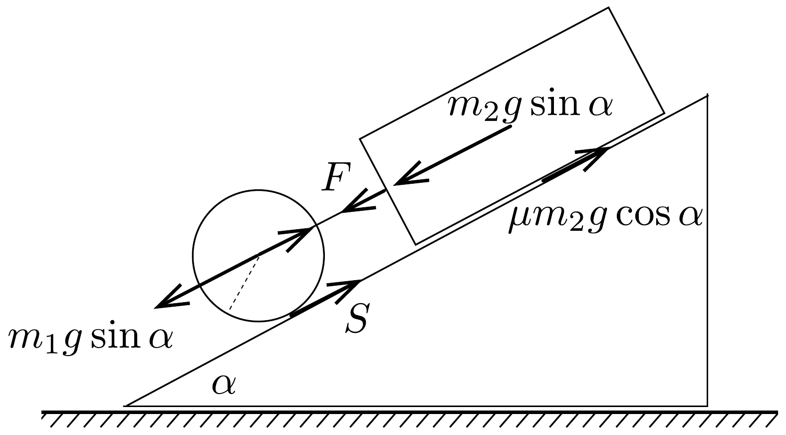
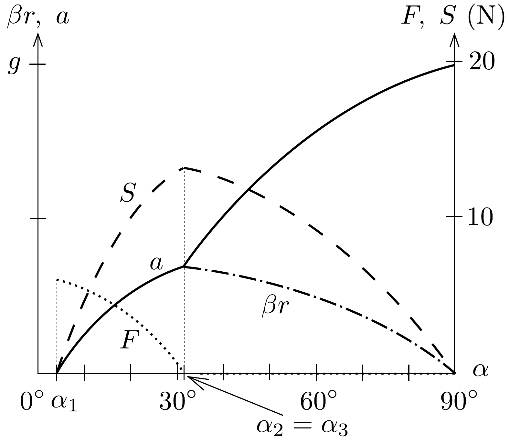

## Megoldás 1

- I. megoldás. Ha a fonál feszült, a két test azonos $a$ gyorsulással mozog. A fonál $F$ eróvel húzza egymáshoz a hengert és a téglát, a henger alján $S$ súrlódási eró hat (8. ábra). A tégla mozgásegyenlete:
\[
m_{2} a=m_{2} g \sin \alpha+F-\mu m_{2} g \cos \alpha,
\]
valamint a henger haladó mozgására:
\[
m_{1} a=m_{1} g \sin \alpha-F-S .
\]
A $\Theta$ tehetetlenségi nyomatékú henger $a / r$ szöggyorsulással forog:
\[
S r=\Theta \frac{a}{r} .
\]

8. ábra.

A három egyenlet egyenletrendszert alkot, amelyet $a$-ra, $S$-re, $F$-re megoldva ezt kapjuk:
\[
\begin{gathered}
a=g \cdot \frac{\left(m_{1}+m_{2}\right) \sin \alpha-\mu m_{2} \cos \alpha}{m_{1}+m_{2}+\Theta / r^{2}}, \\
S=\frac{\Theta}{r^{2}} \cdot g \cdot \frac{\left(m_{1}+m_{2}\right) \sin \alpha-\mu m_{2} \cos \alpha}{m_{1}+m_{2}+\Theta / r^{2}}, \\
F=m_{2} g \cdot \frac{\mu\left(m_{1}+\Theta / r^{2}\right) \cos \alpha-\Theta \sin \alpha / r^{2}}{m_{1}+m_{2}+\Theta / r^{2}} .
\end{gathered}
\]
Homogén henger esetén $\Theta=\frac{1}{2} m_{1} r^{2}$, eredményeink:
\[
\begin{aligned}
& a=\frac{\left(m_{1}+m_{2}\right) \sin \alpha-\mu m_{2} \cos \alpha}{1,5 m_{1}+m_{2}} \cdot g=0,33 g=3,2 \mathrm{~m} / \mathrm{s}^{2}, \\
& S=\frac{m_{1} g}{2} \cdot \frac{\left(m_{1}+m_{2}\right) \sin \alpha-\mu m_{2} \cos \alpha}{1,5 m_{1}+m_{2}}=13 \mathrm{~N}, \\
& F=m_{2} g \cdot \frac{(1,5 \mu \cos \alpha-0,5 \sin \alpha) m_{1}}{1,5 m_{1}+m_{2}}=0,2 \mathrm{~N} .
\end{aligned}
\]
II. megoldás. A rendszer $a$ gyorsulással mozog és $t$ idő alatt $a t^{2} / 2$ utat tesz meg a lejtőn. Ezalatt a helyzeti energia csökkenése: $\left(m_{1}+m_{2}\right) g a t^{2} \sin \alpha / 2$. A haladásból származó összes mozgási energia: $\left(m_{1}+m_{2}\right)(a t)^{2} / 2$, a forgásból származó mozgási energia: $\Theta \omega^{2} / 2=\Theta v^{2} /\left(2 r^{2}\right)=\Theta(a t)^{2} /\left(2 r^{2}\right)(\omega$ a szögsebesség, $r \omega=v=a t$ a kerületi sebesség). A súrlódási munka $\mu m_{2} g \cos \alpha \frac{a}{2} t^{2}$. A munkatétel szerint:
\[
\left(m_{1}+m_{2}\right) g \cdot \frac{a}{2} \cdot t^{2} \sin \alpha=\frac{\left(m_{1}+m_{2}\right)}{2} \cdot a^{2} t^{2}+\frac{\Theta}{2 r^{2}} \cdot a^{2} t^{2}+\mu m_{2} g \cos \alpha \cdot \frac{a}{2} \cdot t^{2} .
\]
Ebből $a$-ra az I. megoldásbeli eredmény adódik.
Diszkusszió. Vizsgáljuk meg, mikor indul el az összekötött szerkezet. Az elindulás feltétele, hogy $a>0$ legyen. A határesetben (68-1) alapján:
\[
\operatorname{tg} \alpha_{1}=\mu \cdot \frac{m_{2}}{m_{1}+m_{2}}, \quad \alpha_{1}=3,82^{\circ} .
\]
(Külön a hengernél $\alpha_{1}=0^{\circ}$, külön a téglánál $\alpha_{1}=\operatorname{arctg} \mu=11,31^{\circ}$ lett volna az elindulás határhelyzete; a henger mintegy lehúzza a téglát.)

Az 1. feladatra mindeddig elmondottak csak akkor igazak, ha $F$ pozitív, mert negatív $F$ fonálerő nyomó igénybevételt jelentene, erre pedig a fonál nem képes. A határeset feltételét megkapjuk, ha $F$ (68-3) szerinti értékét 0-val tesszük egyenlővé:
\[
\mu\left(m_{1}+\Theta / r^{2}\right) \cos \alpha_{2}-\Theta \sin \alpha_{2} / r^{2}=0 .
\]
Innen a fonál feszességének feltétele:
\[
\operatorname{tg} \alpha_{2}=\mu\left(1+\frac{m_{1} r^{2}}{\Theta}\right) ;
\]
hengernél:
\[
\operatorname{tg} \alpha_{2}=3 \mu,
\]
illetve számadatainkkal:
\[
\operatorname{tg} \alpha_{2}=0,6, \quad \alpha_{2}=30,96^{\circ} .
\]
Feladatunkban majdnem elértük ezt a szöget, ezért olyan kicsiny a fonálerő.
Előfordulhat, hogy a henger megcsúszik. Ennek feltétele, hogy $S$ elérje a lehetséges legnagyobb súrlódási erőt, $\mu m_{1} g \cos \alpha_{3}$-at. (Feltesszük, hogy a hengerre és a téglára a csúszási súrlódási együttható azonos.) (68-2) alapján:
\[
\frac{\Theta}{r^{2}} \cdot g \cdot \frac{\left(m_{1}+m_{2}\right) \sin \alpha_{3}-\mu m_{2} \cos \alpha_{3}}{m_{1}+m_{2}+\Theta / r^{2}}=\mu m_{1} g \cos \alpha_{3} .
\]
Innen a határeset feltétele:
\[
\operatorname{tg} \alpha_{3}=\mu\left(1+\frac{m_{1} r^{2}}{\Theta}\right) .
\]

Ez érdekes módon megegyezik a fonálfeszesség (68-4) alatti feltételével, tehát $\alpha_{2}=\alpha_{3}$. E szög túllépése után megszúnik a fonáleró és a két test egymástól függetlenül mozog: a tégla csúszik, a henger forog és csúszik. (Ha a fonalat súlytalan pálcával pótolnánk, ebben nem jönne létre erő.)

Ha a lejtő meredeksége $\alpha_{2}=\alpha_{3}$-nál nagyobb, akkor a tégla és a henger középpontjának gyorsulása:
\[
a=g(\sin \alpha-\mu \cos \alpha),
\]
a henger alján ható súrlódási erő:
\[
S=\mu m_{1} g \cos \alpha,
\]
a forgás szöggyorsulása $\beta$ és kerületi gyorsulása:
\[
\beta r=\mu \frac{m_{1} r^{2}}{\Theta} \cdot g \cos \alpha
\]

A 9. ábra mutatja a mozgás adatainak $\alpha$-tól való függését feladatunk számadatai mellett.

9. ábra.
