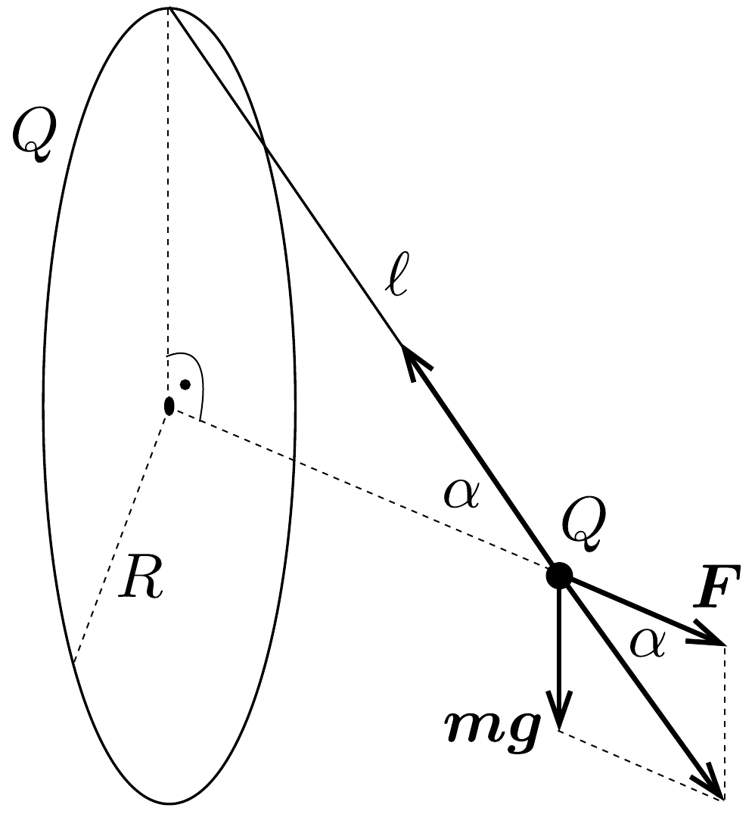

## Megoldás 3

A karika minden egyes $\Delta Q$ töltésú részétől származó $\Delta F=$ $=k Q \Delta Q / \ell^{2}$ erő nem esik egybe a szimmetriatengellyel, hanem vele egyező $\alpha$ szögeket zár be. Az egyensúly szempontjából ezen erők vízszintes vetületére van szükségünk (a függőlegesek kiejtik egymást), melyek összege:
\[
F=\sum \Delta F \cos \alpha=\frac{k Q}{\ell^{2}} \frac{\sqrt{\ell^{2}-R^{2}}}{\ell} \sum \Delta Q=\frac{k Q^{2} \sqrt{\ell^{2}-R^{2}}}{\ell^{3}} .
\]

Az $F$ és $m g$ erők eredője kötélirányú, nagysága a kötélerővel azonos. Ezért az $\alpha$ szögü két háromszög hasonló (14. ábra):
\[
\frac{F}{m g}=\frac{\sqrt{\ell^{2}-R^{2}}}{R} .
\]
Felhasználva az $F$-re kapott összefüggést, a fonálhossz:
\[
\ell=\sqrt[3]{\frac{R k Q^{2}}{m g}}=7,2 \mathrm{~cm} .
\]
