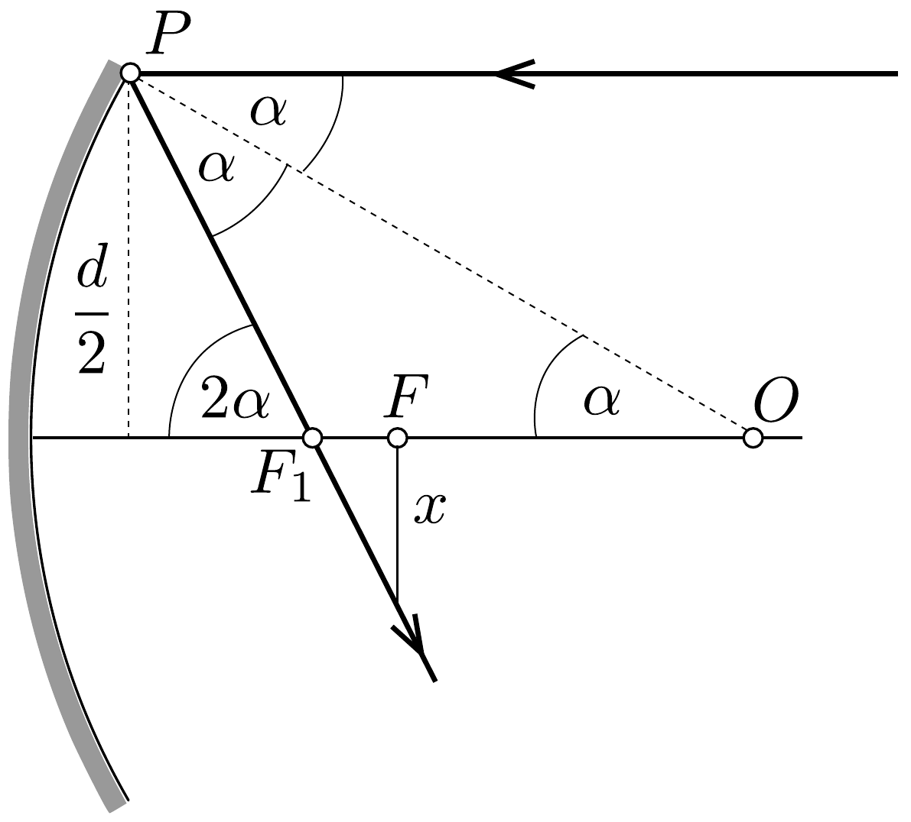

## Megoldás 4

Lényegében véve arról van szó, hogy elhanyagolás nélkül kell számítanunk a sugármenetet a homorú gömbtükörnél. De azért bizonyos geometriai, matematikai közelitéseket mégis alkalmazunk.

A $P O=R$ sugarú homorú gömbtükör elméleti fókuszpontja a sugár felében, $F$ ben van (lásd a 18. ábrát). Az $\alpha$ szög alatt beeső sugár $P$-ben visszaverődve $F_{1}$-ben metszi a tengelyt. (A nem teljesen optikai tengely közelében haladó fénysugarak nem egy pontban metszik egymást, amit szférikus aberrációnak nevezünk.) Jelölje $d$ a tükör átmérőjét. Az egyenlőszárú $O P F_{1}$ háromszögből $O F_{1}=R /(2 \cos \alpha)$ és így a fókuszpont eltérése az elméletitől:
\[
F_{1} F=O F_{1}-O F=\frac{R}{2 \cos \alpha}-\frac{R}{2} .
\]

A $\sin \alpha=d /(2 R)$-ből $\alpha=7,2^{\circ}$, így $2 \alpha=14,4^{\circ}$. Ez már elegendő a szférikus aberráció megfigyeléséhez, de még mindig kicsiny, használhatjuk a $\sin \alpha \approx \operatorname{tg} \alpha$, a $\sin \alpha \approx \alpha$, a $\cos \alpha \approx 1-\alpha^{2} / 2$ és az $(1+x)^{n} \approx 1+n x(x$ kicsi) közelítéseket. Tehát
\[
F_{1} F=O F_{1}-O F=\frac{R \alpha^{2}}{4}=\frac{d^{2}}{16 R} .
\]
A felfogóernyőt $F$-ben helyezzük el, és keressük, hogy legalább mekkora legyen az $x$ sugara. Az $F_{1} F$ alapú derékszögú háromszögből, a kis szögek esetében használható közelítéssel:
\[
x=F_{1} F \operatorname{tg} 2 \alpha \approx F_{1} F \sin 2 \alpha \approx F_{1} F 2 \sin \alpha=F_{1} F \cdot \frac{d}{R} .
\]

Kihasználva az $F F_{1}$-re kapott eredményt, a folt sugara ${ }^{3}$
\[
x=\frac{d^{3}}{16 R^{2}}=1,95 \mathrm{~mm} \approx 2 \mathrm{~mm} .
\]

A felfogóernyő átmérője legalább 4 mm átmérőjú.

\footnotetext{
${ }^{3}$ Természetesen a kiszámolt $\alpha$ értékkel közelítések felhasználása nélkül is meg lehet adni a végeredményt.

A második kérdésnél vegyük figyelembe, hogy a tükör által felfogott egész fényáram $h^{2}$-tel arányos, ahol $h$ az optikai tengely és annak a pontnak a távolsága, ahol az optikai tengellyel párhuzamosan esó fénysugár eléri a tükröt. Az $x$-re kapott eredményt $h$-val kifejezve:
\[
x=\frac{h^{3}}{2 R^{2}},
\]
amiből
\[
h=\sqrt[3]{2 R^{2} x} .
\]
Ha az $x$ sugarú ernyő helyébe $k x$ sugarút teszünk, akkor a számításba veendő új nyalábrádiusz:
\[
h_{k}=\sqrt[3]{2 R^{2} k x},
\]
és a fogott új fényáram arányos a:
\[
h_{k}^{2}=\left(\sqrt[3]{2 R^{2} k x}\right)^{2}=h^{2} \cdot \sqrt[3]{k^{2}}
\]
kifejezéssel. A mi esetünkben $k=1 / 8$ és így a felfogott fényáram a negyedére csökken.

\title{
