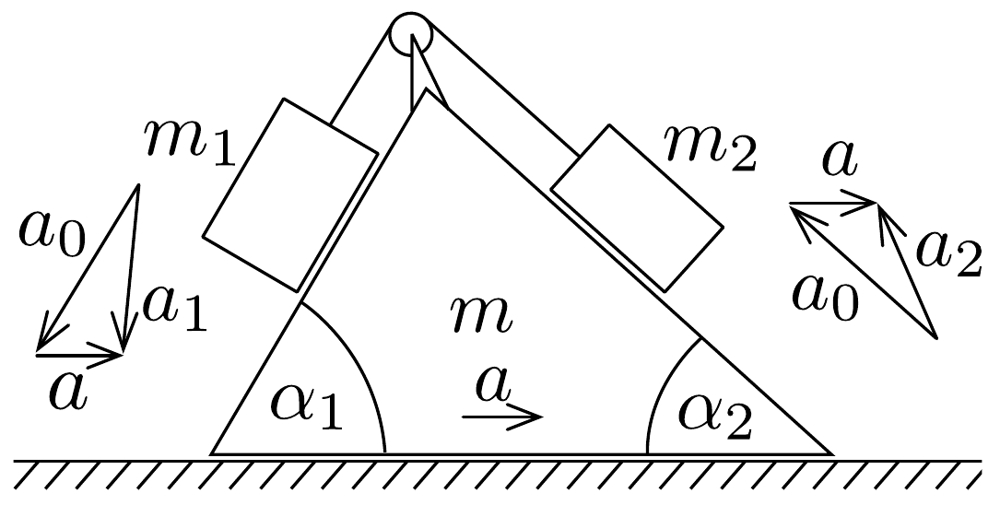

## Megoldás 1

Minden gyorsulást a talajhoz képest számítunk. Az ék gyorsulása $a$, a testek gyorsulása a lejtőhöz képest $a_{0}$. A lógó tömegek gyorsulása a talajhoz képest az $a_{0}$ és az $a$ nagyságú vektorok eredóje ( $a_{1}$, illetve $a_{2}$ ). Az irányokat a 22. ábrán feltüntetett esetben számítjuk pozitívaknak.

Az $m_{1}$ tömegre $m_{1} g$ nehézségi erő, a lejtő részéről merőlegesen kifejtett $K_{1}$ eró és $F$ fonálerő hat. Ezek vektoreredője adja az $m_{1} a$ mozgató erőt. Hasonló a helyzet $m_{2}$-nél. Az éket mozgató ma erót $K_{1}, K_{2}$, ill. a két $F$ nagyságú reakcióeró vízszintes összetevőinek összege adja. Ezeket az összefüggéseket függőleges és vízszintes összetevőkben felírva 5 egyenletet kapunk az 5 ismeretlen ( $a_{0}, a, K_{1}$, $\left.K_{2}, F\right)$ számára. Az egyenletrendszer megoldása hosszadalmas.

Célszerú, ha Newton II. axiómáját a lejtőmenti erőösszetevőkre írjuk fel. $K_{1}$ és $K_{2}$ lejtőre merőleges erők most nem játszanak szerepet. Az $m_{1}$ tömeget a lejtő mentén lefelé (a választott pozitív irányban) $m_{1} g \sin \alpha_{1}-F$ erő mozgatja. Az $m_{1}$ tömeg talajhoz képest számított gyorsulásának lejtőmenti összetevője $a_{0}-a \cos \alpha_{1}$. Az erőtörvény szerint:
\[
m_{1}\left(a_{0}-a \cos \alpha_{1}\right)=m_{1} g \sin \alpha_{1}-F,
\]
innen a fonálerő:
\[
F=m_{1}\left(g \sin \alpha_{1}+a \cos \alpha_{1}-a_{0}\right) .
\]
Hasonlóan az $m_{2}$ tömegnél:
\[
m_{2}\left(a_{0}-a \cos \alpha_{2}\right)=F-m_{2} g \sin \alpha_{2},
\]
ebből:
\[
F=m_{2}\left(g \sin \alpha_{2}-a \cos \alpha_{2}+a_{0}\right) .
\]
A fonálerő (71-1) és (71-2) kifejezéseit egyenlővé téve:
\[
\left(m_{1} \cos \alpha_{1}+m_{2} \cos \alpha_{2}\right) a=\left(m_{1}+m_{2}\right) a_{0}-\left(m_{1} \sin \alpha_{1}-m_{2} \sin \alpha_{2}\right) g .
\]

Az ék viselkedésére legegyszerúbben az impulzusmegmaradásból következtethetünk. A lógó tömegek lejtőhöz viszonyított sebességei $v_{0}$ (bal oldalt lefelé, jobb oldalt felfelé mutat), ezek vízszintes összetevői $v_{0} \cos \alpha_{1}$ és $v_{0} \cos \alpha_{2}$ (mindkettő balra mutat). Figyelembe véve az ék jobbra mutató $v$ sebességét, a lógó tömegek sebességösszetevői a talajhoz képest $v_{0} \cos \alpha_{1}-v$ és $v_{0} \cos \alpha_{2}-v$. Kezdetben a rendszer állt, ezért:
\[
m_{1}\left(v_{0} \cos \alpha_{1}-v\right)+m_{2}\left(v_{0} \cos \alpha_{2}-v\right)=m v .
\]
Egyenletesen gyorsuló mozgás esetén a sebességek arányosak a gyorsulásokkal, ezért
\[
m_{1}\left(a_{0} \cos \alpha_{1}-a\right)+m_{2}\left(a_{0} \cos \alpha_{2}-a\right)=m a .
\]
Rendezve:
\[
a=\frac{m_{1} \cos \alpha_{1}+m_{2} \cos \alpha_{2}}{m+m_{1}+m_{2}} \cdot a_{0} .
\]

Ez az összefüggés mutatja, hogyha a két gyorsulás közül az egyik nulla, akkor a másik is az. Az ék csak akkor maradhat nyugalomban, ha a lógó tömegek is nyugszanak rajta. (Ez azonnal belátható az impulzusmegmaradásból felírt egyenletből is.)

A (71-3)-ból és (71-4)-ból álló egyenletrendszer megoldása $a_{0}$ és $a$ gyorsulásokra az alábbi eredményeket adja:
\[
\begin{aligned}
a_{0} & =g \cdot \frac{\left(m+m_{1}+m_{2}\right)\left(m_{1} \sin \alpha_{1}-m_{2} \sin \alpha_{2}\right)}{\left(m_{1}+m_{2}\right)\left(m+m_{1}+m_{2}\right)-\left(m_{1} \cos \alpha_{1}+m_{2} \cos \alpha_{2}\right)^{2}} \\
a & =g \cdot \frac{\left(m_{1} \cos \alpha_{1}+m_{2} \cos \alpha_{2}\right)\left(m_{1} \sin \alpha_{1}-m_{2} \sin \alpha_{2}\right)}{\left(m_{1}+m_{2}\right)\left(m+m_{1}+m_{2}\right)-\left(m_{1} \cos \alpha_{1}+m_{2} \cos \alpha_{2}\right)^{2}}
\end{aligned}
\]

Mindkét gyorsulás akkor nulla, ha
\[
\frac{m_{1}}{m_{2}}=\frac{\sin \alpha_{2}}{\sin \alpha_{1}} .
\]

A fonálerő kiszámítására (71-1)-et és (71-2)-t összeadjuk; felhasználva (71-5) és (71-6) szerinti eredményeket:
\[
\begin{aligned}
F & =m_{1} m_{2} g \times \\
& \times \frac{\left(m+m_{1}+m_{2}\right)\left(\sin \alpha_{1}+\sin \alpha_{2}\right)-\left(m_{1} \cos \alpha_{1}+m_{2} \cos \alpha_{2}\right) \sin \left(\alpha_{1}+\alpha_{2}\right)}{\left(m_{1}+m_{2}\right)\left(m+m_{1}+m_{2}\right)-\left(m_{1} \cos \alpha_{1}+m_{2} \cos \alpha_{2}\right)^{2}}
\end{aligned}
\]

A $K_{1}$ és $K_{2}$ kényszererók kiszámításához $m_{1}$ és $m_{2}$ tömegeknél a függőleges erőösszetevőket vesszük számításba:
\[
\begin{gathered}
m_{1} a_{0} \sin \alpha_{1}=m_{1} g-K_{1} \cos \alpha_{1}-F \sin \alpha_{1}, \\
m_{2} a_{0} \sin \alpha_{2}=-m_{2} g+K_{2} \cos \alpha_{2}+F \sin \alpha_{2} .
\end{gathered}
\]

Ezekből az egyenletekből, (71-1), (71-2), (71-6) felhasználásával:
\[
\begin{aligned}
& K_{1}=m_{1} g \cos \alpha_{1}\left[1-\frac{\operatorname{tg} \alpha_{1}\left(m_{1} \cos \alpha_{1}+m_{2} \cos \alpha_{2}\right)\left(m_{1} \sin \alpha_{1}-m_{2} \sin \alpha_{2}\right)}{\left(m_{1}+m_{2}\right)\left(m+m_{1}+m_{2}\right)-\left(m_{1} \cos \alpha_{1}+m_{2} \cos \alpha_{2}\right)^{2}}\right] \\
& K_{2}=m_{2} g \cos \alpha_{2}\left[1+\frac{\operatorname{tg} \alpha_{2}\left(m_{1} \cos \alpha_{1}+m_{2} \cos \alpha_{2}\right)\left(m_{1} \sin \alpha_{1}-m_{2} \sin \alpha_{2}\right)}{\left(m_{1}+m_{2}\right)\left(m+m_{1}+m_{2}\right)-\left(m_{1} \cos \alpha_{1}+m_{2} \cos \alpha_{2}\right)^{2}}\right]
\end{aligned}
\]

Valamennyi képletből a rögzített ék esete az $m \rightarrow \infty$ helyettesítéssel kapható meg.
