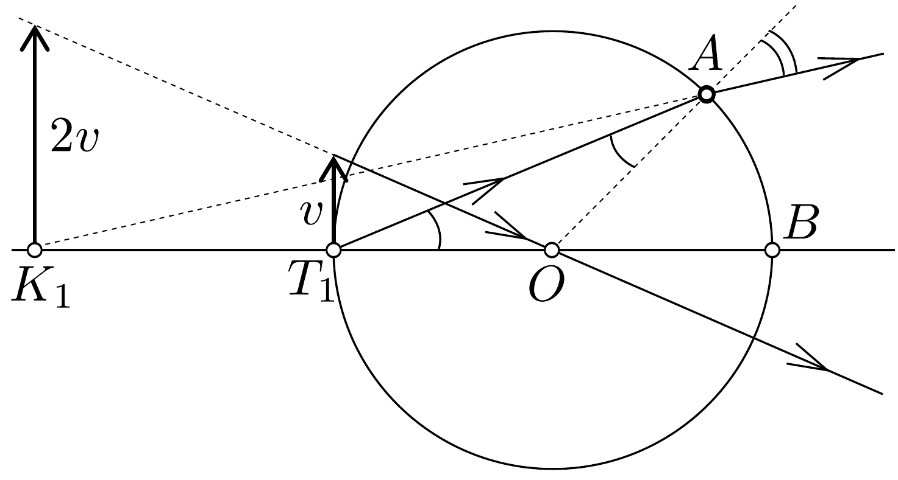
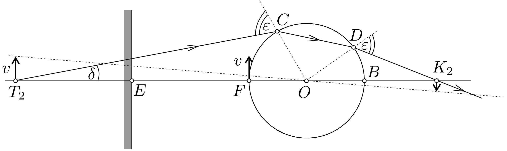

## Megoldás 4

A hal 1 másodperc alatt $v$ utat tesz meg. Ez a szakasz legyen az a tárgy, amelynek kétféle módon keletkezett képét keressük. Csak a tengelyhez közeli sugarakkal, kis szöggel számolunk, ezért mindenütt (a törési törvényben és a szinusztételben) a szöget használjuk szinusza helyett.

A $T_{1}$ pontban úszó halról mint tárgyról, egyetlen törőfelület ad képet (25. áb$r a)$. A törési törvény alapján a $T_{1}$-ből $\gamma=A T_{1} O \varangle$ alatt induló fénysugár törőszöge $A$-nál a vízben $\gamma$, a levegőben $n \gamma$ (kettős ívú szög). Ennek a kilépő sugárnak a visszafelé rajzolt meghosszabbítása adja $K_{1}$-ben a virtuális kép helyét. Továbbá
$K_{1} A T_{1} \varangle=n \gamma-\gamma=(n-1) \gamma$. A $K_{1} T_{1} A$ háromszögre felírjuk a szinusztételt (kihasználva, hogy $\sin \left(180^{\circ}-\gamma\right)=\sin \gamma$ ):
\[
\frac{K_{1} T_{1}}{K_{1} A}=\frac{(n-1) \gamma}{\gamma}=n-1 .
\]
Mivel megengedett közelítéssel $K_{1} A=K_{1} O+R, K_{1} T_{1}=K_{1} O-R$, ezért
\[
\frac{K_{1} O-R}{K_{1} O+R}=n-1 .
\]
Innen a virtuális kép távolsága a középponttól:
\[
K_{1} O=\frac{n}{2-n} \cdot R .
\]
Víznél $n=4 / 3$ és $K_{1} O=2 R$. Ha a törésmutató nagyobb, mint 2 , a kép valódi. A nagyítást a kép- és tárgytávolság hányadosa adja:
\[
\frac{K_{1} O}{T_{1} O}=\frac{n}{2-n} .
\]
Víz esetében a nagyítás kétszeres.
Legyen a síktükör $E$-ben (26. ábra). Ez a síktükör a tőle $2 R$ távolságban levő tárgyról, a $v$ sebességnek megfeleló szakaszról az $F$-ben a tükör mögött $2 R$ távolságban, $T_{2}$-ben ad ugyanakkora virtuális képet. $T_{2}$ a gömb középpontjától $5 R$ távolságban van. Legyen $T_{2} O=k R$. A $T_{2}$-ben levó virtuális kép úgy viselkedik, mint egy normális tárgy, amelyet a gömbön mint lencsén át nézünk; a tükörrel ezután már nem kell törődnünk. $T_{2}$ valódi képét számíthatjuk a vastag lencsék törvényével, de egyenes úton is megkapjuk.

A $T_{2}$-ből $\delta=C T_{2} F$ ◁ szög alatt induló fénysugár $C$-nél levő $\epsilon$ beesési szögét keressük. Szinusztétellel a $T_{2} O C$ háromszögből:
\[
\frac{\epsilon}{\delta}=\frac{T_{2} O}{C O}=\frac{k R}{R}=k, \quad \epsilon=k \delta .
\]

A törőszög az üvegben:
\[
\frac{\epsilon}{n}=\frac{k \delta}{n}=D C O \varangle=C D O \varangle .
\]
Ki kell számítanunk a $D O B \varangle$-et. Ehhez $C O F \varangle=\epsilon-\delta=k \delta-\delta=\delta(k-1)$. A $C O D<$ ugyanúgy 180°-ra egészíti ki a $C$-nél és $D$-nél levó szögek összegét, mint a $C O F \varangle$ és $D O B \varangle$ összegét, ezért
\[
D O B \varangle+\delta(k-1)=2 \cdot \frac{k \delta}{n} \rightarrow D O B \varangle=\delta\left(\frac{2 k}{n}-k+1\right) .
\]
Felírjuk a $D O K_{2}$ háromszögre a szinusztételt:
\[
\frac{O K_{2}}{D K_{2}}=\frac{\epsilon}{\delta\left(\frac{2 k}{n}-k+1\right)}=\frac{k \delta}{\delta\left(\frac{2 k}{n}-k+1\right)}, \quad \frac{O K_{2}}{O K_{2}-R}=\frac{k}{\frac{2 k}{n}-k+1} .
\]
Ebbő̌l megkapjuk a képtávolságot:
\[
O K_{2}=\frac{k n}{n(2 k-1)-2 k} \cdot R .
\]
Ha $k=5$ és $n=4 / 3$, akkor $O K_{2}=10 R / 3$. A nagyítás:
\[
\frac{O K_{2}}{O T_{2}}=\frac{n}{n(2 k-1)-2 k} .
\]
Ha $k=5$ és $n=4 / 3$, akkor a nagyítás 2/3.
Foglaljuk össze a számítások eredményét. A hal valójában $v$ sebességgel halad felfelé. Virtuális képe $2 v$ sebességgel felfelé, valódi képe $2 v / 3$ sebességgel lefelé mozog. A két kép relatív sebessége $2 v+2 v / 3=8 v / 3$, az eredetinek $8 / 3$-szorosa.

De most jön a legfontosabb. Mi az egész számítás értelme? Eddig csak azt tudjuk, hogy a rajzlapon a gömbtől balra egy virtuális kép $+2 v$, a gömbtől jobbra $-2 v / 3$ sebességgel mozog. Mindkét mozgás a rajzlapon, a rajzolt képekkel megy végbe, különböző helyeken. De mit látunk, ha elvégzzük a kísérletet?

Ha a hal mellett milliméterskála van és ezek képein figyeljük a halképek mozgását, ugyanazokat a mérőszámokat kapjuk, mint a valóságos sebességnél. A sebességek ellentétesek és az egyik sebesség a másiknak háromszorosa lesz, továbbá az egyik hal háromszor olyan hosszú, mint a másik. De most nemcsak erről van szó. Nagyon messziről kell néznünk, hiszen egy messze a gömb mögött levő és egy, a gömb előtt levő képet egyszerre kell élesen látnunk. A két kép távolsága $25 R / 3$. A valódi képet is látni lehet szemmel, ha a tiszta látás távolságánál messzebbról nézzük. Itt van annak a jelentősége, hogy a feladat szövege szerint a berendezést messziről kell néznünk. Ekkor a különböző távolságokban levő képekhez vezető egyenesek szögelfordulásait figyeljük meg, és ha elég messziről nézünk, akkor a különböző távolságok ellenére is közelítően 8/3 arányban növekedett sebességet észlelünk. Természetesen valahogy informálódnunk kell a hal valóságos $v$ sebességéről is.

A sebességnövekedés aránya általános esetben:
\[
\frac{2 n}{2-n} \cdot \frac{(k-1)(n-1)}{2 k(n-1)-n} .
\]

Érdemes a jelenséget tényleg megfigyelni. Széles, vízzel telt hengerpoharat tükör elé állítunk. A halat függőlegesen a vízbe tartott hurkapálca helyettesíti. A pálca mozgatásakor jól megfigyelhetjük a képek különböző sebességú mozgását.

\title{
