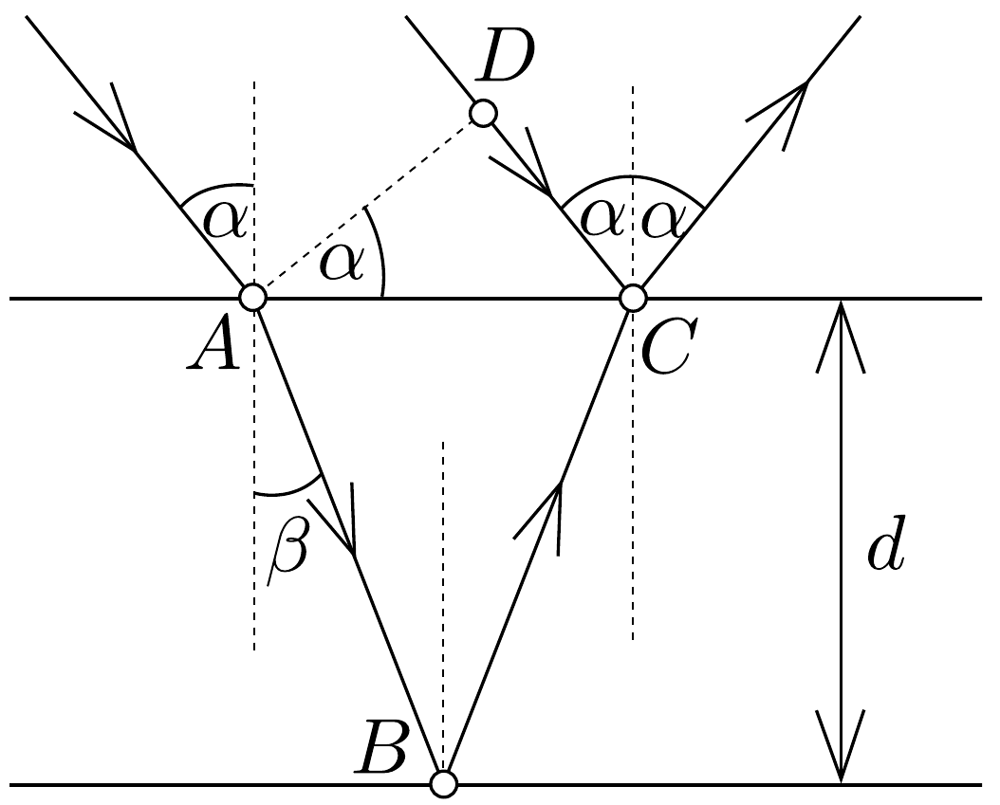

## Megoldás 2

$a)$ A rétegbe bemenő, az 55. ábrán látható $A$ pontban megtört fény egy része $B$-ben visszaverődik, $C$-ben a levegőbe kilépve ismét megtörik, és az elég messze levő szemünkbe jut. A fényforrásból érkező $D C$ sugár egy része is visszaverődik és az előbbi sugárral együtt jut a szemünkbe. Az $A D$ síkba az egész sugárnyaláb egyező fázissal érkezik. Az a kérdés, mekkora az útkülönbség, illetve a fáziskülönbség az alsó és felső határfelületekről érkező sugarak között, mert ettől függ, hogy az interferencia által erősítés vagy gyengítés jön létre, és a fehér fény különböző hullámhosszúságú fényei közül teljes intenzitással mi marad meg.

Az alul visszaverődő fénysugár útja $A$-tól $C$-ig $A B+B C=2 d / \cos \beta$. A közegben a hullámhossz $\lambda_{0} / n$, tehát ezen az úton az $A$-tól $C$-ig elférő hullámok darabszáma:
\[
\frac{2 d}{\lambda_{0} \cos \beta / n}=\frac{2 d n}{\lambda_{0} \cos \beta} .
\]
A felül visszaverődő fénysugár útja $D$-től $C$-ig:
\[
D C=A C \cdot \sin \alpha=2 d \operatorname{tg} \beta \sin \alpha=2 d \frac{\sin \alpha \sin \beta}{\cos \beta} .
\]

Ezen a távolságon a $\lambda_{0}$ hullámhosszból $2 d \sin \alpha \sin \beta /\left(\lambda_{0} \cos \beta\right)$ darab fér el, de a nagyobb törésmutatójú anyagon történő visszaverődéskor 180°-os fázisugrás történik, tehát a $D C$ távolságon elféró hullámok száma:
\[
\frac{2 d \sin \alpha \sin \beta}{\lambda_{0} \cos \beta}+\frac{1}{2} .
\]

Erősítés akkor jön létre, ha a hullámok számának különbsége valamilyen $k$ egész szám:
\[
k=\frac{2 d n}{\lambda_{0} \cos \beta}-\frac{2 d \sin \alpha \sin \beta}{\lambda_{0} \cos \beta}-\frac{1}{2}=\frac{2 d}{\lambda_{0} \cos \beta}(n-\sin \alpha \sin \beta)-\frac{1}{2} .
\]
A törési törvényből $\sin \alpha=n \sin \beta$, amivel
\[
k=\frac{2 d n}{\lambda_{0} \cos \beta}\left(1-\sin ^{2} \beta\right)-\frac{1}{2}=\frac{2 d n \cos \beta}{\lambda_{0}}-\frac{1}{2}=\frac{2 d}{\lambda_{0}} \sqrt{n^{2}-\sin ^{2} \alpha}-\frac{1}{2}
\]
Ennek átalakítása után az erốsítés feltétele:
\[
\frac{4 d}{\lambda_{0}} \sqrt{n^{2}-\sin ^{2} \alpha}=2 k+1 .
\]

A törésmutatótól és a geometriai adatoktól függ, hogy mely hullámhosszra következik be a legnagyobb erősítés. Az ezzel szomszédos hullámhosszúságú fények sem oltódnak ki egészen, csak gyengülnek, tehát nem kapunk monokromatikus fényt. Ha $k$ növekszik, a szín mindig kevésbé teltebb lesz, mert az egyik rendben való erősítést egy másik rendben történő gyengítés lerontja. Valamelyest vastagabb lemeznél szürkét kapunk. Ezért van az, hogy a „vékony lemezek színei” csak vékony lemezeknél látszanak. A feladat élénk zöldet említ és a legvékonyabb hártya iránt érdeklődik, tehát $k=0$ veendő és a rétegvastagság:
\[
d=\frac{\lambda_{0}}{4 \sqrt{n^{2}-\sin ^{2} \alpha}}=100 \mathrm{~nm} .
\]

Megjegyzés. Ez a hártya olyan vékony, hogy egy 2 cm ⋅ 3 cm méretü keretbe férő tömege csak 0,06 mg lenne, a szokásos analitikai mérleggel nem volna megbízhatóan lemérhető.
b) Merőleges beesésnél, $k=0$ esetében a legjobban erősített hullámhossz
\[
\lambda_{\mathrm{b}}=4 d \sqrt{n^{2}-\sin ^{2} 0}=4 d n
\]
volna. Az előbbi $d$-értéket felhasználva:
\[
\lambda_{\mathrm{b}}=\lambda_{0} \cdot \frac{n}{\sqrt{n^{2}-\sin ^{2} \alpha}}=\frac{\lambda_{0}}{\cos \beta} .
\]
$d$-től függetlenül így lehet az $\alpha$-hoz tartozó $\lambda_{0}$-ból a meróleges beeséshez tartozó $\lambda_{b}$-t kiszámítani. A mi esetünkben $\lambda_{b}=1,079 \lambda_{0}=540 \mathrm{~nm}$, ami sárgásabb árnyalatú zöld színt jelent. De nemcsak a szemünket kell bevinni a beesési merőlegesbe, hanem lehetőleg a fényforrást is. A vékony lemezek színeinek vizsgálatakor éppen ezért nagy felületú, diffúz fényforrás célszerú, mint amilyen a borús ég, amikor esó után nézzük a pocsolyán az olajfoltokat.
