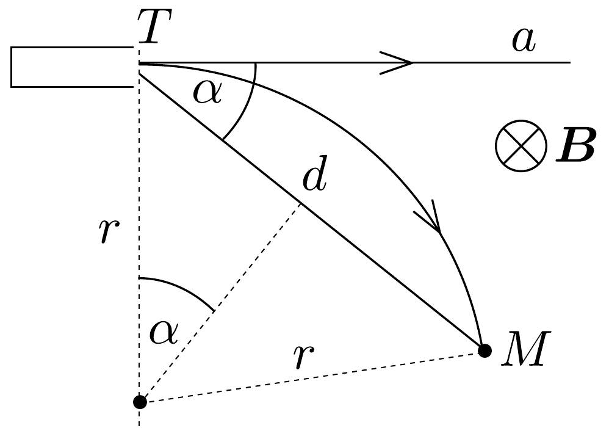
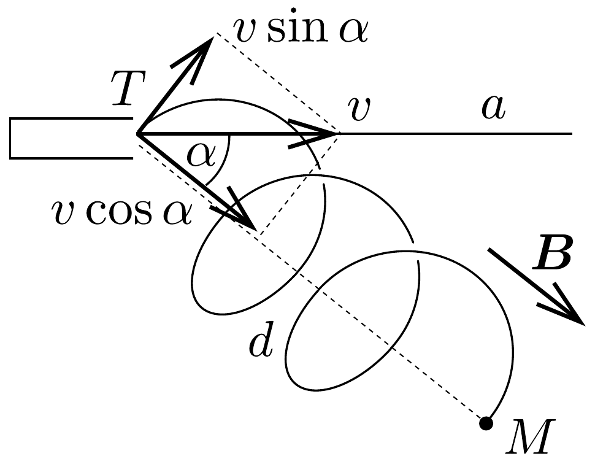

## Megoldás 3

a) A $v$ sebességgel repüló elektront a merőleges irányú, $B$ indukciójú homogén mágneses tér $r$ sugarú körpályára tereli. E mozgáshoz szükséges

$m v^{2} / r$ erốt a $B v Q$ nagyságú Lorentz-eró szolgáltatja. Homogén, állandó mágneses tér nem képes az elektron sebességének nagyságát megváltoztatni, mert az eró mindig merőleges a sebességre.

Esetünkben a körpálya sugara az 56, ábra szerint $r=d /(2 \sin \alpha)$. Az elektronágyúból kirepülő elektron sebessége $m v^{2} / 2=U Q$ alapján $v=\sqrt{2 U Q / m}$. A Lorentz-eró figyelembevételével
\[
\frac{m v^{2}}{r}=B v Q .
\]
Innen a szükséges mágneses indukció:
\[
B=\frac{m v}{r Q} .
\]
Felhasználva a sugár geometriai kifejezését és a sebesség értékét:
\[
B=\frac{2 \sin \alpha}{d} \cdot \sqrt{\frac{2 U m}{Q}} .
\]
Számadatainkkal $B=3,7 \mathrm{mT}$.
b) Ebben az esetben az elektronágyúból kirepüló elektron sebességét felbontjuk a $B$ mágneses indukció irányába eső $v \cos \alpha$ és az erre merőleges $v \sin \alpha$ összetevőre az 57. ábrán látható módon. A $v \cos \alpha$ összetevőre hatástalan a mágneses tér. Ezzel a sebességgel az elektron $d /(v \cos \alpha)$ idő alatt ér el az $M$ célba.

Vizsgáljuk a mozgást egy $v \cos \alpha$ sebességgel a $T M$ irányban haladó koordináta-rendszerből. Az elektron ebben a koordináta-rendszerben $v \sin \alpha$ sebességgel körpályán mozog, amelynek sugara az
\[
\frac{m v^{2} \sin ^{2} \alpha}{r}=B Q v \sin \alpha
\]
összefüggés alapján
\[
r=\frac{m v \sin \alpha}{B Q} .
\]

57. ábra.
(Az elektron a laboratórium rendszerében spirálpályán mozog.) $M$ eltalálása akkor sikerül, ha az elektron $k$ egész számú kört ír le az $M$-be való érkezés $d /(v \cos \alpha)$ ideje alatt. A kör kerülete $2 \pi r=2 \pi m v \sin \alpha /(Q B)$, egy körülfordulás ideje, tekintettel a körön való futás $v \sin \alpha$ sebességére:
\[
\frac{2 \pi m v \sin \alpha}{Q B v \sin \alpha}=\frac{2 \pi m}{Q B} .
\]
Ennek egész számú többszöröse $d /(v \cos \alpha)$ :
\[
\frac{d}{v \cos \alpha}=k \cdot \frac{2 \pi m}{Q B} .
\]
Innen a szükséges mágneses indukció:
\[
B=k \cdot \frac{2 \pi m \cos \alpha}{d Q} \cdot v=k \cdot \frac{2 \pi \cos \alpha}{d} \sqrt{\frac{2 U m}{Q}} .
\]

Lényegtelen, hogy a mágneses indukció az adott irányban előre vagy hátra mutat, ettől csak a spirál menetiránya függ. $k=1$ esetében a spirál egy menetével, $k=2$-nél kettóvel érjük el a célt stb. Számadatainkkal: $B=6,7 \mathrm{mT} \cdot k, k \in \mathbb{Z}^{+}$.

\title{
