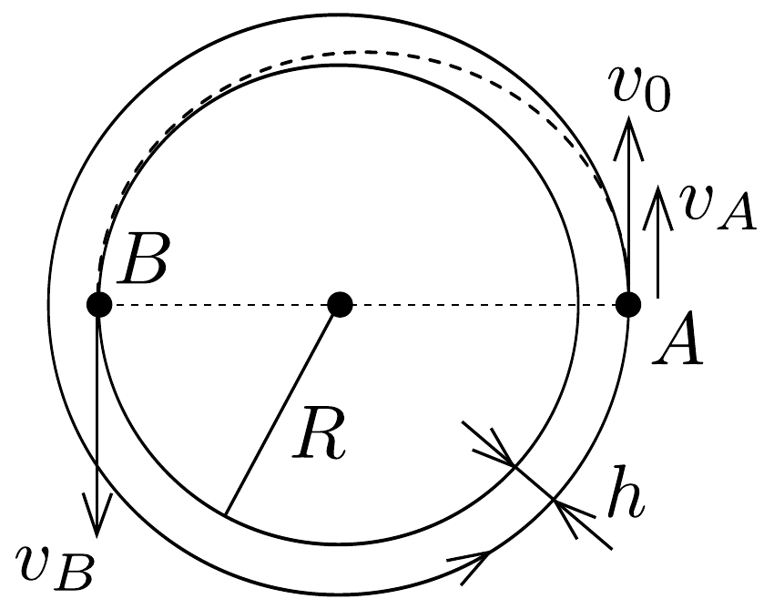
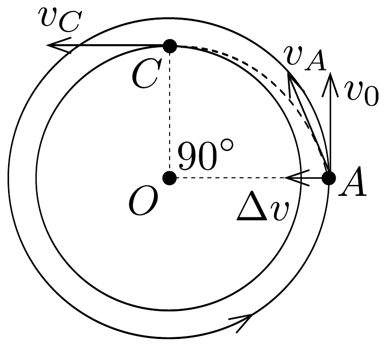

## Megoldás 1

A nehézségi gyorsulás a Hold felszínén $g=f M / R^{2}$ ( $f$ a gravitációs állandó, $M$ a Hold tömege). A körpályán keringő úrhajó eredeti sebessége $v_{0}$, erre nézve
\[
\begin{gathered}
\frac{v_{0}^{2}}{R+h}=\frac{f M}{(R+h)^{2}}=\frac{g R^{2}}{(R+h)^{2}}, \\
v_{0}=\sqrt{\frac{g R^{2}}{R+h}}=1652 \mathrm{~m} / \mathrm{s} .
\end{gathered}
\]
$a)^{5}$ Az ürhajó a rakéta ellenirányú múködtetésével sebességét $v_{0}$-ról egy bizonyos $v_{A}$-ra csökkenti. Ezután ellipszispályán kering; az ellipszis nagytengelyének végpontjai $A$ és $B$. A sebesség az $A$-ban $v_{A}, B$-ben $v_{B}$ (59. ábra). A területi

sebesség állandósága (Kepler II. törvénye vagy perdületmegmaradás) szerint:
\[
v_{B} R=v_{A}(R+h), \quad v_{B}=\frac{R+h}{R} \cdot v_{A} .
\]
A sebesség $v_{A}$-ról $v_{B}$-re növekszik, a mozgási energia gyarapodását a gravitációs energia csökkenése fedezi:
\[
\frac{m v_{B}^{2}}{2}-\frac{m v_{A}^{2}}{2}=\frac{f m M}{R}-\frac{f m M}{R+h},
\]
ebből:
\[
v_{B}^{2}-v_{A}^{2}=2 f M \cdot \frac{h}{R(R+h)}=\frac{2 g h R}{R+h} .
\]

\footnotetext{
${ }^{5}$ Lásd az 1969. évi Eötvös-verseny 1. feladatát, ahol hasonló kérdés kissé eltérő, érdekes megoldása található.

Az perdületmegmaradásból $v_{B}$ értékét felhasználva
\[
\begin{gathered}
v_{A}^{2}\left[\left(\frac{R+h}{R}\right)^{2}-1\right]=v_{A}^{2} \cdot \frac{h(2 R+h)}{R^{2}}=\frac{2 g h R}{R+h} \\
v_{A}^{2}=\frac{2 g R^{3}}{(R+h)(2 R+h)} \\
v_{A}=1628 \mathrm{~m} / \mathrm{s}, \quad v_{B}=1724 \mathrm{~m} / \mathrm{s} .
\end{gathered}
\]

Az ellenrakétázással létrehozandó sebességváltoztatás:
\[
\Delta v=v_{0}-v_{A}=24 \mathrm{~m} / \mathrm{s} .
\]

Az üzemanyag mennyiségének meghatározása céljából alkalmazzuk a lendületmegmaradás törvényét az úrhajóhoz rögzített koordináta-rendszerben:
\[
\mu u=(m-\mu) \Delta v,
\]
ahonnan
\[
\mu=\frac{m \Delta v}{u+\Delta v}=28,7 \mathrm{~kg} .
\]
b) A rakétával a sugár mentén kifelé tüzelnek és ezzel $\Delta v$ sebességet adnak hozzá a meglevő $v_{0}$-hoz, a középpont felé irányítva (60. ábra). Ekkor az úrhajó sebessége $v_{A}=\sqrt{v_{0}^{2}+\Delta v^{2}}$, amellyel olyan ellipszis (esetleg hiperbola vagy parabola) pályán indul el, amelynek csúcspontja $B$, fókusza továbbra is $O$ és $A$-ban a pálya érintője $v_{A} . O A$ a kúpszelet ún. paramétere. $C$-ben a sebesség a $v_{A}$-nál nagyobb $v_{C}$ lesz.

A területi sebesség állandóságát írjuk fel, figyelembe véve, hogy $A$-nál a sugárra merőleges $v_{0}$ összetevő használandó:
\[
v_{C} R=v_{0}(R+h), \quad v_{C}=\frac{R+h}{R} \cdot v_{0}=1749 \mathrm{~m} / \mathrm{s} .
\]

A sebesség $v_{A}$-ról $v_{C}$-re növekszik, a mozgási energia növekedését a gravitációs energia csökkenése fedezi:
\[
\frac{m v_{C}^{2}}{2}-\frac{m v_{A}^{2}}{2}=\frac{f m M}{R}-\frac{f m M}{R+h}=f m M \cdot \frac{h}{R(R+h)},
\]
átalakítva:
\[
\begin{gathered}
v_{C}^{2}-\left(v_{0}^{2}+\Delta v^{2}\right)=\frac{2 g h R}{R+h}, \\
\Delta v^{2}=v_{C}^{2}-v_{0}^{2}-\frac{2 g h R}{R+h}=v_{0}^{2}\left(\frac{R+h}{R}\right)^{2}-v_{0}^{2}-\frac{2 g h R}{R+h}= \\
=v_{0}^{2}\left(\frac{R+h}{R}\right)^{2}-v_{0}^{2}-\frac{2 h}{R} \cdot v_{0}^{2}=v_{0}^{2} \cdot \frac{h^{2}}{R^{2}}, \\
\Delta v=\frac{h}{R} \cdot v_{0}=97 \mathrm{~m} / \mathrm{s} .
\end{gathered}
\]

Ismét alkalmazzuk az úrhajóra az impulzusmegmaradást:
\[
\Delta v(m-\mu)=\mu u, \quad \mu=\frac{m \Delta v}{u+\Delta v}=115 \mathrm{~kg} .
\]

Az úrhajó indulási sebessége az új pályán $v_{A}=1655 \mathrm{~m} / \mathrm{s}$. Az űrhajó az $A$ pontból a kör érintőjéhez képest $\operatorname{arc} \operatorname{tg}\left(\Delta v / v_{0}\right)=3^{\circ} 22^{\prime}$-es szögben indul el. A $C$ pontban a körpályán való mozgáshoz szükséges sebesség $\sqrt{g R}=1700 \mathrm{~m} / \mathrm{s}$. Mindaddig ellipszispályán mozog, amíg $v_{C}$ kisebb, mint a $\sqrt{2} \cdot 1700=2404 \mathrm{~m} / \mathrm{s}$ szökési sebesség. Az 1749 m/s-os sebesség messze ez alatt marad, tehát a pálya ellipszis.
