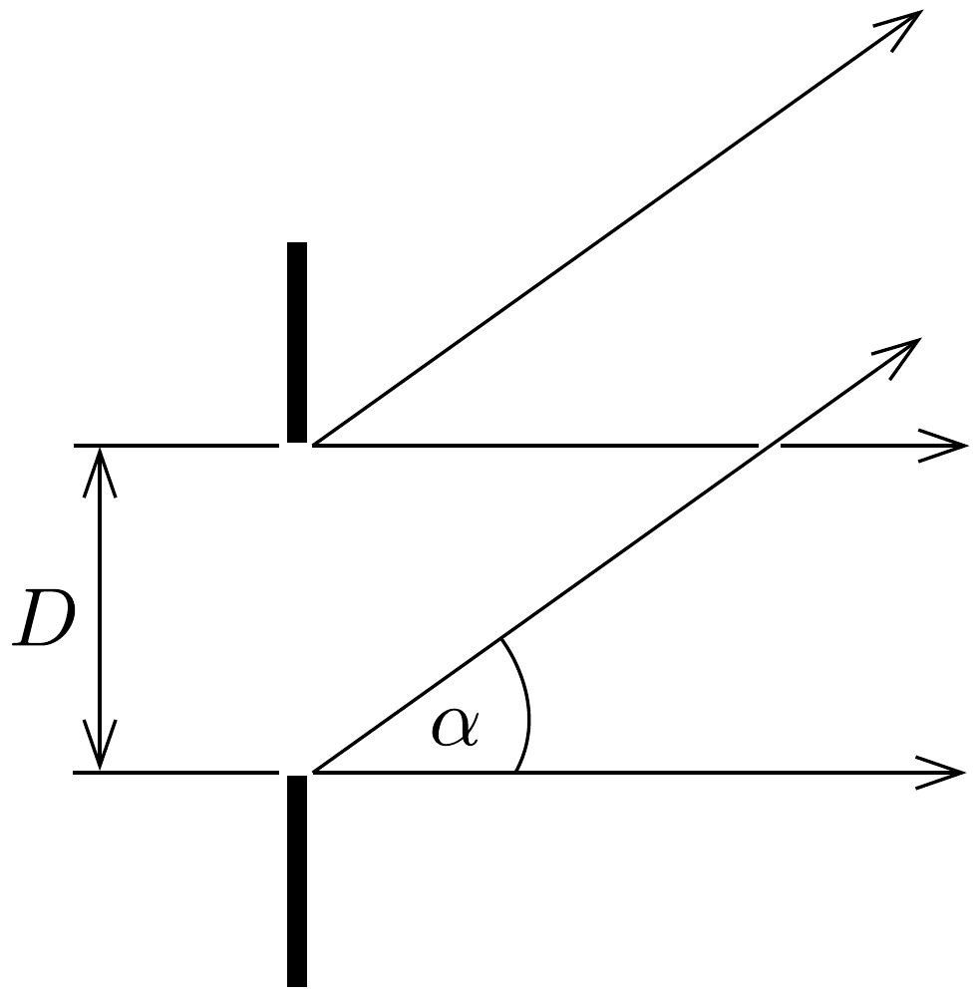
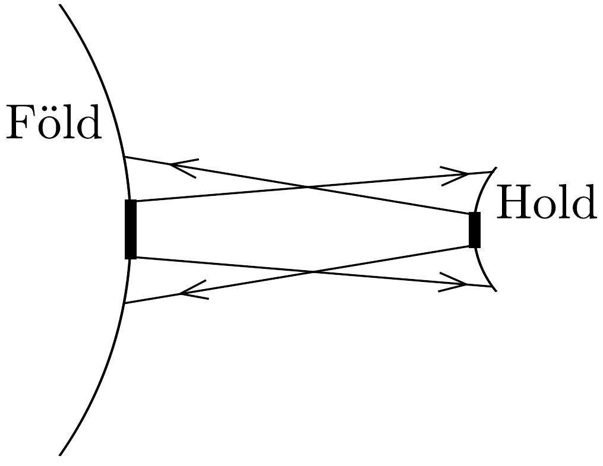
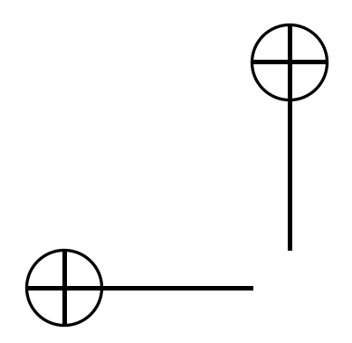

## Megoldás 3

a) A lézer csak mint erós, pontszerú fényforrás szerepel, a mi esetünkben az irányításban nincs szerepe. A távcső $\pi(D / 2)^{2}=5,31 \mathrm{~m}^{2}$ nagyságú nyílásterülete mint fényt kibocsátó rés szerepel és a sugárnyalábot a diffrakció szélesíti ki (61. ábra). A rés Huygens-elv szerint mint hullámfelület múködik, az eredeti irányban adja a legnagyobb intenzitást és $\sin \alpha=\lambda / D$ irányban az első̌ kioltást. Legjobb volna, ha a tengely pontosan a holdi tükör felé mutatna. Ha $\sin \alpha=\lambda / D$ szögnél nagyobb az irányeltérés, akkor biztosan alig kap fényt a holdi tükör. Ez a szög: $\alpha \approx \sin \alpha=\lambda / D=2,65 \cdot 10^{-7} \mathrm{rad}=0,055^{\prime \prime}$. Ennél lényegesen pontosabb legyen az irányítás. E szögön belül sem egyenletes a fényelosztás, a széle felé csökken, ezért minden további számításunk csak közelítő pontosságú.

61. ábra.
XI. olimpia, 1979
b) Az ismertetett diffrakció következtében a Holdon egy megvilágított kör keletkezik, amelynek sugara $\alpha L=\frac{\lambda}{D} \cdot L=101 \mathrm{~m}$, területe $A=\pi \cdot(L \lambda / D)^{2} \approx$ $\approx 3,2 \cdot 10^{4} \mathrm{~m}^{2}$. Ezen oszlik szét az összes kisugárzott $E$ energia és így az átlagos felületi energiasúrúség:
\[
\varepsilon=\frac{E}{A}=\frac{D^{2} E}{\pi \lambda^{2} L^{2}}=3,12 \cdot 10^{-5} \frac{1}{\mathrm{~m}^{2}} \cdot E .
\]

A $d$ átmérőjú és $\pi(d / 2)^{2}=0,0314 \mathrm{~m}^{2}$ területű holdi síktükörre jutó energia:
\[
E^{\prime}=\varepsilon \pi\left(\frac{d}{2}\right)^{2}=\left(\frac{D d}{2 L \lambda}\right)^{2} \cdot E=9,8 \cdot 10^{-7} \cdot E .
\]

A síktükör mindezt az energiát visszaveri, de ismét a diffrakció miatt $\lambda / d=$ $=\beta=3,45 \cdot 10^{-6} \mathrm{rad}=0,71^{\prime \prime}$ nagyságú szögtartományban (lásd a nem méretarányos 62. ábrát). A Földön $\beta L=\frac{\lambda L}{d} \approx 1300 \mathrm{~m}$ sugarú, $A^{\prime}=\pi(L \lambda / d)^{2} \approx$ $\approx 332500 \mathrm{~m}^{2}$ területú kör kap fényt. Ezen oszlik szét a Hold által visszavert $E^{\prime}$ energia, tehát a visszavert fény által a Földön létrehozott energiasúrúség:
\[
\varepsilon^{\prime}=\frac{E^{\prime}}{A^{\prime}}=\frac{D^{2} d^{4}}{4 \pi L^{4} \lambda^{4}} \cdot E=1,8 \cdot 10^{-13} \frac{1}{\mathrm{~m}^{2}} \cdot E .
\]

62. ábra.

A $\pi(D / 2)^{2}$ területú észlelő távcsőbe jutó energia:
\[
\varepsilon^{\prime} \pi\left(\frac{D}{2}\right)^{2}=\left(\frac{D d}{2 L \lambda}\right)^{4} E=9,7 \cdot 10^{-13} \cdot E .
\]
Tehát az eredeti energia kb. billiomod részét kapjuk vissza.
c) A pupilla területe $\pi \cdot 2,5^{2} \mathrm{~mm}^{2} \approx 20 \cdot 10^{-6} \mathrm{~m}^{2}$; ezt kell szorozni a Földön létrejött $\varepsilon^{\prime}=1,8 \cdot 10^{-13} \frac{1}{\mathrm{~m}^{2}} \cdot E$ energiasürúséggel ( $E=1 \mathrm{~J}$ ), az energia $\sim 4 \cdot 10^{-18} \mathrm{~J}$.

A piros fény frekvenciája $f=\left(3 \cdot 10^{8} \mathrm{~m} / \mathrm{s}\right):\left(0,69 \cdot 10^{-8} \mathrm{~m}\right)=4,35 \cdot 10^{14} \mathrm{~Hz}$, egy fotonjának energiája: $h f=2,88 \cdot 10^{-19} \mathrm{~J}$. A szembe jutó fotonok darabszáma $4 \cdot 10^{-18}: 2,88 \cdot 10^{-19} \approx 12$ foton.

Vajon észrevehetnénk-e szabad szemmel a visszavert fényt? Szemünk ideghártyájában csak a pálcikák fokozott érzékenységének vehetnénk hasznát. Ezek a $0,51 \mu \mathrm{~m}$ hullámhosszú zöld fény iránt a legérzékenyebbek, ekkor alkalmas körülmények között néhány fotont is érzékelni lehet. A pálcikák érzékenysége $0,6 \mu \mathrm{~m}$-nél ennek százada és még nagyobb hullámhosszú fény iránt teljesen érzéketlenek. Így szó sem lehet a szabad szemmel történő megfigyelésről. Azonkívül a Hold erős fénye is zavarna.
d) Ha nem helyezünk a Holdra tükröt, akkor a Holdra érkező összes fény tizede, $0,1 E$ verődik vissza. (A 101 méteres kör teljes egésze könnyen ráfér a Holdra.) De a sokkal nagyobb, 0,1E energia most $L$ sugarú, $2 \pi L^{2}=0,907 \cdot 10^{18} \mathrm{~m}^{2}$ felületú félgömbön oszlik szét és így a Földön létrehozott energiasúrúség:
\[
\frac{0,1 E}{2 \pi L^{2}}=1,1 \cdot 10^{-19} \frac{1}{\mathrm{~m}^{2}} \cdot E
\]
ebből a távcső által felfogott energia:
\[
\pi\left(\frac{D}{2}\right)^{2} \cdot \frac{0,1 E}{2 \pi L^{2}}=5,9 \cdot 10^{-19} \cdot E .
\]
A b) esethez képest az energiaarány:
\[
\left(\frac{D d}{2 L \lambda}\right)^{4} \cdot E:\left[\pi\left(\frac{D}{2}\right)^{2} \cdot \frac{0,1 E}{2 \pi L^{2}}\right]=\frac{1}{80} \cdot \frac{D^{2} d^{4}}{L^{2} \lambda^{4}} \approx 2 \cdot 10^{6} .
\]
Az eredmény kb. kétmilliószor rosszabb a holdi tükör nélkül.

"IPhO_konyv" - 2023/6/21 - 16:34 - page 88 - \#88

88
XII. OLIMPIA, 1981

\title{
