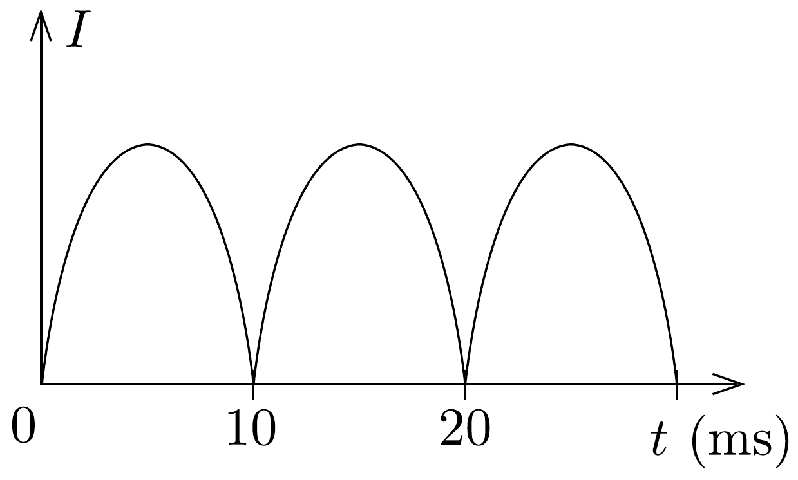

## Megoldás 1

a) A teljes impedancia $Z=U / I=380,8 \Omega$. A fénycsó ohmos ellenállása $R_{\mathrm{f}}=U^{\prime} / I=140 \Omega$, a teljes ohmos ellenállás $R=R_{\mathrm{f}}+R_{\mathrm{t}}=166,3 \Omega$. A tekercs önindukciós együtthatója:
\[
L=\frac{\sqrt{Z^{2}-R^{2}}}{\omega}=1,09 \mathrm{H} .
\]
- b) $\operatorname{tg} \varphi=(\omega L) / R$, amiból $\varphi=64,1^{\circ}$.
- c) A teljesítmény: $P=U I \cos \varphi=59,9 \mathrm{~W}$.
- d) Amikor a gyújtó zár, áram folyik rajta és ez izzítja a fénycső két végén levő izzószálat. A gyújtó kikapcsolásakor a tekercsen nagy feszültség indukálódik, ami begyújtja a csövet. A múködési folyamat fenntartásához a hálózati feszültség már elegendő.
- e) Az 50 Hz-es hálózatról táplált fénycső másodpercenként 100-szor kialszik (egy periódus alatt kétszer villan fel), aztán újból világít. Az ennek megfelelő grafikont mutatja a 70. ábra. (A fénycsövet most nem tekinthetjük ohmikus ellenállásúnak.)

70. ábra.
f) A begyújtáskor az izzószál és az első impulzus sok iont és szabad elektront hoz létre. Ezeknek a semlegesítődéséhez elég sok idő kell. Az újragyújtáshoz szükséges töltéshordozók a feszültség újbóli megjelenésekor még rendelkezésre állnak.
- g) A 4,7 μF-os kondenzátor impedanciája $(\omega C)^{-1}=677,3 \Omega$, ami körülbelül duplája a fojtótekercs $\omega L=342,6 \Omega$ impedanciájának. Ezért a kondenzátor gyakorlatilag a fázisszög előjelét változtatja meg, abszolút értéke nagyjából azonos. Az eredő impedancia:
\[
Z^{\prime}=\sqrt{\left(\omega L-\frac{1}{\omega C}\right)^{2}+R^{2}}=373,7 \Omega,
\]
ami közel azonos a kondenzátor nélküli impedanciával, tehát az áramerősség ugyanakkora. Azaz a fázisszög nullává tehető.

A nagy fázistolás veszteségeket okoz a tápvezetéken, és az eróművekben (a fogyasztón nagyobb áram folyik, mint a hatásos teljesítménynek megfeleló áram). Ezek a kondenzátorok ezt szüntetik meg. Több fénycső esetén fontos a kondenzátorok alkalmazása.
h) A fénycső lumineszkáló bevonattal be nem borított felén a higanygőz vonalas spektruma látható. A bevonattal ellátott részben ezen kívül még egy rárakódott, folytonos spektrumú hátteret is látunk. A higany ultraibolya sugárzása ugyanis gerjeszti a szilárd bevonatot, ami az elnyelt fényt kisebb frekvenciával (energiaveszteség) kisugározza, amely folytonos spektrummal rendelkezik.
