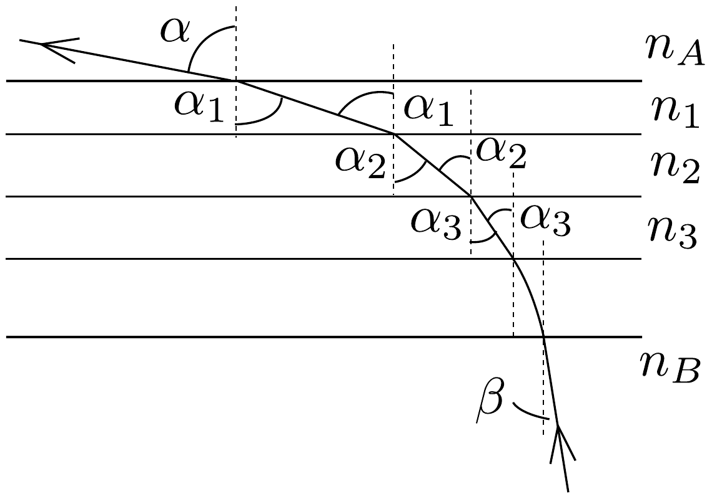
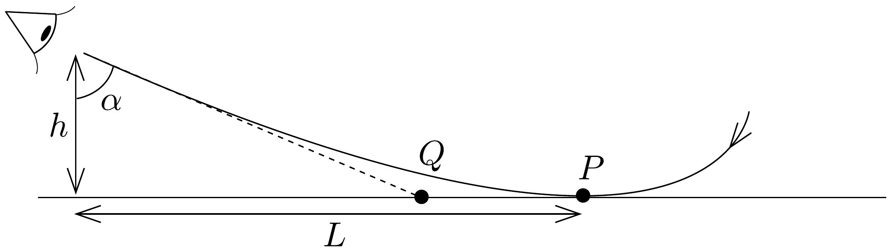

## Megoldás 1

a) Osszuk fel a plánparalel lemezt $k$ darab, kicsiny, a határfelülettel párhuzamos részre a 85, ábrán látható módon. A törésmutatót egy ilyen vékony részben állandónak tekinthetjük, ha sok részre bontjuk fel. A törési tör-
vény alapján:
\[
\frac{\sin \alpha}{\sin \alpha_{1}}=\frac{n_{1}}{n_{A}}, \frac{\sin \alpha_{1}}{\sin \alpha_{2}}=\frac{n_{2}}{n_{1}}, \frac{\sin \alpha_{2}}{\sin \alpha_{3}}=\frac{n_{3}}{n_{2}}, \ldots, \frac{\sin \alpha_{k}}{\sin \beta}=\frac{n_{B}}{n_{k}} .
\]
Átrendezve az egyenleteket, megkapjuk a feladat állítását:
\[
n_{A} \sin \alpha=n_{1} \sin \alpha_{1}=n_{2} \sin \alpha_{2}=n_{3} \sin \alpha_{3}=\ldots=n_{k} \sin \alpha_{k}=n_{B} \sin \beta .
\]

b) A napsugárzás hatására a talaj közvetlen közelében a levegő jobban felmelegszik, mint szemmagasságban, így ott a levegő törésmutatója kisebb. Ha a földfelszínnel elég kis szöget bezáróan nézünk lefelé, azaz elég távolra nézünk, akkor a talaj közvetlen közelében a teljes visszaverődés jelensége lép fel, és a talajon az ég kékjét mint „vizet” látjuk. Ha odébb menve a hőmérsékleti viszonyok nem változnak, a „víz" is odébb megy, hiszen a jelenséget csak bizonyos szög alatt nézve láthatjuk.
c) Jelöljük $T$-vel az ismeretlen hőmérsékletet. Legyen $h=1,6 \mathrm{~m}, L=250 \mathrm{~m}$ és $T_{0}=30^{\circ} \mathrm{C}$. Mivel $h \ll L$, a teljes visszaveródés helye (a 86. ábrán a $P$ pont) gyakorlatilag egybeesik a talaj azon pontjával, ahonnan a szemünkbe jutó fényt kiindulni látjuk (az ábrán a $Q$ pont).

Teljes visszaverődés határesetében $\sin \alpha=n(T) / n\left(T_{0}\right)$. Tudjuk, hogy $\operatorname{tg} \alpha=$ $L / h$, innen $\alpha=89,63^{\circ}$, így az előzó egyenletből
\[
n(T)=n\left(T_{0}\right) \cdot 0,9999795 .
\]

A feladat szövege alapján felírhatjuk, hogy
\[
\begin{aligned}
n(T)-1 & =C \varrho(T), \\
n\left(T_{0}\right)-1 & =C \varrho\left(T_{0}\right), \\
n\left(T_{1}\right)-1 & =C \varrho\left(T_{1}\right),
\end{aligned}
\]
ahol $C$ egy állandó és $T_{1}=15{ }^{\circ} \mathrm{C}$, és a megadott adatoknak megfelelően $n\left(T_{1}\right)=$ 1,000276. A levegőt ideális gáznak tekintve $\varrho(T)=p M /(R T)$, ahol $M$ a levegő átlagos moláris tömege, $T$ pedig az abszolút hőmérséklet. Mivel a nyomás mindenütt azonos, ezért
\[
\varrho(T) \cdot T=\varrho\left(T_{0}\right) \cdot T_{0}=\varrho\left(T_{1}\right) \cdot T_{1} .
\]
Elosztva (84-3)-at (84-4)-gyel, és kihasználva (84-5)-öt:
\[
n\left(T_{0}\right)=\frac{288}{303}\left[n\left(T_{1}\right)-1\right]+1=1,000262 .
\]
Ezzel (84-1) alapján $n(T)=1,000242$. Elosztva (84-2)-t (84-4)-gyel, és ismét kihasználva (84-5)-öt, a hőmérséklet
\[
T=T_{1} \cdot \frac{n\left(T_{1}\right)-1}{n(T)-1} \approx 328 \mathrm{~K}=55^{\circ} \mathrm{C} .
\]

A számolásokból felhalmozódott hiba a számológép pontossága miatt nagyon kicsi (kisebb, mint $0,1^{\circ} \mathrm{C}$ ). A valóságban a feladatban megadott adatok közül több csak nagy hibával mérhető (pl. 250 m, 30 °C), így az eredmény hibája legalább néhány ${ }^{\circ} \mathrm{C}$.
