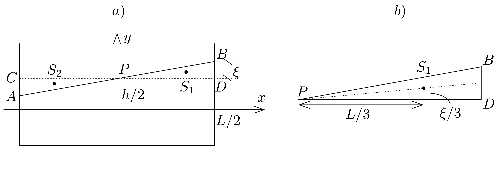

## Megoldás 2

Helyezzük el az edényt a 87. a) ábrán látható koordináta-rendszerben. Mutasson az ábra egy köztes állapotot, tehát olyat, amikor még a víz mozog a szélsőhelyzete felé a vízszintes egyensúlyi helyzetéből. A tólengés során a $P D B$ háromszögbeli víz átkerül a $P C A$ háromszögbe. Tehát a mozgás során ennek a vízmennyiségnek az $S_{1}$ súlypontja átkerül az $S_{2}$ pontba.

Határozzuk meg a teljes vízmennyiség tömegközéppontjának elmozdulását $x$ és $y$ irányba. Ehhez szükségünk van $S_{1}$ és $S_{2}$ koordinátáira. Mivel a súlypont a súlyvonal harmadolópontja, így a 87. b) ábrán lévő távolságokat felhasználva
\[
S_{1}=\left(\frac{L}{3} ; \frac{h}{2}+\frac{\xi}{3}\right), \quad S_{2}=\left(-\frac{L}{3} ; \frac{h}{2}-\frac{\xi}{3}\right) .
\]
A háromszögben lévő víz tömege:
\[
M_{1}=M \frac{\frac{1}{2} \frac{L}{2} \xi}{h L}=M \frac{\xi}{4 h},
\]
ahol $M$ az edényben lévő teljes vízmennyiség tömege. Az ábrán látható helyzetben a TK helye:
\[
\boldsymbol{r}_{\mathrm{TK} 1}=\frac{M_{1} \boldsymbol{r}_{S_{1}}+\left(M-M_{1}\right) \boldsymbol{R}}{M},
\]

ahol $\boldsymbol{r}_{S_{1}}$ az $S_{1}$ súlypontba, $\boldsymbol{R}$ pedig a maradék, $M-M_{1}$ tömegü vízmennyiség tömegközéppontjába mutató helyvektor. Egyensúlyi állapotban a TK helye (amikor a vízfelszín vízszintes):
\[
\boldsymbol{r}_{\mathrm{TK} 0}=\frac{M_{1} \boldsymbol{r}_{S_{2}}+\left(M-M_{1}\right) \boldsymbol{R}}{M} .
\]
Tehát a TK vízszintes és függőleges irányú elmozdulásvektora
\[
\Delta \boldsymbol{r}=\boldsymbol{r}_{\mathrm{TK} 1}-\boldsymbol{r}_{\mathrm{TK} 0}=M_{1} / M\left(\boldsymbol{r}_{S_{1}}-\boldsymbol{r}_{S_{2}}\right) .
\]
Így az $x$ és $y$ irányban a TK elmozdulása az egyensúlyi helyhez képest:
\[
\Delta x_{\mathrm{TK}}=\frac{\xi}{4 h} \frac{2 L}{3}=\frac{\xi L}{6 h}, \quad \Delta y_{\mathrm{TK}}=\frac{\xi}{4 h} \frac{2 \xi}{3}=\frac{\xi^{2}}{6 h} .
\]
Ebbő̌l a TK sebességkomponenseit is megadhatjuk a $\boldsymbol{v}=\lim _{\Delta t \rightarrow 0} \Delta \boldsymbol{r} / \Delta t$ alapján:
\[
v_{x}=\frac{\dot{\xi} L}{6 h}, \quad v_{y}=\frac{2 \xi \dot{\xi}}{6 h} .
\]
Mivel $\xi \ll h$, ezért $v_{y} \ll v_{x}$. A lengés során $v_{x}$ akkor a legnagyobb, amikor a víztömeg az egyensúlyi helyzetén halad át, és nulla szélsőhelyzetben.

A teljes víztömeg energiája, ami a mozgás során megmarad:
\[
E=\frac{1}{2} M v_{x}^{2}+M g \Delta y_{\mathrm{TK}}=\frac{1}{2} \frac{M L^{2}}{36 h^{2}} \dot{\xi}^{2}+\frac{M g}{6 h} \xi^{2} .
\]
Ha összevetjük ezt a harmonikus rezgőmozgás $E=1 / 2 m \dot{x}^{2}+1 / 2 D x^{2}$ energiakifejezésével, láthatjuk, hogy a tólengés harmonikus, és a megfelelő adatok:
\[
m=\frac{M L^{2}}{36 h^{2}}, \quad D=\frac{M g}{3 h} .
\]

Ezzel lengés periódusideje:
\[
T=2 \pi \sqrt{\frac{m}{D}}=\frac{\pi}{\sqrt{3}} \frac{L}{\sqrt{g h}} \approx 1,81 \frac{L}{\sqrt{g h}} .
\]

A kapott eredmény alkalmasságának megvizsgálásához határozzuk meg a lengésidőket és vessük össze a megadott táblázat adataival. Az eredmény által kiszámolt értékekeket az alábbi táblázat tartalmazza megadva a mért értéktől való eltérést is.

\begin{tabular}[t]{|l|l|l|}
\hline \multicolumn{3}{|c|}{$L=479 \mathrm{~mm}$} \\
\hline $h$ (mm) & $T(\mathrm{~s})$ & $\Delta T(\mathrm{~s})$ \\
\hline 30 & 1,60 & -0,18 \\
\hline 50 & 1,39 & -0,01 \\
\hline 69 & 1,06 & -0,12 \\
\hline 88 & 0,94 & -0,14 \\
\hline 107 & 0,85 & -0,15 \\
\hline 124 & 0,79 & -0,12 \\
\hline 142 & 0,74 & -0,08 \\
\hline
\end{tabular}

\begin{tabular}[t]{|l|l|l|}
\hline \multicolumn{3}{|c|}{$L=143 \mathrm{~mm}$} \\
\hline $h$ (mm) & $T(\mathrm{~s})$ & $\Delta T(\mathrm{~s})$ \\
\hline 31 & 0,47 & -0,05 \\
\hline 38 & 0,42 & -0,06 \\
\hline 58 & 0,34 & -0,09 \\
\hline 67 & 0,32 & -0,03 \\
\hline 124 & 0,24 & -0,04 \\
\hline
\end{tabular}

Láthatjuk, hogy a modell alapján számított periódusidő jól követi a mért periódusidő változásait, de szisztematikusan (átlagosan 12 \%-kal) kisebb értéket kapunk. Ezért korrigáljuk a fenti eredményünket:
\[
T=1,1 \cdot 1,81 \frac{L}{\sqrt{g h}} \approx 2 \frac{L}{\sqrt{g h}} .
\]

A periódusidő a Vättern-tó esetén a korrigált összefüggésből $T \approx 3,1$ óra. A megadott ábra időtengelyén 20 beosztásra 13 periódus jut, így egy beosztás $\frac{13}{20} \cdot 3,1 \approx 2$ órának felel meg kb. $10 \%$-os hibával.
