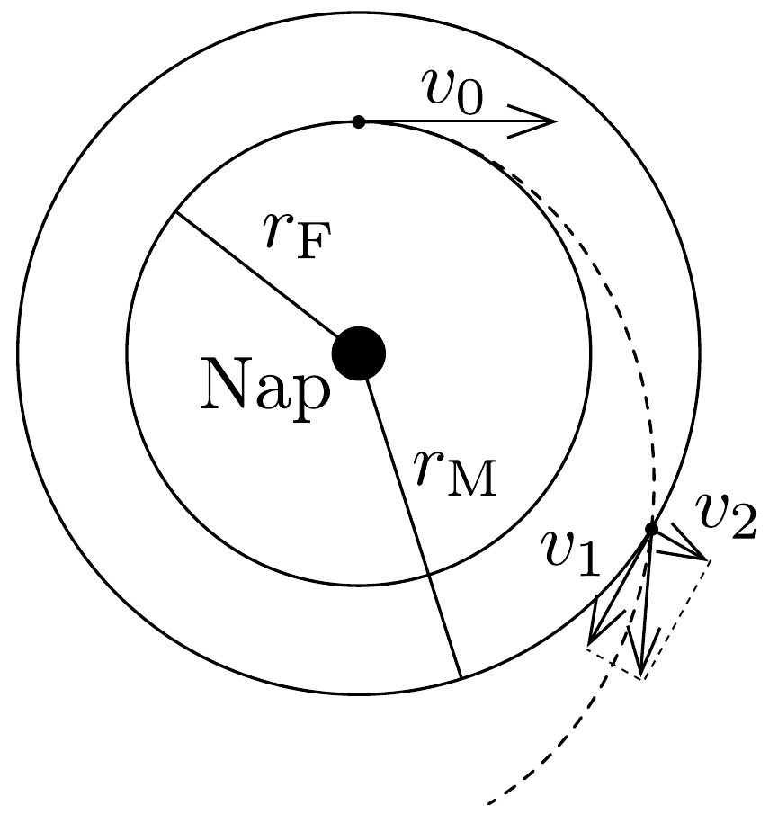

## Megoldás 3

a) A Naprendszer elhagyásának feltétele az, hogy a szonda teljes $E$ energiája nemnegatív legyen. A kilövés után közvetlenül:
\[
E=\frac{m v^{2}}{2}-f \frac{m M}{r_{\mathrm{F}}} \geq 0,
\]
ahol $m$ a szonda tömege, $v$ a Naphoz viszonyított sebessége, $M$ a Nap tömege, $r_{\mathrm{F}}$ a földpálya sugara és $f$ a gravitációs állandó.

A Föld keringése során a Földre ható gravitációs eró a centripetális erố:
\[
\frac{m_{\mathrm{F}} v_{\mathrm{F}}^{2}}{r_{\mathrm{F}}}=f \frac{m_{\mathrm{F}} M}{r_{\mathrm{F}}^{2}},
\]
ahol $m_{\mathrm{F}}$ és $v_{\mathrm{F}}$ rendre a Föld tömege és sebessége. Ebből
\[
v_{\mathrm{F}}^{2}=f \frac{M}{r_{\mathrm{F}}} .
\]
(85-6) és (85-7) felhasználásával a lehető legkisebb kilövés utáni sebesség $v=$ $\sqrt{2} v_{\mathrm{F}}$. A szonda Földhöz viszonyított sebessége a kilövés után
\[
\boldsymbol{v}_{a}=\boldsymbol{v}-\boldsymbol{v}_{\mathrm{F}},
\]
aminek nagysága nyilván akkor a legkisebb, ha $\boldsymbol{v}_{a}$ és $\boldsymbol{v}_{\mathrm{F}}$ egyirányú, tehát a szondát a Föld mozgásának irányába lőjük ki. Ekkor
\[
v_{a}=(\sqrt{2}-1) v_{F}=12,4 \mathrm{~km} / \mathrm{s} .
\]
b) Jelöljük a szonda $v_{b}+v_{\mathrm{F}}$ nagyságú kezdősebességét $v_{0}-\operatorname{lal}$, továbbá használjuk a 94. ábra jelöléseit. Írjuk fel a szonda mozgására a perdület megmaradását:

94. ábra.
\[
m v_{0} r_{\mathrm{F}}=m v_{1} r_{\mathrm{M}},
\]
ahol $r_{\mathrm{M}}$ a Mars pályasugara. Az energia megmaradása
\[
m \frac{v_{0}^{2}}{2}-f \frac{m M}{r_{\mathrm{F}}}=m \frac{v_{1}^{2}+v_{2}^{2}}{2}-f \frac{m M}{r_{\mathrm{M}}} .
\]
Bevezetve a $\lambda=r_{\mathrm{F}} / r_{\mathrm{M}}=2 / 3$ jelölést, az utóbbi két egyenletből:
\[
\begin{gathered}
v_{1}=\lambda v_{0}, \\
v_{2}=\sqrt{v_{0}^{2}\left(1-\lambda^{2}\right)-2(1-\lambda) v_{\mathrm{F}}^{2}} .
\end{gathered}
\]
c) Az a térrész, ahol a Mars gravitációs tere erősebb, mint a Napé, nagyon kis méretú a marspálya méreteihez képest. Azt mondhatjuk tehát, hogy amikor a szonda a Mars pályájának keresztezése előtt belép a Mars gravitációs terébe, akkor
a b) pontban kiszámított $\sqrt{v_{1}^{2}+v_{2}^{2}}$ sebességgel rendelkezik. Ekkor a szondának a Marshoz viszonyított relatív sebessége:
\[
v_{\text {rel. }}=\sqrt{v_{2}^{2}+\left(v_{1}-v_{\mathrm{M}}\right)^{2}},
\]
ahol $v_{\mathrm{M}}$ a Mars keringési sebessége.
A Marshoz rögzített koordináta-rendszerből nézve a szonda a Mars gravitációs terében hiperbola pályán mozog $(E>0)$. Amikor a szonda elhagyja a Mars gravitációs terét, akkor a Marshoz viszonyított sebéssége ugyanakkora, mint amikor oda belépett. A szonda további mozgása olyan lesz, mintha a Marsról lőtték volna ki $v_{\text {rel. }}$ nagyságú sebességgel. Alkalmazhatjuk tehát az $a$ ) rész eredményeit. Ideális esetben a Marsot elhagyva a szonda sebessége egyirányú a Mars sebességével, és a Naprendszer elhagyásának feltétele:
\[
v_{\text {rel. }}=(\sqrt{2}-1) v_{\mathrm{M}} .
\]
A Mars sebességére a (85-7) egyenlethez hasonlót írhatunk fel:
\[
v_{\mathrm{M}}^{2}=f M / r_{\mathrm{M}} \rightarrow v_{\mathrm{M}}^{2}=\lambda v_{\mathrm{F}}^{2} .
\]

A (85-8)-(85-12) egyenletekből $v_{0}$-ra egy másodfokú egyenletet kapunk
\[
v_{0}^{2}-2 \lambda^{3 / 2} v_{\mathrm{F}} v_{0}+(2 \sqrt{2} \lambda-2) v_{\mathrm{F}}^{2}=0,
\]
amelynek megoldása
\[
v_{0_{1,2}}=v_{\mathrm{F}}\left(\lambda^{3 / 2} \pm \sqrt{\lambda^{3}-2 \sqrt{2} \lambda+2}\right) .
\]
Ebből
\[
v_{b_{1,2}}^{\prime}=v_{0}-v_{\mathrm{F}}=v_{\mathrm{F}}\left(\lambda^{3 / 2}-1 \pm \sqrt{\lambda^{3}-2 \sqrt{2} \lambda+2}\right) .
\]
Az adatokat behelyettesítve, az egyik gyök negatív, a másik pedig $v_{b}^{\prime}=5,6 \mathrm{~km} / \mathrm{s}$. Tehát a Mars gravitációs terének kihasználásával elegendő, ha a szondát csak 5,6 km/s nagyságú sebességgel indítjuk el.
- d) Az energiamegtakarítás
\[
\frac{v_{a}^{2}-v_{b}^{\prime 2}}{v_{a}^{2}} \approx 80 \% .
\]

\section*{
