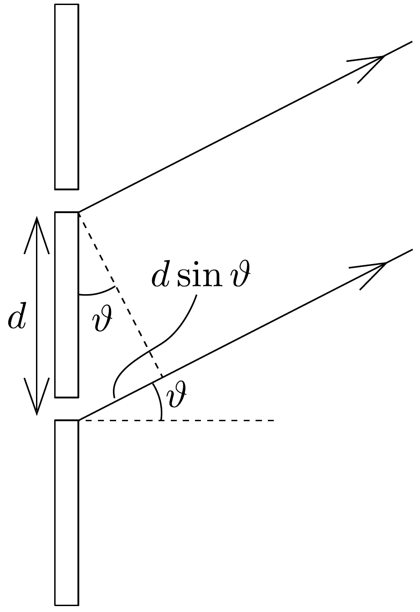
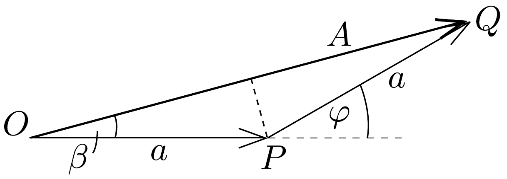
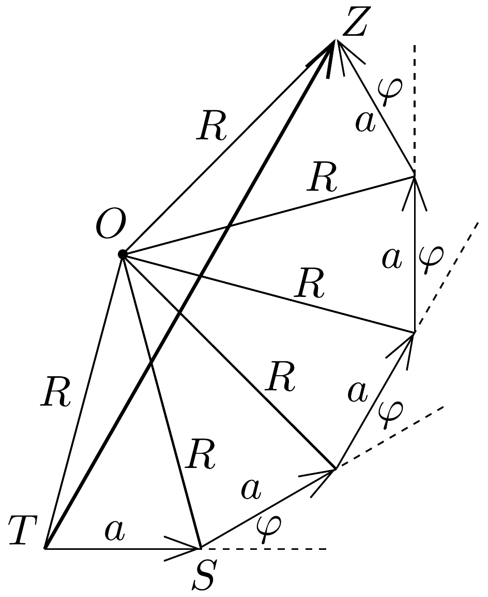
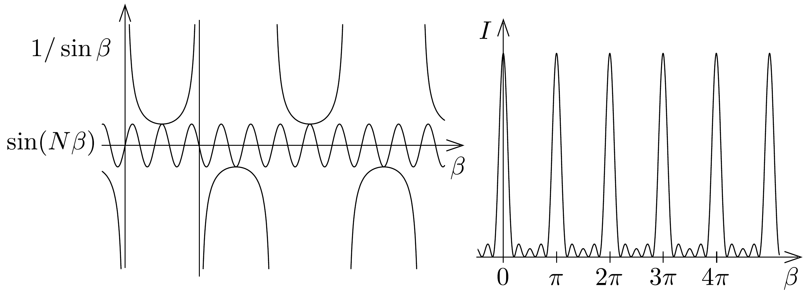

## Megoldás 1

a) Amennyiben az első résből érkező fény fázisa nulla, úgy a másik fázisa $\varphi=2 \pi \cdot d \sin \vartheta / \lambda$ a 98, ábrának megfelelően. Két $-\varphi$ fáziskülönbségü - hullámot összeadva a $\xi=2 \pi(f t-x / \lambda)$ jelölés alkalmazásával, valamint a megadott addíciós összefüggéssel
\[
\begin{gathered}
a \cos (\xi+\varphi)+a \cos \xi= \\
=2 a \cos \frac{\varphi}{2} \cdot \cos \left(\xi+\frac{\varphi}{2}\right)= \\
=2 a \cos \beta \cdot \cos (\xi+\beta)
\end{gathered}
\]
adódik, ahonnan leolvasható, hogy az eredő hullám amplitúdója $A=2 a \cos \beta$, fázisa pedig éppen $\beta=\pi / \lambda \cdot d \sin \vartheta$.

98. ábra.

99. ábra.

Ugyanez a 99. ábrán látható vektordiagramról is leolvasható. Az $O P Q$ egyenló szárú háromszögben
\[
\beta=\frac{\varphi}{2}=\frac{\pi}{\lambda} d \sin \vartheta
\]
és
\[
A=2 a \cos \beta,
\]
tehát az eredő hullám olyan két síkbeli vektoramplitúdó összegeként kapható meg, amelyek nagysága $a$, szögeltérésük pedig a hullámok $\varphi$ fáziskülönbsége.
b) Az előző alfeladat megoldása alapján elmondható, hogy mindegyik rés egyegy $a$ amplitúdójú, és az előzó rés hullámához képest $\varphi=2 \beta$ fáziseltolású hullámot bocsát ki az adott irányban. A vektordiagram eszerint egy szabályos sokszög részét képezi; az egyes oldalak hossza $a$, az egymás melletti oldalak szöge pedig azonos.

A 100. ábra jelöléseit használva a $\varphi$ csúcsszögú $T O S$ háromszögből leolvashatjuk, hogy
\[
R=\frac{a}{2 \sin (\varphi / 2)}=\frac{a}{2 \sin \beta},
\]
a $T O Z \varangle$ nagysága pedig $N$-szerese a $T O S \varangle=\varphi$-nek, azaz $N \varphi=2 N \beta$. Így az

eredő hullám amplitúdója
\[
T Z=2 R \sin (N \beta)=a \frac{\sin (N \beta)}{\sin \beta} .
\]
Az eredő hullám fázisa a $Z T S \varangle$, amely az $O T S \varangle$ és $O T Z \varangle$ különbsége, azaz
\[
\left(90^{\circ}-\frac{\varphi}{2}\right)-\frac{1}{2}\left(180^{\circ}-N \varphi\right)=\frac{1}{2}(N-1) \varphi=(N-1) \beta
\]
nagyságú.
- c) A kérdezett függvények és az amplitúdó négyzetével arányos intenzitás
\[
I \sim \frac{a^{2} \cdot \sin ^{2} N \beta}{\sin ^{2} \beta}
\]
pedig a 101. ábrán látható.

- d) A fő intenzitásmaximumok a $\beta=n \cdot \pi(n=0, \pm 1, \pm 2, \ldots)$ értékeknél figyelhetők meg. Ezeknél az intenzitás a $\beta=n \pi+\beta^{\prime}$, ahol $\beta^{\prime} \rightarrow 0$ helyettesítéssel és addíciós tételek felhasználáasával
\[
I_{\max } \sim a^{2}\left(\frac{N \beta^{\prime}}{\beta^{\prime}}\right)^{2}=N^{2} a^{2}
\]
nagyságúnak adódik.
- $e$ ) Fómaximum esetén $\beta=n \pi=\pi / \lambda \cdot d \sin \vartheta$, vagyis
\[
\sin \vartheta=n \frac{\lambda}{d} \leq 1,
\]
ahonnan $n \leq d / \lambda$. Tehát a pozitív és negatív $\vartheta$ értékek esetén legfeljebb $2 d / \lambda$ számú maximumot találhatunk, amihez hozzá kell adni a nulladrendú fómaximumot is. Tehát valóban $2 d / \lambda+1$ a főmaximumok lehetséges legnagyobb száma.
- $f$ ) Írjuk fel az $e$ ) részben kapott $n=d / \lambda \sin \vartheta$ összefüggést két közeli hullámhosszra, $\lambda$-ra és $\lambda+\Delta \lambda$-ra:
\[
\lambda=\frac{d \sin \vartheta}{n}, \quad \text { és } \quad \lambda+\Delta \lambda=\frac{d \sin (\vartheta+\Delta \vartheta)}{n} .
\]
Kivonva egymásból, a $\Delta \lambda$ hullámhosszkülönbséghez tartozó $\Delta \vartheta$ szögkülönbségre a
\[
\Delta \lambda=\frac{d}{n}(\sin \vartheta \cos \Delta \vartheta+\cos \vartheta \sin \Delta \vartheta-\sin \vartheta) \approx \frac{d}{n} \Delta \vartheta \cos \vartheta,
\]
vagyis a
\[
\Delta \vartheta=\frac{n \Delta \lambda}{d \cos \vartheta}
\]
adódik. Behelyettesítve a megadott adatokat és felhasználva, hogy $\sin \vartheta=n \lambda / d$, $\Delta \vartheta=5,2 \cdot 10^{-3}$ radián $=0,30^{\circ}$ adódik.
