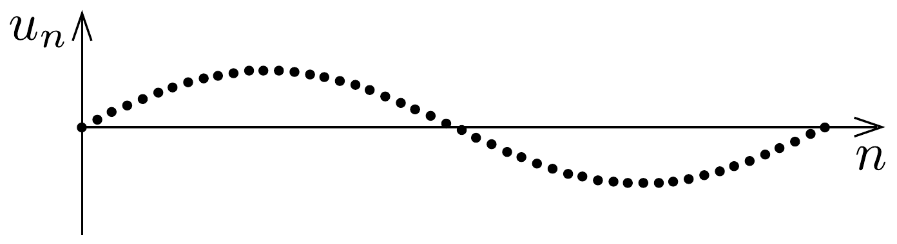
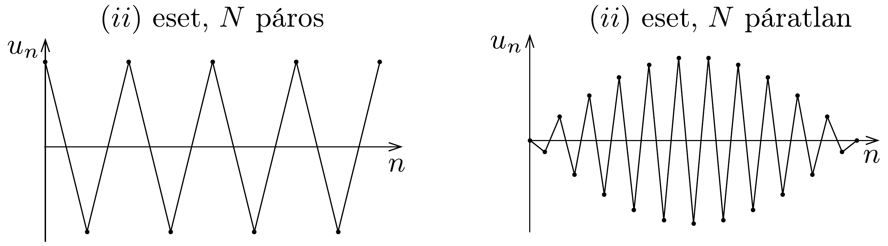
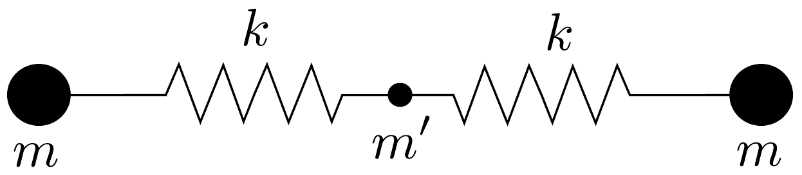
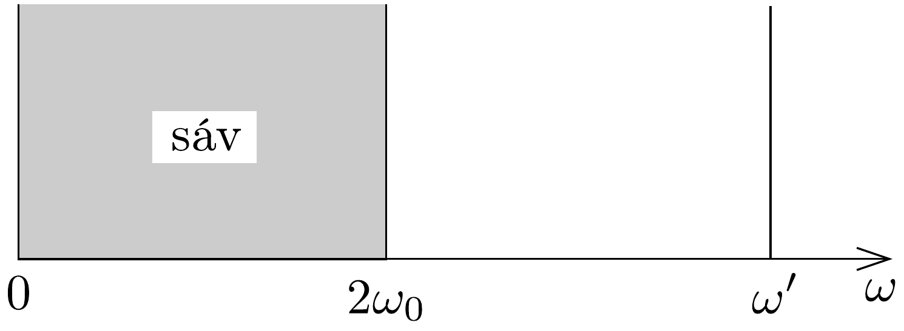
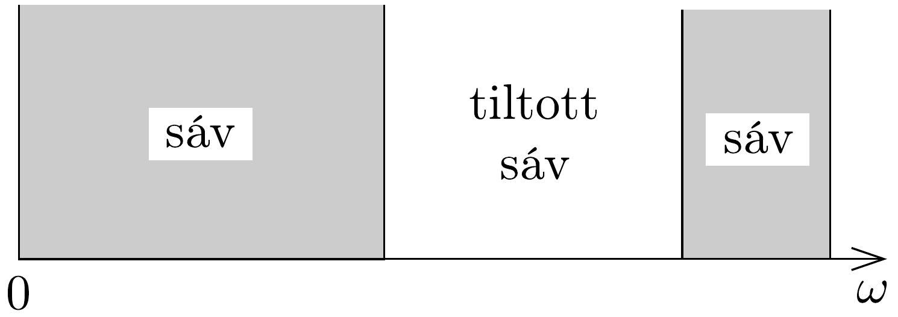

## Megoldás 3

a) Az egyes részecskék mozgásegyenlete:
\[
\begin{aligned}
& m A_{1}=k\left(u_{2}-u_{1}\right)+k\left(u_{3}-u_{1}\right), \\
& m A_{2}=k\left(u_{3}-u_{2}\right)+k\left(u_{1}-u_{2}\right), \\
& m A_{3}=k\left(u_{1}-u_{3}\right)+k\left(u_{2}-u_{3}\right),
\end{aligned}
\]
ahol $A_{i}$ az $i$-edik részecske gyorsulását jelöli.
b) Behelyettesítve az $u_{n}(t)=a_{n} \cos (\omega t)$ alakú megoldást, $A_{n}=-a_{n} \omega^{2} \cos (\omega t)$
felhasználásával a következő egyenletrendszer adódik:
\[
\begin{aligned}
\left(2 \omega_{0}^{2}-\omega^{2}\right) a_{1}-\omega_{0}^{2} a_{2}-\omega_{0}^{2} a_{3} & =0, \\
-\omega_{0}^{2} a_{1}+\left(2 \omega_{0}^{2}-\omega^{2}\right) a_{2}-\omega_{0}^{2} a_{3} & =0, \\
-\omega_{0}^{2} a_{1}-\omega_{0}^{2} a_{2}+\left(2 \omega_{0}^{2}-\omega^{2}\right) a_{3} & =0,
\end{aligned}
\]
ahol $\omega_{0}^{2}=k / m$. A fenti egyenletrendszerből $a_{1}, a_{2}$ és $a_{3}$ kiküszöbölhető, és $\omega$-ra
\[
\left(3 \omega_{0}^{2}-\omega^{2}\right)^{2} \omega^{2}=0
\]
adódik, amelyből közvetlenül adódnak a bizonyítandó frekvenciák.
- c) $N$ részecske esetén a mozgásegyenletek
\[
m A_{i}=k\left(u_{i+1}-u_{i}\right)+k\left(u_{i-1}-u_{i}\right) \quad(i=1,2, \ldots, N) .
\]
(A periodikus határfeltétel miatt a fenti egyenletrendszerben $u_{i+N} \equiv u_{i}$, speciálisan $u_{0} \equiv u_{N}$ és $u_{N+1} \equiv u_{1}$.) A feladat szövegében megadott megoldást a mozgásegyenletekbe helyettesítve az időtől függő tényező kiesik (ez igazolja, hogy valóban létezik ilyen alakú megoldás), és $\omega_{s}^{2}$-re a következő megszorítást kapjuk:
\[
\begin{aligned}
& -\omega_{s}^{2} \sin \left(\frac{2 \pi n s}{N}+\Phi\right)=\omega_{0}^{2} \sin \left(\frac{2 \pi(n+1) s}{N}+\Phi\right)- \\
& -2 \omega_{0}^{2} \sin \left(\frac{2 \pi n s}{N}+\Phi\right)+\omega_{0}^{2} \sin \left(\frac{2 \pi(n-1) s}{N}+\Phi\right)
\end{aligned}
\]
Ennek az összefüggésnek valamennyi $n$-re ugyanazt az $\omega_{s}$-t kell adnia, és ez valóban így is van, hiszen a jobb oldal az addíciós tételek felhasználásával átalakítható, így végül az
\[
\omega_{s}^{2}=2 \omega_{0}^{2}\left[1-\cos \frac{2 \pi s}{N}\right] \equiv 4 \omega_{0}^{2} \sin ^{2} \frac{s \pi}{N} \quad(s=1,2, \ldots, N)
\]
eredményt kapjuk. A lehetséges frekvenciák tartománya $N \rightarrow \infty$ határesetben $\omega=0$-tól $\omega_{\text {max }}=2 \sqrt{k / m}$-ig terjed, az előbbi az $s=1$, az utóbbi pedig $s=$ $N / 2$-nek felel meg. Az $s$ paraméternek azért kell egész értékeket felvennie, hogy teljesüljön az $u_{i+N}(t) \equiv u_{i}(t)$ feltétel.
- d) Az $s$-edik megoldásban (az $s$-edik „módusban”)
\[
\begin{aligned}
\frac{u_{n}}{u_{n+1}} & =\frac{\sin \left(\frac{2 \pi n s}{N}+\Phi\right)}{\sin \left(\frac{2 \pi(n+1) s}{N}+\Phi\right)}= \\
& =\frac{\sin \left(\frac{2 \pi n s}{N}+\Phi\right)}{\sin \left(\frac{2 \pi n s}{N}+\Phi\right) \cos \left(\frac{2 \pi s}{N}\right)+\cos \left(\frac{2 \pi n s}{N}+\Phi\right) \sin \left(\frac{2 \pi s}{N}\right)}
\end{aligned}
\]
- (i) Alacsony frekvenciákon, vagyis amikor $s \ll N, u_{n} / u_{n+1} \approx 1$, vagyis az egymás melletti részecskék kitérése majdnem azonos.

(ii) A legmagasabb frekvencia páros $N$ esetén $s=N / 2$-nek felel meg, páratlan $N$-re pedig $s=(N \pm 1) / 2$-hez tartozik a legnagyobb $\omega$. Mindkét esetben $u_{n} / u_{n+1} \approx-1$ vagyis az egymás melletti részecskék ellentétes irányban rezegnek.

A részecskék adott pillanatbeli elmozdulása a részecskék láncmenti sorszámának függvényében a 107. ábrán látható.
$e$ ) Amennyiben csak egyetlen testnél áll fenn, hogy $m^{\prime} \ll m$, úgy a könnyü test rezgésénél a nagy tömegúek elmozdulását elhanyagolhatjuk, így rá az
\[
m^{\prime} A=-2 k x
\]
mozgásegyenlet érvényes (lásd a 108. ábrát). Az ennek megfelelő körfrekvencia

\[
\omega^{\prime}=\sqrt{\frac{2 k}{m^{\prime}}} .
\]
Ez kicsiny $m^{\prime}$ esetén sokkal nagyobb, mint $\omega_{\text {max }}$. Tehát a lehetséges frekvenciák a nehéz testek rezgéseit megadó $0 \leq \omega \leq 2 \omega_{0}$ tartományból, úgynevezett sávból és a könnyú test egyetlen $\omega^{\prime}$ frekvenciájából áll (lásd a 109. ábrát).

Kétatomos lánc esetén (amely felváltva tartalmaz könnyü és nehéz részecskéket) a könnyú testek nem egyetlenegy, hanem nagyon sokféle frekvenciával mozoghatnak, ezek azonban valamennyien sokkal nagyobbak a nehéz testek rezgési frekvenciáinál. Emiatt a „frekvenciaspektrum”, vagyis a lehetséges frekvenciák 110. ábrája két sávra hasad fel, amelyeket egy tiltott tartomány (ún. gap) választ el egymástól.

\title{
