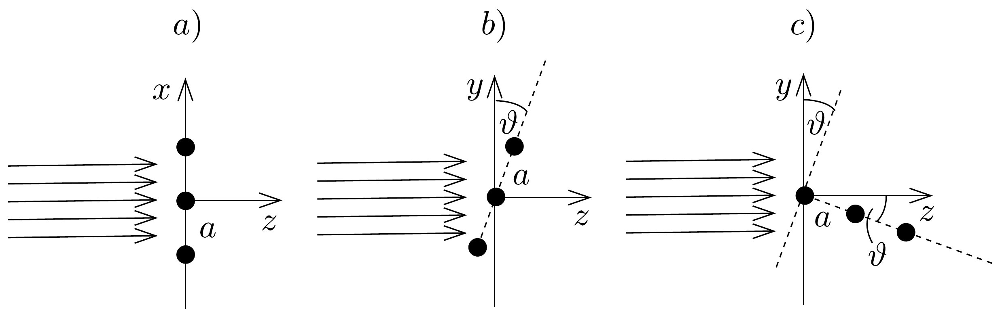
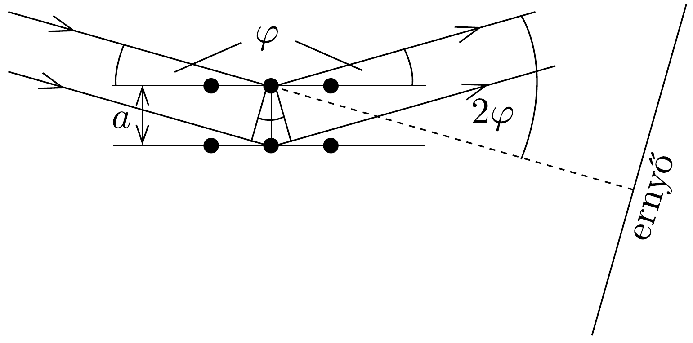

## Megoldás 1

a) Tekintsük először az $x$ irányt. Ha a szomszédos résekből (amelyek távolsága $d_{1}$ ) érkező hullámok útkülönbsége:
\[
\Delta_{1}=n_{1} \lambda,
\]
ahol $n_{1}$ egész szám, akkor fómaximumhoz jutunk. Ennek helye az ernyőn (a $\Delta_{1}=$ $d_{1} \sin \alpha_{n_{1}}$ és a $\operatorname{tg} \alpha_{n_{1}}=x_{n_{1}} / L \approx \sin \alpha_{n_{1}}$ összefüggésekből):
\[
x_{n_{1}}=\frac{n_{1} \lambda L}{d_{1}} .
\]
Ekkor a középső rés és az egyik szélső rés közötti útkülönbség:
\[
\Delta_{\left(N_{1} / 2\right)}=\frac{N_{1}}{2} n_{1} \lambda .
\]
Másrészről ha ez az útkülönbség
\[
\Delta_{\left(N_{1} / 2\right)}=\frac{N_{1}}{2} n_{1} \lambda+\frac{\lambda}{2},
\]
akkor a főmaximumot követő minimumhoz jutunk. Ennek a minimumnak az ernyőn észlelhető elhelyezkedését így adhatjuk meg:
\[
x_{n_{1}}+\Delta x=\frac{\left(\frac{N_{1}}{2} n_{1} \lambda+\frac{\lambda}{2}\right) L}{\frac{N_{1}}{2} d_{1}}=\frac{n_{1} \lambda L}{d_{1}}+\frac{\lambda L}{N_{1} d_{1}},
\]
amiből
\[
\Delta x=\frac{\lambda L}{N_{1} d_{1}} .
\]
Ennek megfelelően a főmaximum szélessége:
\[
2 \Delta x=2 \frac{\lambda L}{N_{1} d_{1}} .
\]

Hasonló módon járhatunk el az $y$ irányban is, ahol $N_{2}$ rés található egymástól $d_{2}$ távolságra. A fómaximumok helyzete és szélessége tehát ( $n_{2}$ szintén egész szám):
\[
\begin{gathered}
\left(x_{n_{1}}, y_{n_{2}}\right)=\left(\frac{n_{1} \lambda L}{d_{1}}, \frac{n_{2} \lambda L}{d_{2}}\right) \\
2 \Delta x=2 \frac{\lambda L}{N_{1} d_{1}} ; \quad 2 \Delta y=2 \frac{\lambda L}{N_{2} d_{2}} .
\end{gathered}
\]
b) Az $x$ irányban a sugár $a$ rácsállandójú rácsot „lát” (132. $a$ ) ábra), így ebben az irányban:
\[
x_{n_{1}}=\frac{n_{1} \lambda L}{a} ; \quad \Delta x=\frac{\lambda L}{N_{0} a} .
\]

Az $y$ irányban a sugár $a \cos \vartheta$ effektív rácsállandójú rácsot „lát” (132. b) ábra). Hasonlóan az előzőekhez, így
\[
y_{n_{2}}=\frac{n_{2} \lambda L}{a \cos \vartheta} ; \quad \Delta y=\frac{\lambda L}{N_{0} a \cos \vartheta} .
\]

Az $y$ irányban az előzőn kívül a sugár $a \sin \vartheta$ effektív rácsállandójú rácsot is „lát” (132. c) ábra). Ez a következő főmaximum elhelyezkedésekhez és szélességekhez vezet:
\[
y_{n_{3}}^{\prime}=\frac{n_{3} \lambda L}{a \sin \vartheta} ; \quad \Delta y^{\prime}=\frac{\lambda L}{N_{1} a \sin \vartheta} .
\]
Ez az elhajlási kép hozzáadódik az előző, $y$ irányban kapott elhajlási képhez. Mivel $\sin \vartheta$ nagyon kicsi, csak a nulladrendú kép jelenik meg, amely azonban nagyon széles, hiszen $N_{1} \sin \vartheta \ll N_{0}$. Ha tehát egy vékony köbös kristálylapra kicsiny beesési szögben síkhullám esik, az elhajlási kép csaknem azonos lesz a kétdimenziós rács esetével.
c) Bragg-reflexió esetén a szomszédos síkokról való visszevert sugarak interferenciát eredményezó útkülönbsége (lásd $a$ 133. ábrát):
\[
\Delta=2 a \sin \varphi \approx 2 a \varphi=n \lambda,
\]
ahol $2 \varphi$ az elhajlási szög. Ebből
\[
\frac{x}{L} \approx 2 \varphi \approx \frac{n \lambda}{a},
\]
tehát
\[
x \approx \frac{n \lambda L}{a} .
\]
Ez a $b$ ) alkérdéssel megegyező maximumfeltétel.

d) A szomszédos $\mathrm{K}^{+}$-ionok távolsága $a \sqrt{2}$, mivel a kétféle iont azonos szórócentrumnak tételezzük fel, így egyrészt az $a$ rácsállandó egy kálium- és egy kloridion közötti távolág, másrészt az első gyűrú az $a$ távolságra lévó síkoktól (porminta esetén a különböző orientációk azonos valószínűséggel állnak a tér minden irányába, ezért ekkor gömbökről beszélhetünk) származik. Tehát
\[
\operatorname{tg}(2 \varphi)=\frac{x}{L}=\frac{0,053}{0,1}=0,53,
\]
amiből
\[
a=\frac{\lambda}{2 \sin \varphi} \approx \frac{0,15 \cdot 10^{-9}}{2 \cdot 0,24} \approx 0,31 \mathrm{~nm},
\]
tehát a káliumionok távolsága $\sqrt{2} \cdot 0,31 \mathrm{~nm} \approx 0,44 \mathrm{~nm}$.
Megjegyzés: A fenti megoldásban a főmaximumok helyzetének meghatározása, a vonalszélességek számítása, valamint a Bragg-elmélet levezetése mind egyszerú meggondolásokon alapulnak, amelyeket azonban a részletesebb számítások alátámasztanak.

A pontosabb elmélet és úgynevezett szórási (vagy szerkezeti) amplitúdó számításán alapu. ${ }^{11}$. A szórt hullám intenzitása (ez észlelhető) a szórási amplitúdó abszolútérték négyzetével arányos. Például egy $N$ rácspontból álló, $a$ rácsállandójú lineáris láncra a szórási amplitúdó négyzete a következő:
\[
|A|^{2}=\frac{\sin ^{2}\left[\frac{1}{2} N(\boldsymbol{a} \cdot \Delta \boldsymbol{k})\right]}{\sin ^{2}\left[\frac{1}{2}(\boldsymbol{a} \cdot \Delta \boldsymbol{k})\right]}
\]
ahol az $\boldsymbol{a} \cdot \Delta \boldsymbol{k}$ kifejezés két vektor skalárszorzata. Az $\boldsymbol{a}$ rácsvektor két szomszédos rácspontot összekötő vektor, míg a $\boldsymbol{\Delta} \boldsymbol{k}$ vektor a beeső és a szóródó sugarak közötti különbséget jellemzi. A beesó sugarat jellemezze az ún. $\boldsymbol{k}$ hullámszámvektor, melynek iránya megegyezik a beeső nyalábbal, a szóródó nyalábot jellemezzük a $\boldsymbol{k}^{\prime}$ hullámszámvektorral. Mindkét vektor nagysága ugyanakkora (ezt nevezik rugalmas szórásnak) $:|\boldsymbol{k}|=\left|\boldsymbol{k}^{\prime}\right|=\frac{2 \pi}{\lambda}$. A $\Delta \boldsymbol{k}$ vektor a fenti két hullámszámvektor különbsége: $\Delta \boldsymbol{k}=\boldsymbol{k}^{\prime}-\boldsymbol{k}$. Így a szórási amplitúdóban lévő $\boldsymbol{a} \cdot \Delta \boldsymbol{k}$ skalárszorzat a következő módon fejezhető ki:
\[
\boldsymbol{a} \cdot \Delta \boldsymbol{k}=\boldsymbol{a}\left(\boldsymbol{k}^{\prime}-\boldsymbol{k}\right)=\frac{2 \pi}{\lambda} a \cdot\left(\cos \alpha^{\prime}-\cos \alpha\right),
\]

\footnotetext{
${ }^{11}$ A részletes levezetés sok kézikönyvben megtalálható, lásd például C. Kittel: Bevezetés a szilárdtest-fizikába vagy Sólyom J.: A modern szilárdtest-fizika alapjai I. c. könyvet.

ahol $\alpha^{\prime}$ és $\alpha$ a szóródó és a beeső nyaláboknak az $\boldsymbol{a}$ vektorral bezárt szögét jelentik. $\mathrm{Az}|A|^{2}$ függvény matematikai viselkedése mutatja meg a diffrakciós maximumok helyét, melynek feltétele, hogy $\boldsymbol{a} \cdot \Delta \boldsymbol{k}=2 \pi n$ legyen, ahol $n$ egész szám. Merőleges beesés esetén $\alpha=\frac{\pi}{2}$, tehát $\cos \alpha=0$, vagyis
\[
2 \pi n=\frac{2 \pi}{\lambda} a \cos \alpha^{\prime},
\]
továbbá a messzi ernyőn a beeső nyalábtól mért $x$ távolságra (a szórt nyaláb kissé tér el a beesőtől):
\[
\cos \alpha^{\prime}=\frac{n \lambda}{a} \approx \frac{x}{L},
\]
amiből
\[
x=\frac{n \lambda L}{a},
\]
tehát megkaptuk a főmaximumok ismert helyét.
A szórási amplitúdó első minimumhelyét úgy kereshetjük meg, hogy kissé megváltoztatjuk $\Delta \boldsymbol{k}$-t és definiálunk egy olyan $\varepsilon$ számot az $\boldsymbol{a} \Delta \boldsymbol{k}=2 \pi n+\varepsilon$ kifejezéssel, hogy $\varepsilon$ adja meg a $\sin \left[\frac{1}{2} N(\boldsymbol{a} \Delta \boldsymbol{k})\right]$ kifejezés első nullhelyét. Könnyen megmutatható, hogy ekkor $\varepsilon=\frac{2 \pi}{N}$, tehát az elhajlási maximum szélessége arányos $1 / N$-nel. Ezzel visszakaptuk a hivatalos megoldás vonalszélességi eredményét. A fenti tárgyalás háromdimenziós kristályokra is érvényes, így belátható, hogy mind a köbös kristály elhajlási képe, mind a Bragg-reflexiós elmélet levezethető a szórási amplitúdó segítségével.
